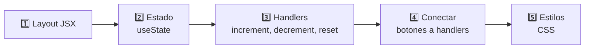
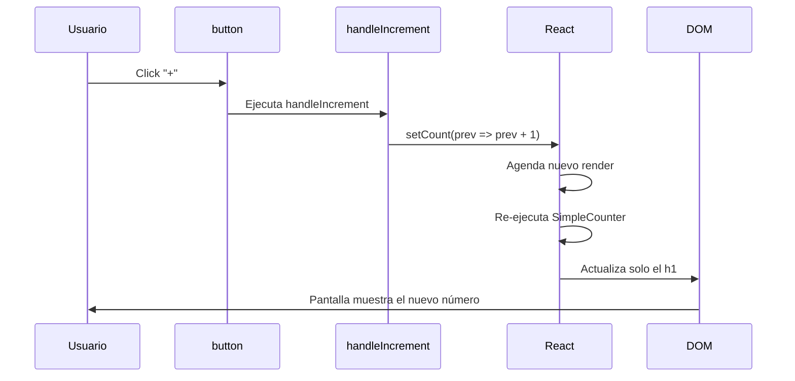

🇪🇸 **Español** | [🇬🇧 English](README.en.md)

# Step 3: Proyecto — Simple Counter

## 🎯 Objetivo

Construir, de principio a fin, un **Simple Counter** en React: un contador que se incrementa, se decrementa y se resetea con tres botones. Aplicarás todo lo de los steps anteriores: componentes, props, `useState`, y handlers.

> 🔗 Referencia oficial del proyecto: [Simple Counter (React)](https://4geeks.com/syllabus/spain-fs-pt-129/project/simple-counter-react)

---

## 🤔 ¿Por qué importa?

Un contador parece trivial, pero contiene **el patrón completo** de una app React interactiva: estado local, eventos, actualización del DOM. Si dominas este patrón, dominas el 80% de los componentes que escribirás en tu vida.

---

## 🧭 Plan en 5 pasos



1. Pintar el layout sin lógica.
2. Añadir el estado `count`.
3. Escribir los handlers.
4. Atar cada botón a su handler.
5. Aplicar CSS para que se vea bien.

---

## 🏗️ Paso 1: Layout JSX (sin lógica)

Empieza siempre por la "carcasa": HTML/JSX puro, sin estado, para visualizar la UI.

```jsx
function SimpleCounter() {
    return (
        <div className="counter">
            <h1 className="counter__value">0</h1>
            <div className="counter__buttons">
                <button>-</button>
                <button>Reset</button>
                <button>+</button>
            </div>
        </div>
    );
}
```

Verás un `0` y tres botones que no hacen nada. Perfecto: la UI ya está, ahora hay que darle vida.

---

## 🧠 Paso 2: Añadir el estado

El contador necesita **recordar su valor actual**. Eso es estado.

```jsx
import { useState } from 'react';

function SimpleCounter() {
    const [count, setCount] = useState(0);

    return (
        <div className="counter">
            <h1 className="counter__value">{count}</h1>
            <div className="counter__buttons">
                <button>-</button>
                <button>Reset</button>
                <button>+</button>
            </div>
        </div>
    );
}
```

Cambios:

- Importamos `useState`.
- Declaramos `count` con valor inicial `0`.
- Sustituimos `0` literal por `{count}` en el JSX.

Tu UI todavía muestra `0`, pero ya estamos leyendo del estado.

---

## ✋ Paso 3: Diseñar los handlers

Tres acciones, tres handlers:

| Handler | Qué hace | Implementación |
|---------|----------|----------------|
| `handleIncrement` | Suma 1 a `count` | `setCount(prev => prev + 1)` |
| `handleDecrement` | Resta 1 a `count` | `setCount(prev => prev - 1)` |
| `handleReset` | Vuelve a 0 | `setCount(0)` |

```jsx
function SimpleCounter() {
    const [count, setCount] = useState(0);

    function handleIncrement() {
        setCount(prev => prev + 1);
    }

    function handleDecrement() {
        setCount(prev => prev - 1);
    }

    function handleReset() {
        setCount(0);
    }

    // ... return omitido por ahora
}
```

> 💡 Usar `setCount(prev => prev + 1)` en vez de `setCount(count + 1)` es opcional aquí, pero es un buen hábito: te protege si en el futuro disparas varias actualizaciones seguidas.

---

## 🔌 Paso 4: Conectar botones y handlers

Recuerda del Step 2: pasamos la **referencia**, no la llamada.

```jsx
return (
    <div className="counter">
        <h1 className="counter__value">{count}</h1>
        <div className="counter__buttons">
            <button onClick={handleDecrement}>-</button>
            <button onClick={handleReset}>Reset</button>
            <button onClick={handleIncrement}>+</button>
        </div>
    </div>
);
```

Aquí ya tienes un contador **funcional**. Pulsa los botones y verás el número cambiar en tiempo real.

---

## 🎨 Paso 5: CSS

```css
.counter {
    display: flex;
    flex-direction: column;
    align-items: center;
    gap: 1.5rem;
    margin-top: 4rem;
    font-family: 'Courier New', monospace;
}

.counter__value {
    font-size: 6rem;
    color: #282c34;
    background: #f4f4f4;
    padding: 1rem 2rem;
    border-radius: 12px;
    min-width: 6rem;
    text-align: center;
    box-shadow: 0 4px 6px rgba(0, 0, 0, 0.08);
}

.counter__buttons {
    display: flex;
    gap: 0.5rem;
}

.counter__buttons button {
    padding: 0.75rem 1.5rem;
    font-size: 1.25rem;
    border: none;
    border-radius: 8px;
    background: #61dafb;
    color: #282c34;
    cursor: pointer;
    transition: transform 0.1s;
}

.counter__buttons button:hover {
    transform: translateY(-2px);
}
```

---

## ✅ Componente final completo

```jsx
import { useState } from 'react';
import './SimpleCounter.css';

function SimpleCounter() {
    const [count, setCount] = useState(0);

    function handleIncrement() {
        setCount(prev => prev + 1);
    }

    function handleDecrement() {
        setCount(prev => prev - 1);
    }

    function handleReset() {
        setCount(0);
    }

    return (
        <div className="counter">
            <h1 className="counter__value">{count}</h1>
            <div className="counter__buttons">
                <button onClick={handleDecrement}>-</button>
                <button onClick={handleReset}>Reset</button>
                <button onClick={handleIncrement}>+</button>
            </div>
        </div>
    );
}

export default SimpleCounter;
```

Y para montarlo:

```jsx
import React from 'react';
import ReactDOM from 'react-dom/client';
import SimpleCounter from './SimpleCounter';

const root = ReactDOM.createRoot(document.getElementById('root'));
root.render(<SimpleCounter />);
```

---

## 🔁 Flujo completo cuando el usuario hace click en "+"



> 💡 Fíjate en cómo `<h1>{count}</h1>` se actualiza pero los `<button>` no se vuelven a crear. React es eficiente: compara y solo cambia lo necesario.

---

## 🚀 Extras opcionales

Para subir el nivel del proyecto:

| Idea | Pista |
|------|-------|
| Botón para sumar/restar 10 | Otro handler `setCount(prev => prev + 10)` |
| Que no baje de 0 | `setCount(prev => Math.max(0, prev - 1))` |
| Cambiar el color cuando llega a un número | `style={{ color: count > 5 ? 'red' : 'black' }}` |
| Mostrar "negativo" cuando es < 0 | Condicional en el JSX `{count < 0 && <p>negativo</p>}` |
| Input para "saltar" a un número | `useState` para el input + handler que parsea y llama a `setCount` |

---

## 🧠 Pregunta para reflexionar

<details>
<summary>¿Por qué definimos `count` con `useState(0)` y no con `let count = 0` arriba del componente?</summary>

Porque el componente es **una función que React ejecuta una y otra vez** (cada render). Si haces `let count = 0` dentro, **se reinicia a 0 en cada render** — el contador nunca subiría.

Si lo pones **fuera** de la función, sería una variable global, compartida entre todos los componentes y, sobre todo, **no provocaría re-render** al cambiarla.

`useState` resuelve ambos problemas a la vez:

1. Persiste el valor **entre renders** (React lo guarda en su memoria interna).
2. Cuando llamas a `setCount`, **dispara un nuevo render** para que la UI refleje el cambio.

Es la forma específica de React de decir "esta es una variable de mi componente que recuerda su valor y, cuando cambia, redibuja".

</details>

---

## ✅ Checklist de este step

- [ ] He pintado el layout JSX vacío
- [ ] He añadido `useState` para `count`
- [ ] He creado tres handlers: `handleIncrement`, `handleDecrement`, `handleReset`
- [ ] He conectado cada botón con `onClick={handlerSinParentesis}`
- [ ] El contador sube, baja y se resetea correctamente
- [ ] He aplicado CSS para que el contador se vea presentable
- [ ] (Opcional) He implementado al menos un extra de la lista
