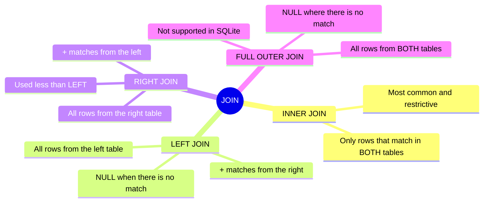
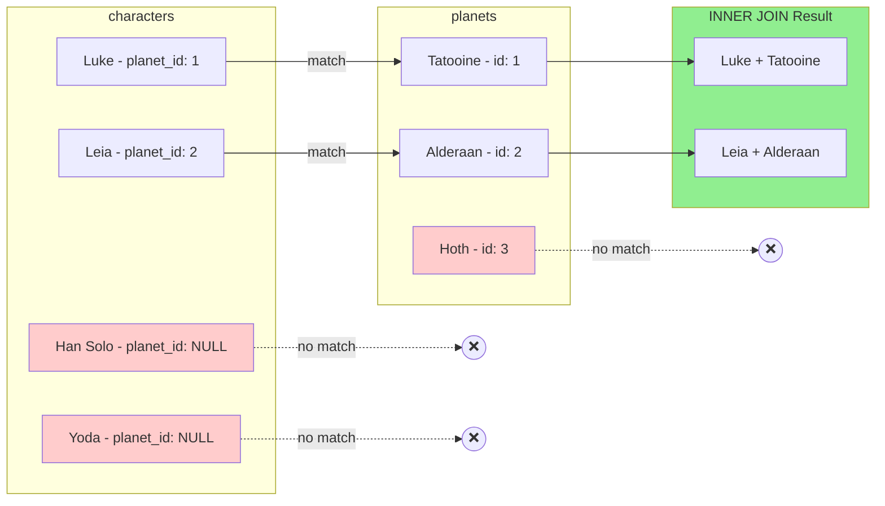
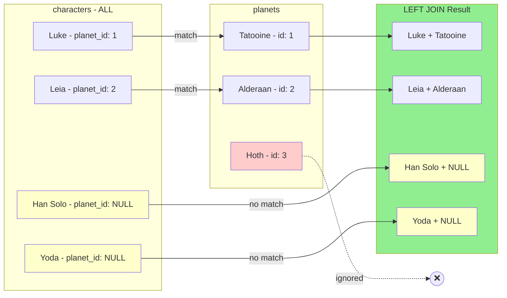
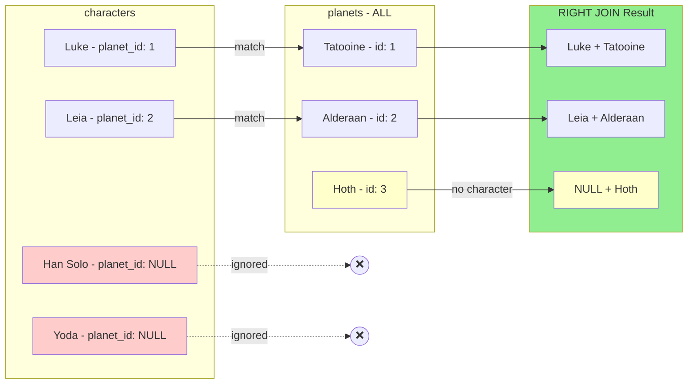
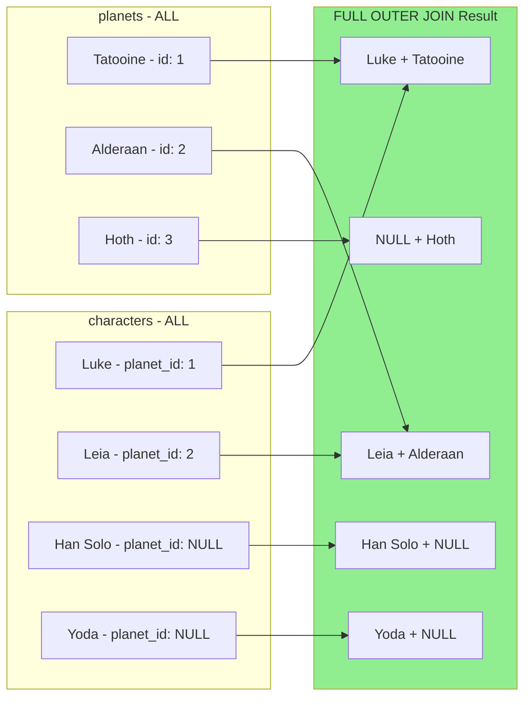
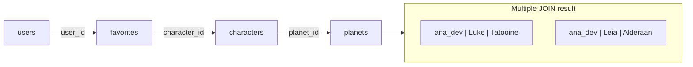

[🇪🇸 Español](JOINs-guia-visual.md) | 🇬🇧 **English**

# 📊 Visual Guide to JOINs in SQL and SQLAlchemy

## 🎯 What is a JOIN?

A **JOIN** is an operation that **combines rows from two or more tables** based on a relationship condition between them (usually a foreign key).

### Simple analogy

Imagine you have two Excel sheets:

- **Sheet A**: List of characters with a `planet_id` column
- **Sheet B**: List of planets with an `id` column

A JOIN is like saying: _"For each character, find the planet whose `id` matches the character's `planet_id` and show me both pieces of data together"_.

---

## 🗺️ Mind Map: JOIN Types



---

## 📋 Sample Data

For all examples we will use these tables:

### Table `characters`

| id  | name           | planet_id |
| --- | -------------- | --------- |
| 1   | Luke Skywalker | 1         |
| 2   | Leia Organa    | 2         |
| 3   | Han Solo       | NULL      |
| 4   | Yoda           | NULL      |

### Table `planets`

| id  | name     | climate   |
| --- | -------- | --------- |
| 1   | Tatooine | arid      |
| 2   | Alderaan | temperate |
| 3   | Hoth     | frozen    |

> 💡 **Note**: Han Solo and Yoda have no `planet_id` (they are NULL). Hoth has no associated character.

---

## 1️⃣ INNER JOIN

### Concept

Returns **only the rows that have a match in BOTH tables**. If a character has no planet, or a planet has no characters, those rows **do not appear**.

### Diagram



### SQL

```sql
SELECT c.name AS character_name, p.name AS planet_name
FROM characters c
INNER JOIN planets p ON c.planet_id = p.id;
```

### SQLAlchemy ORM

```python
from sqlalchemy import select
from day_26.example_models import Character, Planet

stmt = (
    select(Character.name, Planet.name.label("planet_name"))
    .join(Planet, Character.planet_id == Planet.id)  # INNER JOIN by default
)
rows = db.session.execute(stmt).all()
```

### Result

| character_name | planet_name |
| -------------- | ----------- |
| Luke Skywalker | Tatooine    |
| Leia Organa    | Alderaan    |

> ⚠️ **Han Solo, Yoda, and Hoth DO NOT appear** because they have no match.

---

## 2️⃣ LEFT JOIN (LEFT OUTER JOIN)

### Concept

Returns **all rows from the left table** (characters), plus matches from the right table (planets). When there is no match, the right-side fields will be **NULL**.

### Diagram



### SQL

```sql
SELECT c.name AS character_name, p.name AS planet_name
FROM characters c
LEFT JOIN planets p ON c.planet_id = p.id;
```

### SQLAlchemy ORM

```python
stmt = (
    select(Character.name, Planet.name.label("planet_name"))
    .outerjoin(Planet, Character.planet_id == Planet.id)  # LEFT OUTER JOIN
)
rows = db.session.execute(stmt).all()
```

### Result

| character_name | planet_name |
| -------------- | ----------- |
| Luke Skywalker | Tatooine    |
| Leia Organa    | Alderaan    |
| Han Solo       | NULL        |
| Yoda           | NULL        |

> ✅ **Han Solo and Yoda DO appear** (with NULL planet). Hoth still does not appear.

### When to use LEFT JOIN?

- When you want **all main records** even if they have no relationship
- Example: "List all users with their orders (including those who haven't bought anything)"

---

## 3️⃣ RIGHT JOIN (RIGHT OUTER JOIN)

### Concept

It is the mirror of the LEFT JOIN: it returns **all rows from the right table** (planets), plus matches from the left. When there is no match, the left-side fields will be **NULL**.

### Diagram



### SQL

```sql
SELECT c.name AS character_name, p.name AS planet_name
FROM characters c
RIGHT JOIN planets p ON c.planet_id = p.id;
```

### SQLAlchemy ORM

```python
# RIGHT JOIN can be simulated by reversing table order with LEFT JOIN
stmt = (
    select(Character.name, Planet.name.label("planet_name"))
    .select_from(Planet)  # Start from planets
    .outerjoin(Character, Character.planet_id == Planet.id)
)
rows = db.session.execute(stmt).all()
```

### Result

| character_name | planet_name |
| -------------- | ----------- |
| Luke Skywalker | Tatooine    |
| Leia Organa    | Alderaan    |
| NULL           | Hoth        |

> ✅ **Hoth DOES appear** (with no character). Han Solo and Yoda do not appear.

### Practical note

In practice, **you can almost always rewrite a RIGHT JOIN as a LEFT JOIN** by simply swapping the table order. That is why RIGHT JOIN is rarely used.

---

## 4️⃣ FULL OUTER JOIN

### Concept

Returns **all rows from BOTH tables**. Where there is no match, it puts NULL.

### Diagram



### SQL

```sql
-- In PostgreSQL/MySQL:
SELECT c.name AS character_name, p.name AS planet_name
FROM characters c
FULL OUTER JOIN planets p ON c.planet_id = p.id;

-- In SQLite (does not support FULL OUTER JOIN directly):
SELECT c.name, p.name FROM characters c LEFT JOIN planets p ON c.planet_id = p.id
UNION
SELECT c.name, p.name FROM characters c RIGHT JOIN planets p ON c.planet_id = p.id;
```

### Result

| character_name | planet_name |
| -------------- | ----------- |
| Luke Skywalker | Tatooine    |
| Leia Organa    | Alderaan    |
| Han Solo       | NULL        |
| Yoda           | NULL        |
| NULL           | Hoth        |

> ✅ **ALL records appear**: characters without planet AND planets without characters.

### ⚠️ SQLite limitation

SQLite **does not support FULL OUTER JOIN** directly. In SQLite projects, you will have to simulate it with a UNION of LEFT and RIGHT JOIN.

---

## 🔗 Multiple JOINs (3+ tables)

In real applications, you frequently need to join more than two tables.

### Example: User → Favorites → Characters → Planets

We want: _"For each user, show their favorite characters and each character's planet"_

### Additional data

**Table `users`**

| id  | username |
| --- | -------- |
| 1   | ana_dev  |

**Table `favorites`**

| id  | user_id | character_id |
| --- | ------- | ------------ |
| 1   | 1       | 1            |
| 2   | 1       | 2            |

### Flow diagram



### SQL

```sql
SELECT
    u.username,
    c.name AS character_name,
    p.name AS planet_name
FROM users u
INNER JOIN favorites f ON f.user_id = u.id
INNER JOIN characters c ON c.id = f.character_id
LEFT JOIN planets p ON p.id = c.planet_id
ORDER BY u.username, c.name;
```

### SQLAlchemy ORM

```python
from sqlalchemy import select
from day_26.example_models import User, Favorite, Character, Planet

stmt = (
    select(
        User.username,
        Character.name.label("character_name"),
        Planet.name.label("planet_name")
    )
    .join(Favorite, Favorite.user_id == User.id)
    .join(Character, Character.id == Favorite.character_id)
    .outerjoin(Planet, Planet.id == Character.planet_id)  # LEFT JOIN for characters without a planet
    .order_by(User.username, Character.name)
)
rows = db.session.execute(stmt).all()
```

### Result

| username | character_name | planet_name |
| -------- | -------------- | ----------- |
| ana_dev  | Leia Organa    | Alderaan    |
| ana_dev  | Luke Skywalker | Tatooine    |

---

## 📈 JOIN + Aggregation (GROUP BY + HAVING)

JOINs can be combined with aggregate functions to obtain statistics.

### Example: Count favorites per character

_"How many users have each character as a favorite? Show only those with at least 1."_

### SQL

```sql
SELECT
    c.name AS character_name,
    COUNT(f.user_id) AS total_fans
FROM characters c
INNER JOIN favorites f ON f.character_id = c.id
GROUP BY c.id, c.name
HAVING COUNT(f.user_id) >= 1
ORDER BY total_fans DESC;
```

### SQLAlchemy ORM

```python
from sqlalchemy import select, func
from day_26.example_models import Character, Favorite

stmt = (
    select(
        Character.name,
        func.count(Favorite.user_id).label("total_fans")
    )
    .join(Favorite, Favorite.character_id == Character.id)
    .group_by(Character.id, Character.name)
    .having(func.count(Favorite.user_id) >= 1)
    .order_by(func.count(Favorite.user_id).desc())
)
rows = db.session.execute(stmt).all()
```

### Result

| character_name | total_fans |
| -------------- | ---------- |
| Luke Skywalker | 1          |
| Leia Organa    | 1          |

---

## 🎯 Summary: When to use each JOIN?

| JOIN type      | Use when...                                       | Example use case                                                                |
| -------------- | ------------------------------------------------- | ------------------------------------------------------------------------------- |
| **INNER JOIN** | You only want records with a match in both tables | "List characters WITH their planet"                                             |
| **LEFT JOIN**  | You want ALL records from the main table          | "List ALL users, with their orders if they have any"                            |
| **RIGHT JOIN** | You want ALL records from the secondary table     | Rare; better to use LEFT by swapping the order                                  |
| **FULL OUTER** | You want ABSOLUTELY EVERYTHING                    | "Audit: which users have no profile AND which profiles have no user?"           |

---

## 🧪 Practical exercises

Using the models in `day_26/example_models.py`, try writing these queries:

1. **INNER JOIN**: List all characters with the title of the films they appear in
2. **LEFT JOIN**: List all users with their profile bio (even if they have no profile)
3. **Multiple JOIN**: List the username, favorite character's name, and the character's planet
4. **Aggregation**: How many characters are there per planet? Include planets with no characters (count 0)

The solutions are in `day_26/example_queries.py`.

---

## ✅ Comprehension Checklist

- [ ] I can explain the difference between INNER JOIN and LEFT JOIN
- [ ] I know when to use LEFT JOIN vs INNER JOIN
- [ ] I can write a JOIN across 3+ tables
- [ ] I understand how to combine JOIN with GROUP BY and HAVING
- [ ] I know SQLite does not support FULL OUTER JOIN directly
