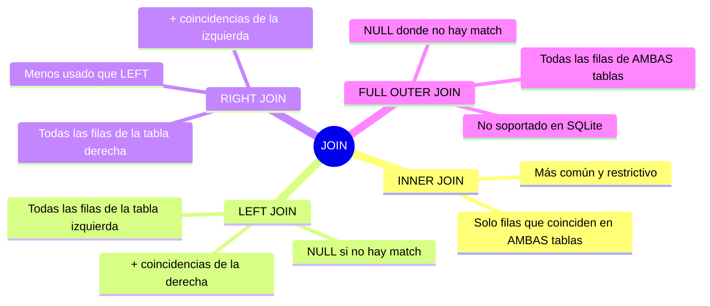
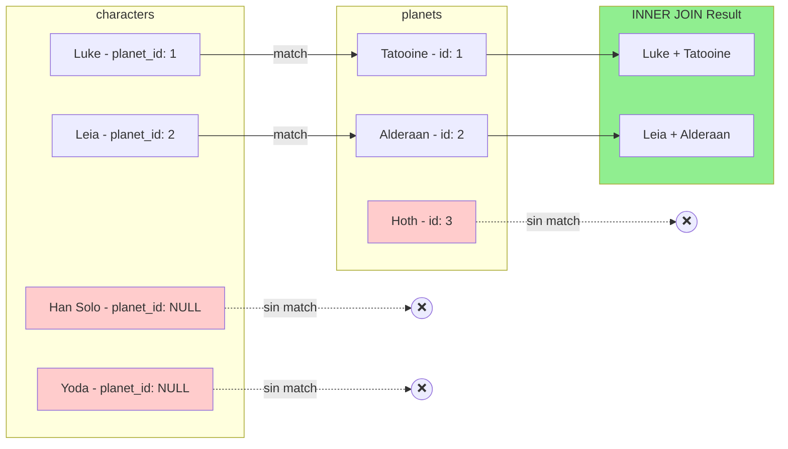
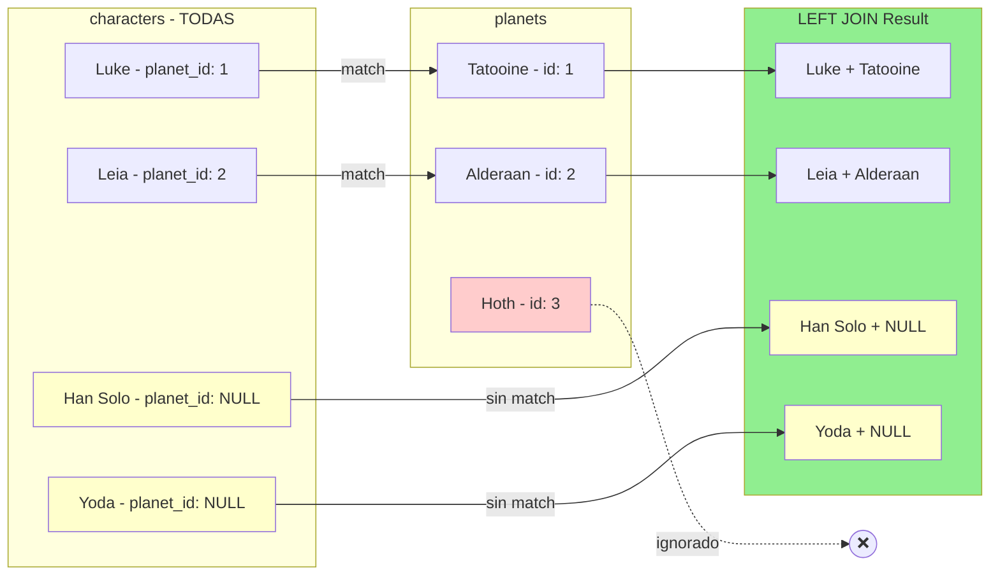
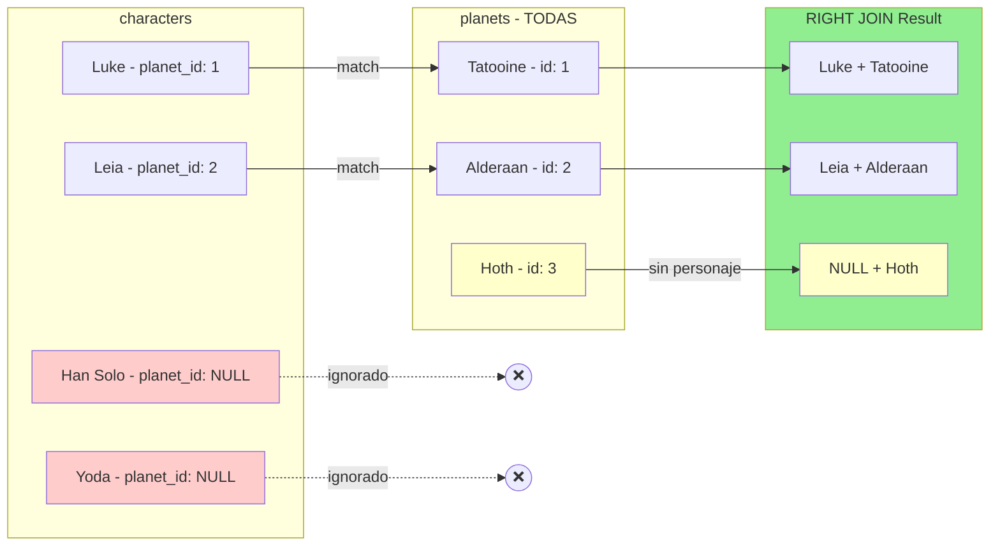
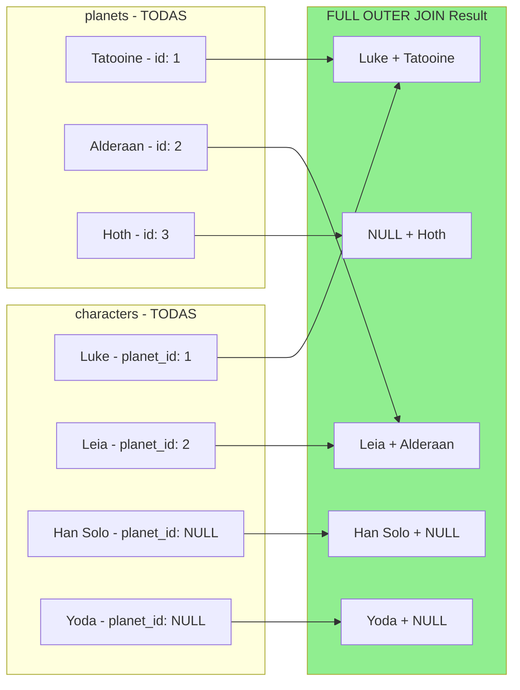
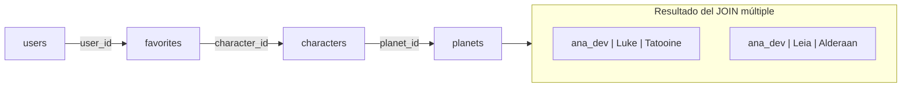

# 📊 Guía Visual de JOINs en SQL y SQLAlchemy

## 🎯 ¿Qué es un JOIN?

Un **JOIN** es una operación que **combina filas de dos o más tablas** basándose en una condición de relación entre ellas (generalmente una clave foránea).

### Analogía simple

Imagina que tienes dos hojas de Excel:

- **Hoja A**: Lista de personajes con una columna `planet_id`
- **Hoja B**: Lista de planetas con una columna `id`

Un JOIN es como decir: _"Para cada personaje, busca el planeta cuyo `id` coincida con el `planet_id` del personaje y muéstrame ambos datos juntos"_.

---

## 🗺️ Mapa Mental: Tipos de JOIN



---

## 📋 Datos de Ejemplo

Para todos los ejemplos usaremos estas tablas:

### Tabla `characters`

| id  | name           | planet_id |
| --- | -------------- | --------- |
| 1   | Luke Skywalker | 1         |
| 2   | Leia Organa    | 2         |
| 3   | Han Solo       | NULL      |
| 4   | Yoda           | NULL      |

### Tabla `planets`

| id  | name     | climate   |
| --- | -------- | --------- |
| 1   | Tatooine | arid      |
| 2   | Alderaan | temperate |
| 3   | Hoth     | frozen    |

> 💡 **Observa**: Han Solo y Yoda no tienen `planet_id` (son NULL). Hoth no tiene ningún personaje asociado.

---

## 1️⃣ INNER JOIN

### Concepto

Devuelve **solo las filas que tienen coincidencia en AMBAS tablas**. Si un personaje no tiene planeta, o un planeta no tiene personajes, esas filas **no aparecen**.

### Diagrama



### SQL

```sql
SELECT c.name AS character_name, p.name AS planet_name
FROM characters c
INNER JOIN planets p ON c.planet_id = p.id;
```

### SQLAlchemy ORM

```python
from sqlalchemy import select
from day_26.example_models import Character, Planet

stmt = (
    select(Character.name, Planet.name.label("planet_name"))
    .join(Planet, Character.planet_id == Planet.id)  # INNER JOIN por defecto
)
rows = db.session.execute(stmt).all()
```

### Resultado

| character_name | planet_name |
| -------------- | ----------- |
| Luke Skywalker | Tatooine    |
| Leia Organa    | Alderaan    |

> ⚠️ **Han Solo, Yoda y Hoth NO aparecen** porque no tienen match.

---

## 2️⃣ LEFT JOIN (LEFT OUTER JOIN)

### Concepto

Devuelve **todas las filas de la tabla izquierda** (characters), y las coincidencias de la tabla derecha (planets). Si no hay coincidencia, los campos de la derecha serán **NULL**.

### Diagrama



### SQL

```sql
SELECT c.name AS character_name, p.name AS planet_name
FROM characters c
LEFT JOIN planets p ON c.planet_id = p.id;
```

### SQLAlchemy ORM

```python
stmt = (
    select(Character.name, Planet.name.label("planet_name"))
    .outerjoin(Planet, Character.planet_id == Planet.id)  # LEFT OUTER JOIN
)
rows = db.session.execute(stmt).all()
```

### Resultado

| character_name | planet_name |
| -------------- | ----------- |
| Luke Skywalker | Tatooine    |
| Leia Organa    | Alderaan    |
| Han Solo       | NULL        |
| Yoda           | NULL        |

> ✅ **Han Solo y Yoda SÍ aparecen** (con planeta NULL). Hoth sigue sin aparecer.

### ¿Cuándo usar LEFT JOIN?

- Cuando quieres **todos los registros principales** aunque no tengan relación
- Ejemplo: "Listar todos los usuarios con sus pedidos (incluso los que no han comprado nada)"

---

## 3️⃣ RIGHT JOIN (RIGHT OUTER JOIN)

### Concepto

Es el espejo del LEFT JOIN: devuelve **todas las filas de la tabla derecha** (planets), y las coincidencias de la izquierda. Si no hay coincidencia, los campos de la izquierda serán **NULL**.

### Diagrama



### SQL

```sql
SELECT c.name AS character_name, p.name AS planet_name
FROM characters c
RIGHT JOIN planets p ON c.planet_id = p.id;
```

### SQLAlchemy ORM

```python
# RIGHT JOIN se puede simular invirtiendo el orden de las tablas con LEFT JOIN
stmt = (
    select(Character.name, Planet.name.label("planet_name"))
    .select_from(Planet)  # Empezamos desde planets
    .outerjoin(Character, Character.planet_id == Planet.id)
)
rows = db.session.execute(stmt).all()
```

### Resultado

| character_name | planet_name |
| -------------- | ----------- |
| Luke Skywalker | Tatooine    |
| Leia Organa    | Alderaan    |
| NULL           | Hoth        |

> ✅ **Hoth SÍ aparece** (sin personaje). Han Solo y Yoda no aparecen.

### Nota práctica

En la práctica, **casi siempre puedes reescribir un RIGHT JOIN como LEFT JOIN** simplemente cambiando el orden de las tablas. Por eso RIGHT JOIN se usa poco.

---

## 4️⃣ FULL OUTER JOIN

### Concepto

Devuelve **todas las filas de AMBAS tablas**. Donde no hay coincidencia, pone NULL.

### Diagrama



### SQL

```sql
-- En PostgreSQL/MySQL:
SELECT c.name AS character_name, p.name AS planet_name
FROM characters c
FULL OUTER JOIN planets p ON c.planet_id = p.id;

-- En SQLite (no soporta FULL OUTER JOIN directamente):
SELECT c.name, p.name FROM characters c LEFT JOIN planets p ON c.planet_id = p.id
UNION
SELECT c.name, p.name FROM characters c RIGHT JOIN planets p ON c.planet_id = p.id;
```

### Resultado

| character_name | planet_name |
| -------------- | ----------- |
| Luke Skywalker | Tatooine    |
| Leia Organa    | Alderaan    |
| Han Solo       | NULL        |
| Yoda           | NULL        |
| NULL           | Hoth        |

> ✅ **TODOS los registros aparecen**: personajes sin planeta Y planetas sin personajes.

### ⚠️ Limitación SQLite

SQLite **no soporta FULL OUTER JOIN** directamente. En proyectos con SQLite, tendrás que simular con UNION de LEFT y RIGHT JOIN.

---

## 🔗 JOINs Múltiples (3+ tablas)

En aplicaciones reales, frecuentemente necesitas unir más de dos tablas.

### Ejemplo: Usuario → Favoritos → Personajes → Planetas

Queremos: _"Para cada usuario, mostrar sus personajes favoritos y el planeta de cada personaje"_

### Datos adicionales

**Tabla `users`**

| id  | username |
| --- | -------- |
| 1   | ana_dev  |

**Tabla `favorites`**

| id  | user_id | character_id |
| --- | ------- | ------------ |
| 1   | 1       | 1            |
| 2   | 1       | 2            |

### Diagrama de flujo



### SQL

```sql
SELECT
    u.username,
    c.name AS character_name,
    p.name AS planet_name
FROM users u
INNER JOIN favorites f ON f.user_id = u.id
INNER JOIN characters c ON c.id = f.character_id
LEFT JOIN planets p ON p.id = c.planet_id
ORDER BY u.username, c.name;
```

### SQLAlchemy ORM

```python
from sqlalchemy import select
from day_26.example_models import User, Favorite, Character, Planet

stmt = (
    select(
        User.username,
        Character.name.label("character_name"),
        Planet.name.label("planet_name")
    )
    .join(Favorite, Favorite.user_id == User.id)
    .join(Character, Character.id == Favorite.character_id)
    .outerjoin(Planet, Planet.id == Character.planet_id)  # LEFT JOIN para personajes sin planeta
    .order_by(User.username, Character.name)
)
rows = db.session.execute(stmt).all()
```

### Resultado

| username | character_name | planet_name |
| -------- | -------------- | ----------- |
| ana_dev  | Leia Organa    | Alderaan    |
| ana_dev  | Luke Skywalker | Tatooine    |

---

## 📈 JOIN + Agregación (GROUP BY + HAVING)

Los JOINs se pueden combinar con funciones de agregación para obtener estadísticas.

### Ejemplo: Contar favoritos por personaje

_"¿Cuántos usuarios tienen a cada personaje como favorito? Mostrar solo los que tienen al menos 1."_

### SQL

```sql
SELECT
    c.name AS character_name,
    COUNT(f.user_id) AS total_fans
FROM characters c
INNER JOIN favorites f ON f.character_id = c.id
GROUP BY c.id, c.name
HAVING COUNT(f.user_id) >= 1
ORDER BY total_fans DESC;
```

### SQLAlchemy ORM

```python
from sqlalchemy import select, func
from day_26.example_models import Character, Favorite

stmt = (
    select(
        Character.name,
        func.count(Favorite.user_id).label("total_fans")
    )
    .join(Favorite, Favorite.character_id == Character.id)
    .group_by(Character.id, Character.name)
    .having(func.count(Favorite.user_id) >= 1)
    .order_by(func.count(Favorite.user_id).desc())
)
rows = db.session.execute(stmt).all()
```

### Resultado

| character_name | total_fans |
| -------------- | ---------- |
| Luke Skywalker | 1          |
| Leia Organa    | 1          |

---

## 🎯 Resumen: ¿Cuándo usar cada JOIN?

| Tipo de JOIN   | Usar cuando...                                     | Ejemplo de caso de uso                                                        |
| -------------- | -------------------------------------------------- | ----------------------------------------------------------------------------- |
| **INNER JOIN** | Solo quieres registros con match en ambas tablas   | "Listar personajes CON su planeta"                                            |
| **LEFT JOIN**  | Quieres TODOS los registros de la tabla principal  | "Listar TODOS los usuarios, con sus pedidos si tienen"                        |
| **RIGHT JOIN** | Quieres TODOS los registros de la tabla secundaria | Raro, mejor usa LEFT invirtiendo el orden                                     |
| **FULL OUTER** | Quieres ABSOLUTAMENTE TODO                         | "Auditoría: ¿qué usuarios no tienen perfil Y qué perfiles no tienen usuario?" |

---

## 🧪 Ejercicios prácticos

Usando los modelos de `day_26/example_models.py`, intenta escribir estas queries:

1. **INNER JOIN**: Lista todos los personajes con el título de las películas en las que aparecen
2. **LEFT JOIN**: Lista todos los usuarios con su bio del perfil (incluso si no tienen perfil)
3. **JOIN múltiple**: Lista el username, nombre del personaje favorito, y el planeta del personaje
4. **Agregación**: ¿Cuántos personajes hay por planeta? Incluye planetas sin personajes (count 0)

Las soluciones están en `day_26/example_queries.py`.

---

## ✅ Checklist de comprensión

- [ ] Puedo explicar la diferencia entre INNER JOIN y LEFT JOIN
- [ ] Sé cuándo usar LEFT JOIN vs INNER JOIN
- [ ] Puedo escribir un JOIN de 3+ tablas
- [ ] Entiendo cómo combinar JOIN con GROUP BY y HAVING
- [ ] Sé que SQLite no soporta FULL OUTER JOIN directamente
