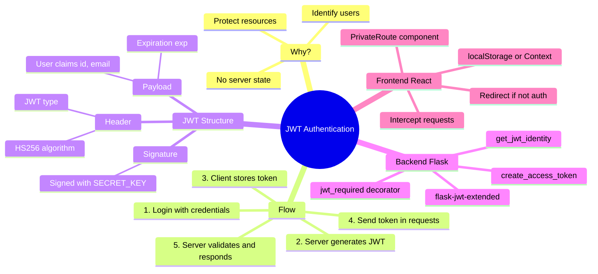

[🇪🇸 Español](README.md) | 🇬🇧 **English**

# 🔐 Day 28: Authentication with JWT (JSON Web Tokens)

## 📚 Official material

- **READ**: [Token Based Authentication in your API](https://4geeks.com/syllabus/spain-fs-pt-129/read/token-based-api-authentication)
- **READ**: [Understanding JWT and how to implement a simple JWT with Flask](https://4geeks.com/syllabus/spain-fs-pt-129/read/what-is-jwt-and-how-to-implement-with-flask)
- **PROJECT**: [Authentication system with Python Flask and React.js](https://4geeks.com/syllabus/spain-fs-pt-129/project/jwt-authentication-with-flask-react)
- **DOCS**: [Flask-JWT-Extended Documentation](https://flask-jwt-extended.readthedocs.io/en/stable/)

---

## 🎯 Goals of the day

By the end of this day you should be able to:

- Explain what authentication is and why it is necessary
- Understand the difference between authentication and authorization
- Describe what a JWT is and its structure (header.payload.signature)
- Implement login/signup with JWT in Flask using `flask-jwt-extended`
- Protect backend endpoints with `@jwt_required()`
- Understand why `@jwt_required()` is a decorator and what it does before executing an endpoint
- Create protected routes in React that are only shown if a valid JWT exists
- Implement the complete flow: Login → Save Token → Access private routes

---

## 🗺️ Mind Map: JWT Authentication



---

## 🗂️ Day structure

```text
day_28/
├── README.md
├── requirements.txt
├── step0-conceptos-autenticacion/
│   └── README.md          # What is authentication? Why JWT?
├── step1-glosario-tecnico/
│   └── README.md          # 📖 Glossary: Hash, Base64, Headers, Decorators...
├── step2-que-es-jwt/
│   └── README.md          # Anatomy of a JWT, claims, signature
├── step3-jwt-flask-backend/
│   └── README.md          # Implementation with flask-jwt-extended + decorators in context with @jwt_required()
├── step4-rutas-protegidas-react/
│   └── README.md          # PrivateRoute, auth Context
└── step5-flujo-completo/
    └── README.md          # Full-stack integration
```

---

## 🚀 Recommended setup

### Backend (Flask)

```bash
cd day_28
python -m venv .venv
source .venv/bin/activate
pip install -r requirements.txt
```

### Frontend (React)

For the frontend, we assume you already have a React project with:

- `react-router-dom` for routing
- `Context API` for global state

---

## 🧭 Suggested study order

1. `step0-conceptos-autenticacion` — Theoretical foundations
2. `step1-glosario-tecnico` — Essential vocabulary (refer back as you go)
3. `step2-que-es-jwt` — Token structure and behavior
4. `step3-jwt-flask-backend` — Flask implementation and contextual explanation of decorators with `@jwt_required()`
5. `step4-rutas-protegidas-react` — Private routes in React
6. `step5-flujo-completo` — Frontend + backend integration

---

## ✅ End-of-day checklist

- [ ] I can explain the difference between authentication and authorization
- [ ] I can describe the 3 parts of a JWT (header.payload.signature)
- [ ] I implemented login/signup with JWT in Flask
- [ ] My protected endpoints require a valid token
- [ ] I have private routes in React that redirect if no token is present
- [ ] The full Login → Protected Dashboard flow works
- [ ] I understand why I should NOT store sensitive data in the JWT
