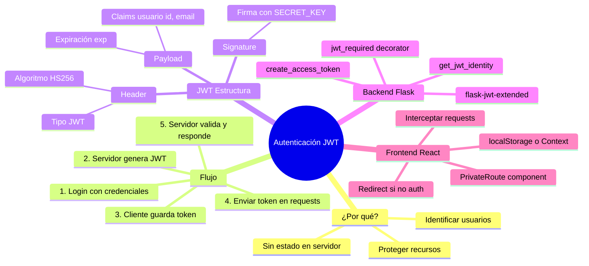

# 🔐 Día 28: Autenticación con JWT (JSON Web Tokens)

## 📚 Material oficial

- **READ**: [Token Based Authentication in your API](https://4geeks.com/syllabus/spain-fs-pt-129/read/token-based-api-authentication)
- **READ**: [Understanding JWT and how to implement a simple JWT with Flask](https://4geeks.com/syllabus/spain-fs-pt-129/read/what-is-jwt-and-how-to-implement-with-flask)
- **PROJECT**: [Authentication system with Python Flask and React.js](https://4geeks.com/syllabus/spain-fs-pt-129/project/jwt-authentication-with-flask-react)
- **DOCS**: [Flask-JWT-Extended Documentation](https://flask-jwt-extended.readthedocs.io/en/stable/)

---

## 🎯 Objetivos del día

Al terminar este día deberías poder:

- Explicar qué es autenticación y por qué es necesaria
- Entender la diferencia entre autenticación y autorización
- Describir qué es un JWT y su estructura (header.payload.signature)
- Implementar login/registro con JWT en Flask usando `flask-jwt-extended`
- Proteger endpoints del backend con `@jwt_required()`
- Crear rutas protegidas en React que solo se muestren si hay JWT válido
- Implementar el flujo completo: Login → Guardar Token → Acceder a rutas privadas

---

## 🗺️ Mapa Mental: Autenticación JWT



---

## 🗂️ Estructura del día

```text
day_28/
├── README.md
├── requirements.txt
├── step0-conceptos-autenticacion/
│   └── README.md          # ¿Qué es autenticación? ¿Por qué JWT?
├── step1-que-es-jwt/
│   └── README.md          # Anatomía de un JWT, claims, firma
├── step2-jwt-flask-backend/
│   └── README.md          # Implementación con flask-jwt-extended
├── step3-rutas-protegidas-react/
│   └── README.md          # PrivateRoute, Context de auth
└── step4-flujo-completo/
    └── README.md          # Integración full-stack
```

---

## 🚀 Setup recomendado

### Backend (Flask)

```bash
cd day_28
python -m venv .venv
source .venv/bin/activate
pip install -r requirements.txt
```

### Frontend (React)

Para el frontend se asume que ya tienes un proyecto React con:

- `react-router-dom` para rutas
- `Context API` para estado global

---

## 🧭 Orden sugerido de estudio

1. `step0-conceptos-autenticacion` — Fundamentos teóricos
2. `step1-que-es-jwt` — Estructura y funcionamiento del token
3. `step2-jwt-flask-backend` — Implementación en Flask
4. `step3-rutas-protegidas-react` — Rutas privadas en React
5. `step4-flujo-completo` — Integración frontend + backend

---

## ✅ Checklist de cierre del día

- [ ] Sé explicar la diferencia entre autenticación y autorización
- [ ] Puedo describir las 3 partes de un JWT (header.payload.signature)
- [ ] Implementé login/signup con JWT en Flask
- [ ] Mis endpoints protegidos requieren token válido
- [ ] Tengo rutas privadas en React que redirigen si no hay token
- [ ] El flujo completo Login → Dashboard protegido funciona
- [ ] Entiendo por qué NO debo guardar datos sensibles en el JWT
