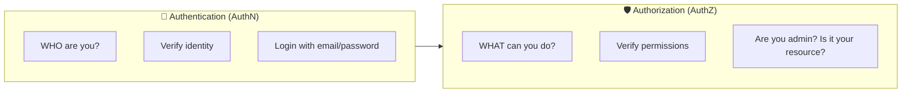
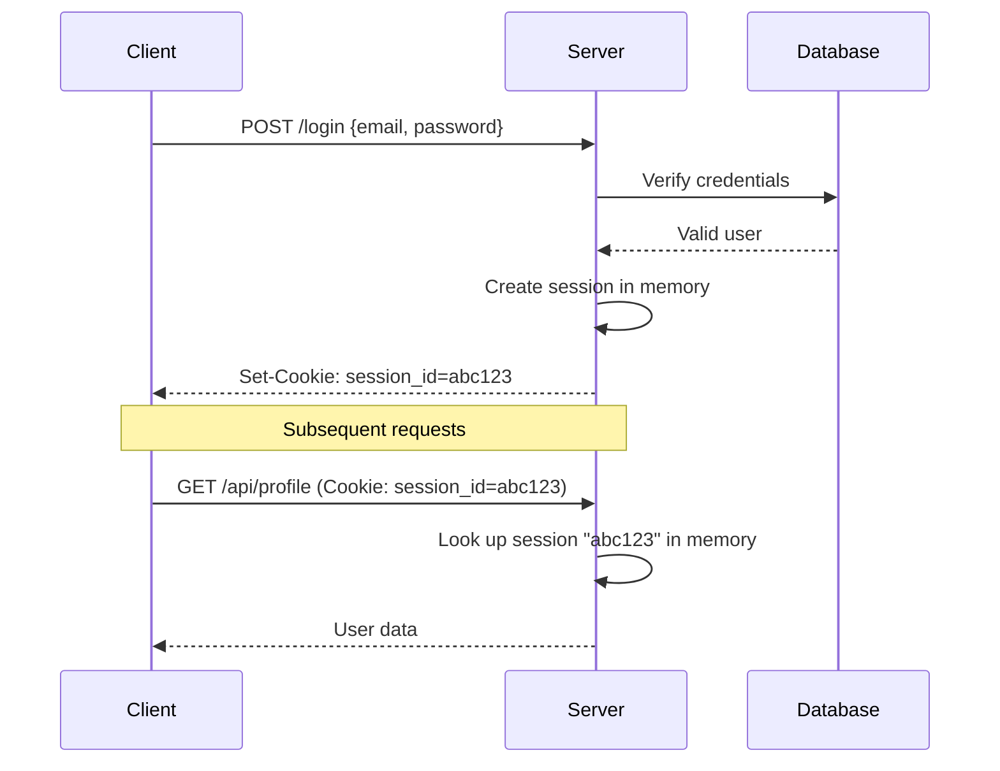
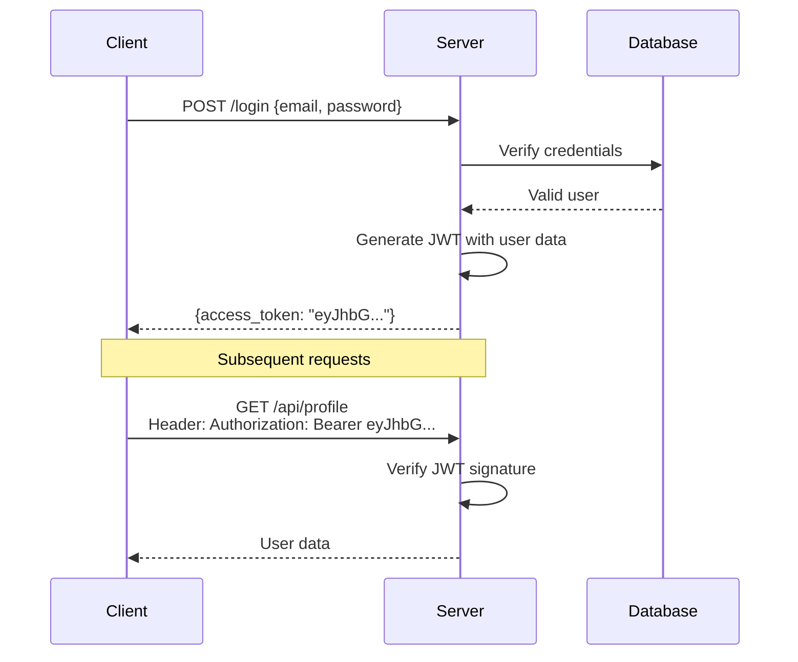
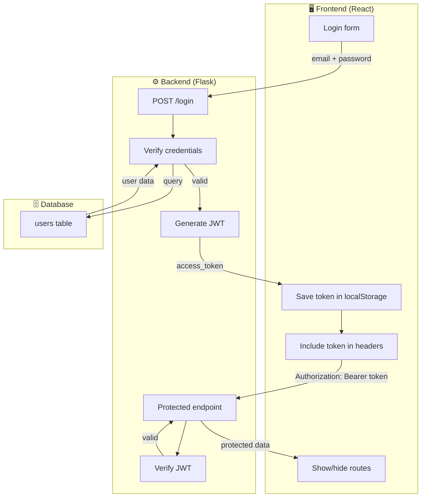
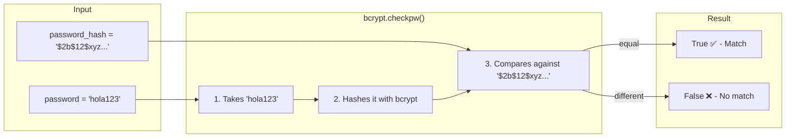

[🇪🇸 Español](README.md) | 🇬🇧 **English**

# Step 0: Authentication Concepts

## 🎯 Goal

Understand **why** we need authentication, **what problem it solves**, and the difference between authentication and authorization.

---

## 🤔 The Problem: Why protect endpoints?

Imagine you have an API with these endpoints:

```
GET  /api/users          → List all users
GET  /api/users/5        → Data for user 5
PUT  /api/users/5        → Modify user 5
DELETE /api/users/5      → Delete user 5
```

### Without protection

Anyone who knows the URL can:

- View data for ALL users
- Modify data for ANY user
- Delete users

**This is a security disaster.**

### With protection

- Only **authenticated** users can access
- A user can only modify **their own data**
- Only **administrators** can delete users

---

## 🔑 Authentication vs Authorization

These two concepts are often confused:



| Concept              | Question         | Example                            |
| -------------------- | ---------------- | ---------------------------------- |
| **Authentication**   | Who are you?     | Login with email and password      |
| **Authorization**    | What can you do? | Only admins can delete users       |

> 💡 **First you authenticate** (verify who they are), **then you authorize** (verify what they can do).

---

## 📜 Brief history: From sessions to tokens

Over the years, the way web applications identify their users has evolved significantly. Understanding this evolution will help you grasp why JWT is the preferred solution today.

### Era 1: Server sessions (stateful)

In the early days of web applications, the most common approach was to use **server-side sessions**.

#### What is a server-side session?

A **session** is simply a **temporary record** that the server creates to "remember" that a specific user is authenticated. Think of it as an entry in a list:

```
Active sessions in server memory:
┌─────────────┬──────────┬─────────────────────┐
│ session_id  │ user_id  │ created_at          │
├─────────────┼──────────┼─────────────────────┤
│ abc123      │ 5        │ 2024-03-08 10:30:00 │
│ xyz789      │ 12       │ 2024-03-08 10:45:00 │
│ def456      │ 3        │ 2024-03-08 11:00:00 │
└─────────────┴──────────┴─────────────────────┘
```

When we say "server-side" it means **this information lives on the server**, not in the user's browser. The browser only knows its `session_id` (for example, `abc123`), but doesn't know what it means — it's the server that translates that ID into "this is user 5".

#### Analogy: The coat check at a nightclub

Imagine you go to a nightclub and leave your coat at the coat check:

1. **You hand over your coat** (you log in with your credentials)
2. **The coat check stores your coat** and gives you a **ticket with a number** (the server creates a session and gives you a `session_id`)
3. **You only have the ticket** — not the coat (your browser only has the `session_id`)
4. **When you come back**, you show the ticket and **the coat check looks up your coat** (the server looks up your session in memory)

The problem is that the coat check has to **keep all the coats organized**. If there are 10,000 people, it needs a lot of space and organization.

#### The detailed process

1. **The user logs in** by sending their credentials (email and password) to the server
2. **The server verifies** the credentials against the database
3. **If they are correct**, the server creates a "session" — a record in memory or in a database that says "this user is authenticated"
4. **The server sends a cookie** to the browser with a unique `session_id` (for example, `abc123`)
5. **On every future request**, the browser automatically sends that cookie
6. **The server looks up** the `session_id` in its memory to know who the user is

This approach is called **"stateful"** because the server must **remember** (maintain state of) all active sessions.



#### Problems with traditional sessions

This approach worked well for small applications, but it presents several problems as the application grows:

| Problem                       | Explanation                                                                                                                                                                                                  |
| ----------------------------- | ------------------------------------------------------------------------------------------------------------------------------------------------------------------------------------------------------------ |
| **Memory consumption**        | The server must keep ALL active sessions in memory. If you have 100,000 connected users, that's 100,000 session records                                                                                      |
| **Horizontal scalability**    | If you have multiple servers (to handle more traffic), how do they share sessions? The user could log in on server A, but their next request goes to server B, which doesn't know their session              |
| **Complexity**                | You need additional solutions such as Redis or shared session databases                                                                                                                                      |

### Era 2: Tokens (stateless) — JWT

The modern solution is to use **self-contained tokens** like JWT. The fundamental difference is that the server **doesn't store any state**.

#### What does "self-contained" mean?

A **self-contained** token is one that **carries all the necessary information inside itself**. It's not just an identifier that points to data stored elsewhere — it IS the data.

Let's compare:

| Traditional session                                       | Self-contained token (JWT)                                                          |
| --------------------------------------------------------- | ----------------------------------------------------------------------------------- |
| `session_id: abc123`                                      | `eyJhbGciOiJIUzI1NiJ9.eyJ1c2VyX2lkIjo1LCJlbWFpbCI6Imx1aXNAZXhhbXBsZS5jb20ifQ.firma` |
| Just an ID — you need to look up what it means on server  | Contains: `{user_id: 5, email: "luis@example.com"}` + signature                     |
| The server MUST consult its memory                        | The server just verifies the signature                                              |

**Analogy: ID card vs registration number**

- **Traditional session**: It's like having a registration number (e.g., `12345`). To know who you are, someone has to go to an office and look up that number in a file.

- **Self-contained token**: It's like your ID card. Your name, photo, and details are **printed directly on the card**. Anyone can read them without consulting any database. The official signature/stamp guarantees it is authentic.

```
Decoded JWT token:
┌────────────────────────────────────────┐
│ Header:  { "alg": "HS256" }            │  ← How it is signed
├────────────────────────────────────────┤
│ Payload: {                             │
│   "user_id": 5,                        │  ← User data
│   "email": "luis@example.com",         │     (self-contained)
│   "exp": 1709917200                    │
│ }                                      │
├────────────────────────────────────────┤
│ Signature: HMACSHA256(header.payload,  │  ← Guarantees authenticity
│            SECRET_KEY)                 │
└────────────────────────────────────────┘
```

#### What does "stateless" mean?

**Stateless** means the server **doesn't need to remember anything** between requests. Each request is independent and contains all the information needed.

| Stateful                                    | Stateless                                       |
| ------------------------------------------- | ----------------------------------------------- |
| The server remembers who is authenticated   | The server doesn't remember anything            |
| Needs memory/session database               | No session storage needed                       |
| "I know you because I stored your session"  | "I know you because your token tells me who you are" |

**Analogy: Receptionist with memory vs without memory**

Imagine two receptionists in a building:

- **Stateful receptionist**: Remembers the face of everyone who entered. "Hello Luis, welcome back!" But if there are 10,000 visitors, their memory runs out. And if there are two receptionists (two servers), they have to share their memories.

- **Stateless receptionist**: Doesn't remember anyone, but each visitor carries a **badge with their name and the boss's signature**. The receptionist just verifies that the signature is authentic. They don't need to remember anything — each interaction is independent.

#### Why is stateless better for modern applications?

```
Stateful scenario (sessions):
┌─────────┐    ┌─────────┐    ┌─────────┐
│Server1  │    │Server2  │    │Server3  │
│ session │    │?session?│    │?session?│
│  abc123 │    │   ???   │    │   ???   │
└─────────┘    └─────────┘    └─────────┘
     ↑              ↑              ↑
     └──────────────┴──────────────┘
          User with session_id=abc123
          Which server does it go to? Only #1 knows!

Stateless scenario (JWT):
┌─────────┐    ┌─────────┐    ┌─────────┐
│Server1  │    │Server2  │    │Server3  │
│SECRET_KEY    │SECRET_KEY    │SECRET_KEY
└─────────┘    └─────────┘    └─────────┘
     ↑              ↑              ↑
     └──────────────┴──────────────┘
          User with JWT
          Any server can validate it!
```

#### The detailed process

1. **The user logs in** by sending their credentials to the server
2. **The server verifies** the credentials against the database
3. **If they are correct**, the server **generates a JWT** — a token that contains user information (ID, email, etc.) and is **cryptographically signed**
4. **The server sends the JWT** to the client (not as a cookie, but in the response body)
5. **The client stores the JWT** (typically in localStorage or in memory)
6. **On every future request**, the client sends the JWT in the `Authorization` header
7. **The server verifies the signature** of the JWT. If valid, it trusts the data in the token — **without consulting any session database**



#### Advantages of JWT

| Advantage                  | Explanation                                                                       |
| -------------------------- | --------------------------------------------------------------------------------- |
| **Stateless server**       | The server doesn't store sessions — it just verifies the token signature          |
| **Easy scalability**       | Any server can verify the token, because they all know the `SECRET_KEY`           |
| **Perfect for APIs**       | Tokens are sent in HTTP headers, ideal for REST APIs                              |
| **Ideal for SPAs**         | The frontend (React, Vue, etc.) controls when and how to send the token           |
| **Microservices**          | The same token can be validated across multiple services                          |

---

## 🎯 What problem does JWT solve?

| Problem                         | Solution with JWT                                  |
| ------------------------------- | -------------------------------------------------- |
| Stateless server                | The token contains all the info needed             |
| Multiple servers                | Any server can verify the token                    |
| RESTful APIs                    | Tokens are sent in headers, not cookies            |
| Single Page Applications        | The frontend manages the token in localStorage/memory |
| Microservices                   | Tokens can be passed between services              |

---

## 🔄 Complete JWT authentication flow

Now that you understand the difference between sessions and tokens, let's see how the complete flow works in a modern application with React (frontend) and Flask (backend):



---

## 🛡️ The 3 pillars of API security

### 1. Authentication

Verify the user's identity.

```python
# Flask: Verify email and password
user = User.query.filter_by(email=email).first()
if user and bcrypt.checkpw(password, user.password_hash):
    # Authenticated user
```

#### What does `bcrypt.checkpw()` do?

`checkpw` stands for **"check password"**. This function compares a plaintext password against a stored hash.

```python
bcrypt.checkpw(password, user.password_hash)
#              ^^^^^^^^  ^^^^^^^^^^^^^^^^^^
#              What the user typed         What is stored in the DB
#              (plaintext)                  (hash)
```

**How does it work under the hood?**



**Analogy**: It's like comparing fingerprints. You can't "reconstruct" the finger from the print, but you can compare whether two prints are equal.

---

### 2. Authorization

Verify that the user has permission for the action.

```python
# Flask: Only the user can edit their profile
@jwt_required()
def update_profile(user_id):
    current_user_id = get_jwt_identity()
    if current_user_id != user_id:
        return {"error": "Not authorized"}, 403
```

### 3. Data Protection

Never expose sensitive data.

```python
# ❌ BAD: Expose password hash
return {"id": user.id, "password": user.password_hash}

# ✅ GOOD: Only public data
return {"id": user.id, "username": user.username}
```

---

## 📋 Summary

| Concept             | Description                                  |
| ------------------- | -------------------------------------------- |
| **Authentication**  | Verify who the user is (login)               |
| **Authorization**   | Verify what the user can do                  |
| **Sessions**        | Stateful, server stores state (old)          |
| **JWT**             | Stateless, self-contained token (modern)     |
| **Stateless**       | The server does not store session info       |

---

## 🧪 Mini-challenge: Authentication or Authorization?

Classify each scenario. Answers are at the end.

| #   | Scenario                                                                     | AuthN or AuthZ? |
| --- | ---------------------------------------------------------------------------- | --------------- |
| 1   | A user enters their email and password                                       | ?               |
| 2   | Check whether a user is an administrator before deleting a post              | ?               |
| 3   | Google asks if you want to use your Google account to sign in to Spotify     | ?               |
| 4   | A student tries to access another student's grades                           | ?               |
| 5   | Scanning your fingerprint to unlock your phone                               | ?               |
| 6   | Netflix checks whether your plan includes 4K before showing you that option  | ?               |

<details>
<summary>See answers</summary>

| #   | Scenario                  | Answer                                                       |
| --- | ------------------------- | ------------------------------------------------------------ |
| 1   | Enter email/password      | **Authentication** — verifying identity                       |
| 2   | Check if admin            | **Authorization** — verifying permissions                     |
| 3   | Login with Google         | **Authentication** — verifying identity                       |
| 4   | Access another's grades   | **Authorization** — do they have permission for that resource? |
| 5   | Fingerprint               | **Authentication** — verifying biometric identity             |
| 6   | Check Netflix plan        | **Authorization** — verifying what features are allowed       |

</details>

---

## ✅ Checklist for this step

- [ ] I understand why we need to protect endpoints
- [ ] I know the difference between authentication and authorization
- [ ] I understand the advantages of JWT over traditional sessions
- [ ] I can explain the basic flow: login → token → protected request
