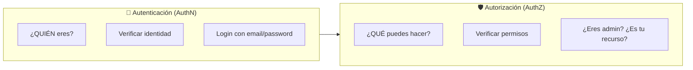
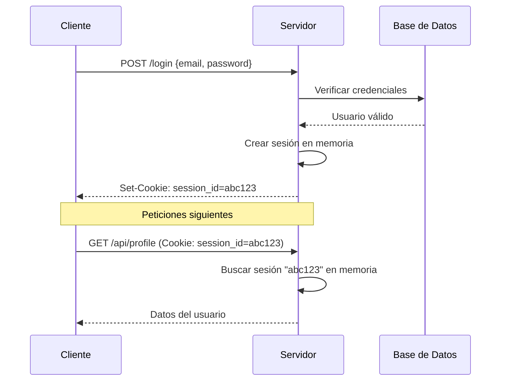
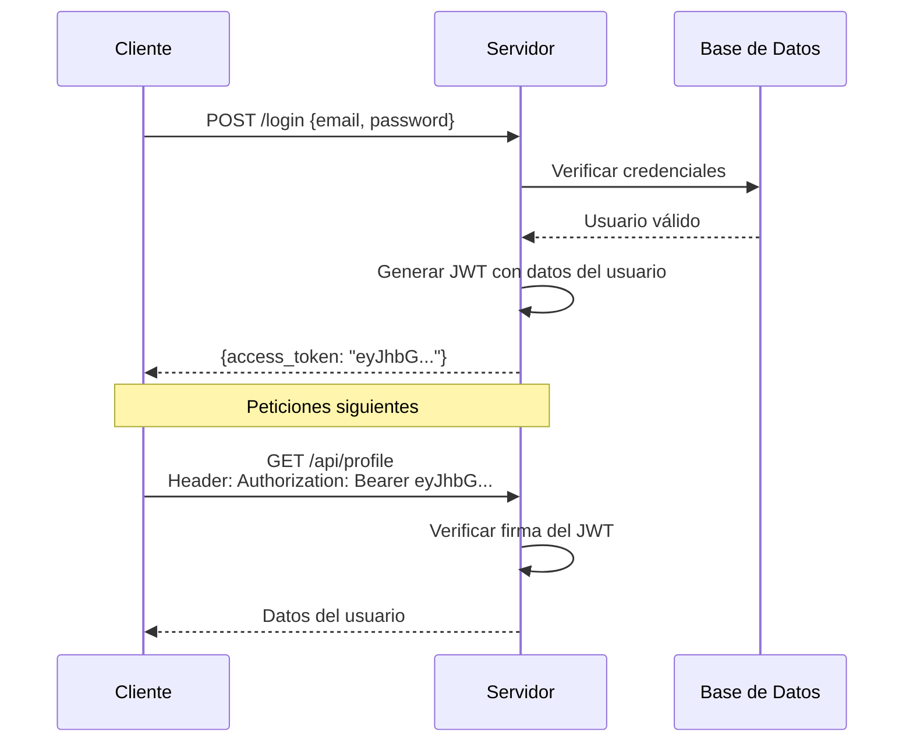
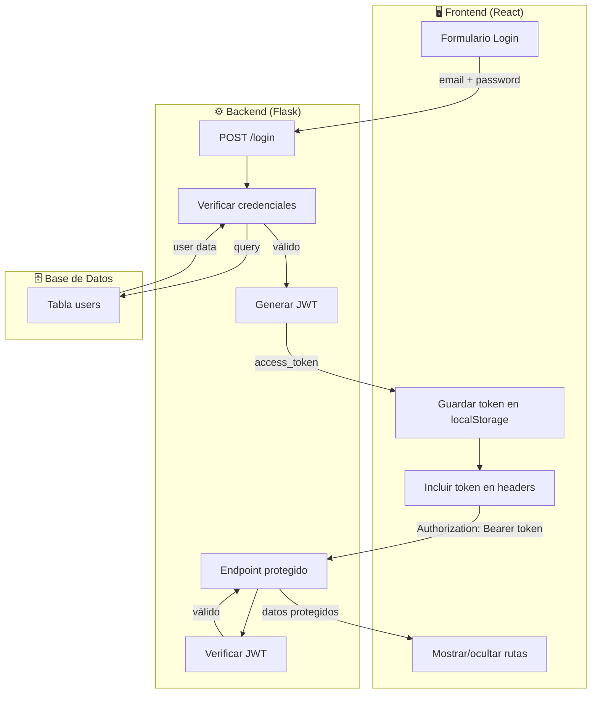
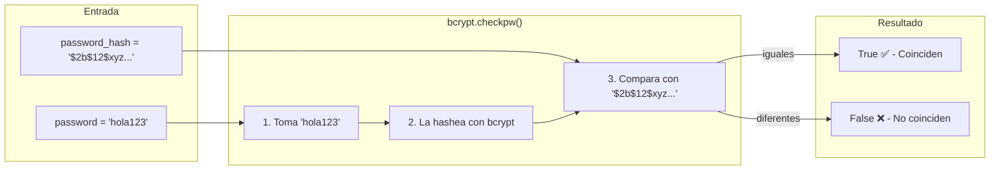

# Step 0: Conceptos de Autenticación

## 🎯 Objetivo

Entender **por qué** necesitamos autenticación, **qué problema resuelve**, y la diferencia entre autenticación y autorización.

---

## 🤔 El Problema: ¿Por qué proteger endpoints?

Imagina que tienes una API con estos endpoints:

```
GET  /api/users          → Lista todos los usuarios
GET  /api/users/5        → Datos del usuario 5
PUT  /api/users/5        → Modificar usuario 5
DELETE /api/users/5      → Eliminar usuario 5
```

### Sin protección

Cualquier persona que conozca la URL puede:

- Ver datos de TODOS los usuarios
- Modificar datos de CUALQUIER usuario
- Eliminar usuarios

**Esto es un desastre de seguridad.**

### Con protección

- Solo usuarios **autenticados** pueden acceder
- Un usuario solo puede modificar **sus propios datos**
- Solo **administradores** pueden eliminar usuarios

---

## 🔑 Autenticación vs Autorización

Estos dos conceptos se confunden frecuentemente:



| Concepto          | Pregunta           | Ejemplo                            |
| ----------------- | ------------------ | ---------------------------------- |
| **Autenticación** | ¿Quién eres?       | Login con email y contraseña       |
| **Autorización**  | ¿Qué puedes hacer? | Solo admins pueden borrar usuarios |

> 💡 **Primero autenticas** (verificas quién es), **luego autorizas** (verificas qué puede hacer).

---

## 📜 Breve historia: De sesiones a tokens

A lo largo de los años, la forma en que las aplicaciones web identifican a sus usuarios ha evolucionado significativamente. Entender esta evolución te ayudará a comprender por qué JWT es la solución preferida hoy en día.

### Era 1: Sesiones en el servidor (stateful)

En los primeros días de las aplicaciones web, el enfoque más común era usar **sesiones del lado del servidor**.

#### ¿Qué es una sesión del lado del servidor?

Una **sesión** es simplemente un **registro temporal** que el servidor crea para "recordar" que un usuario específico está autenticado. Piénsalo como una entrada en una lista:

```
Sesiones activas en memoria del servidor:
┌─────────────┬──────────┬─────────────────────┐
│ session_id  │ user_id  │ created_at          │
├─────────────┼──────────┼─────────────────────┤
│ abc123      │ 5        │ 2024-03-08 10:30:00 │
│ xyz789      │ 12       │ 2024-03-08 10:45:00 │
│ def456      │ 3        │ 2024-03-08 11:00:00 │
└─────────────┴──────────┴─────────────────────┘
```

Cuando decimos "del lado del servidor" significa que **esta información vive en el servidor**, no en el navegador del usuario. El navegador solo conoce su `session_id` (por ejemplo, `abc123`), pero no sabe qué significa — es el servidor quien traduce ese ID a "este es el usuario 5".

#### Analogía: El guardarropa de una discoteca

Imagina que vas a una discoteca y dejas tu abrigo en el guardarropa:

1. **Entregas tu abrigo** (haces login con tus credenciales)
2. **El guardarropa guarda tu abrigo** y te da un **ticket con un número** (el servidor crea una sesión y te da un `session_id`)
3. **Tú solo tienes el ticket** — no el abrigo (tu navegador solo tiene el `session_id`)
4. **Cuando vuelves**, muestras el ticket y **el guardarropa busca tu abrigo** (el servidor busca tu sesión en memoria)

El problema es que el guardarropa tiene que **mantener todos los abrigos organizados**. Si hay 10,000 personas, necesita mucho espacio y organización.

#### El proceso detallado

1. **El usuario hace login** enviando sus credenciales (email y contraseña) al servidor
2. **El servidor verifica** las credenciales contra la base de datos
3. **Si son correctas**, el servidor crea una "sesión" — un registro en memoria o en una base de datos que dice "este usuario está autenticado"
4. **El servidor envía una cookie** al navegador con un `session_id` único (por ejemplo, `abc123`)
5. **En cada petición futura**, el navegador envía automáticamente esa cookie
6. **El servidor busca** el `session_id` en su memoria para saber quién es el usuario

Este enfoque se llama **"stateful"** porque el servidor debe **recordar** (mantener estado de) todas las sesiones activas.



#### Problemas de las sesiones tradicionales

Este enfoque funcionaba bien para aplicaciones pequeñas, pero presenta varios problemas cuando la aplicación crece:

| Problema                     | Explicación                                                                                                                                                                                                  |
| ---------------------------- | ------------------------------------------------------------------------------------------------------------------------------------------------------------------------------------------------------------ |
| **Consumo de memoria**       | El servidor debe guardar TODAS las sesiones activas en memoria. Si tienes 100,000 usuarios conectados, son 100,000 registros de sesión                                                                       |
| **Escalabilidad horizontal** | Si tienes múltiples servidores (para manejar más tráfico), ¿cómo comparten las sesiones? El usuario podría hacer login en el servidor A, pero su siguiente petición ir al servidor B que no conoce su sesión |
| **Complejidad**              | Necesitas soluciones adicionales como Redis o bases de datos de sesiones compartidas                                                                                                                         |

### Era 2: Tokens (stateless) — JWT

La solución moderna es usar **tokens auto-contenidos** como JWT. La diferencia fundamental es que el servidor **no guarda ningún estado**.

#### ¿Qué significa "auto-contenido"?

Un token **auto-contenido** es aquel que **lleva toda la información necesaria dentro de sí mismo**. No es solo un identificador que apunta a datos guardados en otro lugar — ES los datos.

Comparemos:

| Sesión tradicional                                         | Token auto-contenido (JWT)                                                          |
| ---------------------------------------------------------- | ----------------------------------------------------------------------------------- |
| `session_id: abc123`                                       | `eyJhbGciOiJIUzI1NiJ9.eyJ1c2VyX2lkIjo1LCJlbWFpbCI6Imx1aXNAZXhhbXBsZS5jb20ifQ.firma` |
| Solo un ID — necesitas buscar en el servidor qué significa | Contiene: `{user_id: 5, email: "luis@example.com"}` + firma                         |
| El servidor DEBE consultar su memoria                      | El servidor solo verifica la firma                                                  |

**Analogía: Carnet de identidad vs número de registro**

- **Sesión tradicional**: Es como tener un número de registro (ej: `12345`). Para saber quién eres, alguien tiene que ir a una oficina y buscar ese número en un archivo.

- **Token auto-contenido**: Es como tu carnet de identidad. Tu nombre, foto y datos están **impresos directamente en el carnet**. Cualquiera puede leerlos sin consultar ninguna base de datos. La firma/sello oficial garantiza que es auténtico.

```
Token JWT decodificado:
┌────────────────────────────────────────┐
│ Header:  { "alg": "HS256" }            │  ← Cómo está firmado
├────────────────────────────────────────┤
│ Payload: {                             │
│   "user_id": 5,                        │  ← Datos del usuario
│   "email": "luis@example.com",         │     (auto-contenido)
│   "exp": 1709917200                    │
│ }                                      │
├────────────────────────────────────────┤
│ Signature: HMACSHA256(header.payload,  │  ← Garantiza autenticidad
│            SECRET_KEY)                 │
└────────────────────────────────────────┘
```

#### ¿Qué significa "stateless"?

**Stateless** (sin estado) significa que el servidor **no necesita recordar nada** entre peticiones. Cada petición es independiente y contiene toda la información necesaria.

| Stateful (con estado)                       | Stateless (sin estado)                          |
| ------------------------------------------- | ----------------------------------------------- |
| El servidor recuerda quién está autenticado | El servidor no recuerda nada                    |
| Necesita memoria/base de datos de sesiones  | No necesita almacenamiento de sesiones          |
| "Te conozco porque guardé tu sesión"        | "Te conozco porque tu token me dice quién eres" |

**Analogía: Recepcionista con memoria vs sin memoria**

Imagina dos recepcionistas en un edificio:

- **Recepcionista stateful**: Recuerda la cara de todos los que entraron. "¡Hola Luis, bienvenido de nuevo!" Pero si hay 10,000 visitantes, su memoria se agota. Y si hay dos recepcionistas (dos servidores), tienen que compartir sus memorias.

- **Recepcionista stateless**: No recuerda a nadie, pero cada visitante lleva un **gafete con su nombre y firma del jefe**. El recepcionista solo verifica que la firma sea auténtica. No necesita recordar nada — cada interacción es independiente.

#### ¿Por qué stateless es mejor para aplicaciones modernas?

```
Escenario stateful (sesiones):
┌─────────┐    ┌─────────┐    ┌─────────┐
│Servidor1│    │Servidor2│    │Servidor3│
│ sesión  │    │ ¿sesión?│    │ ¿sesión?│
│  abc123 │    │   ???   │    │   ???   │
└─────────┘    └─────────┘    └─────────┘
     ↑              ↑              ↑
     └──────────────┴──────────────┘
          Usuario con session_id=abc123
          ¿A qué servidor va? Solo el 1 lo conoce!

Escenario stateless (JWT):
┌─────────┐    ┌─────────┐    ┌─────────┐
│Servidor1│    │Servidor2│    │Servidor3│
│SECRET_KEY    │SECRET_KEY    │SECRET_KEY
└─────────┘    └─────────┘    └─────────┘
     ↑              ↑              ↑
     └──────────────┴──────────────┘
          Usuario con JWT
          ¡Cualquier servidor puede validarlo!
```

#### El proceso detallado

1. **El usuario hace login** enviando sus credenciales al servidor
2. **El servidor verifica** las credenciales contra la base de datos
3. **Si son correctas**, el servidor **genera un JWT** — un token que contiene información del usuario (ID, email, etc.) y está **firmado criptográficamente**
4. **El servidor envía el JWT** al cliente (no como cookie, sino en el body de la respuesta)
5. **El cliente guarda el JWT** (típicamente en localStorage o en memoria)
6. **En cada petición futura**, el cliente envía el JWT en el header `Authorization`
7. **El servidor verifica la firma** del JWT. Si es válida, confía en los datos del token — **sin consultar ninguna base de datos de sesiones**



#### Ventajas de JWT

| Ventaja                       | Explicación                                                                       |
| ----------------------------- | --------------------------------------------------------------------------------- |
| **Sin estado en el servidor** | El servidor no guarda sesiones — solo verifica la firma del token                 |
| **Escalabilidad fácil**       | Cualquier servidor puede verificar el token, porque todos conocen la `SECRET_KEY` |
| **Perfecto para APIs**        | Los tokens se envían en headers HTTP, ideal para REST APIs                        |
| **Ideal para SPAs**           | El frontend (React, Vue, etc.) controla cuándo y cómo enviar el token             |
| **Microservicios**            | El mismo token puede validarse en múltiples servicios                             |

---

## 🎯 ¿Qué problema resuelve JWT?

| Problema                        | Solución con JWT                                   |
| ------------------------------- | -------------------------------------------------- |
| Servidor sin estado (stateless) | El token contiene toda la info necesaria           |
| Múltiples servidores            | Cualquier servidor puede verificar el token        |
| APIs RESTful                    | Tokens se envían en headers, no cookies            |
| Single Page Applications        | El frontend maneja el token en localStorage/memory |
| Microservicios                  | Tokens se pueden pasar entre servicios             |

---

## 🔄 Flujo completo de autenticación con JWT

Ahora que entiendes la diferencia entre sesiones y tokens, veamos cómo funciona el flujo completo en una aplicación moderna con React (frontend) y Flask (backend):



---

## 🛡️ Los 3 pilares de seguridad en APIs

### 1. Autenticación (Authentication)

Verificar la identidad del usuario.

```python
# Flask: Verificar email y password
user = User.query.filter_by(email=email).first()
if user and bcrypt.checkpw(password, user.password_hash):
    # Usuario autenticado
```

#### ¿Qué hace `bcrypt.checkpw()`?

`checkpw` significa **"check password"** (verificar contraseña). Esta función compara una contraseña en texto plano con un hash guardado.

```python
bcrypt.checkpw(password, user.password_hash)
#              ^^^^^^^^  ^^^^^^^^^^^^^^^^^^
#              Lo que el usuario escribió    Lo que está guardado en la DB
#              (texto plano)                 (hash)
```

**¿Cómo funciona por dentro?**



**Analogía**: Es como comparar huellas dactilares. No puedes "reconstruir" el dedo desde la huella, pero puedes comparar si dos huellas son iguales.

---

### 2. Autorización (Authorization)

Verificar que el usuario tiene permiso para la acción.

```python
# Flask: Solo el usuario puede editar su perfil
@jwt_required()
def update_profile(user_id):
    current_user_id = get_jwt_identity()
    if current_user_id != user_id:
        return {"error": "No autorizado"}, 403
```

### 3. Protección de datos (Data Protection)

Nunca exponer datos sensibles.

```python
# ❌ MAL: Exponer password hash
return {"id": user.id, "password": user.password_hash}

# ✅ BIEN: Solo datos públicos
return {"id": user.id, "username": user.username}
```

---

## 📋 Resumen

| Concepto          | Descripción                                 |
| ----------------- | ------------------------------------------- |
| **Autenticación** | Verificar quién es el usuario (login)       |
| **Autorización**  | Verificar qué puede hacer el usuario        |
| **Sesiones**      | Stateful, servidor guarda estado (antiguo)  |
| **JWT**           | Stateless, token auto-contenido (moderno)   |
| **Stateless**     | El servidor no guarda información de sesión |

---

## 🧪 Mini-reto: ¿Autenticación o Autorización?

Clasifica cada escenario. Las respuestas están al final.

| #   | Escenario                                                                    | ¿AuthN o AuthZ? |
| --- | ---------------------------------------------------------------------------- | --------------- |
| 1   | Un usuario ingresa su email y contraseña                                     | ?               |
| 2   | Verificar si un usuario es administrador antes de borrar un post             | ?               |
| 3   | Google te pregunta si quieres usar tu cuenta de Google para entrar a Spotify | ?               |
| 4   | Un estudiante intenta acceder a las notas de otro estudiante                 | ?               |
| 5   | Escanear tu huella dactilar para desbloquear el teléfono                     | ?               |
| 6   | Netflix verifica si tu plan incluye 4K antes de mostrarte esa opción         | ?               |

<details>
<summary>Ver respuestas</summary>

| #   | Escenario                 | Respuesta                                                    |
| --- | ------------------------- | ------------------------------------------------------------ |
| 1   | Ingresar email/contraseña | **Autenticación** — verificando identidad                    |
| 2   | Verificar si es admin     | **Autorización** — verificando permisos                      |
| 3   | Login con Google          | **Autenticación** — verificando identidad                    |
| 4   | Acceder a notas de otro   | **Autorización** — ¿tiene permiso para ese recurso?          |
| 5   | Huella dactilar           | **Autenticación** — verificando identidad biométrica         |
| 6   | Verificar plan Netflix    | **Autorización** — verificando qué features tiene permitidas |

</details>

---

## ✅ Checklist de este step

- [ ] Entiendo por qué necesitamos proteger endpoints
- [ ] Sé la diferencia entre autenticación y autorización
- [ ] Entiendo las ventajas de JWT sobre sesiones tradicionales
- [ ] Puedo explicar el flujo básico: login → token → request protegido
