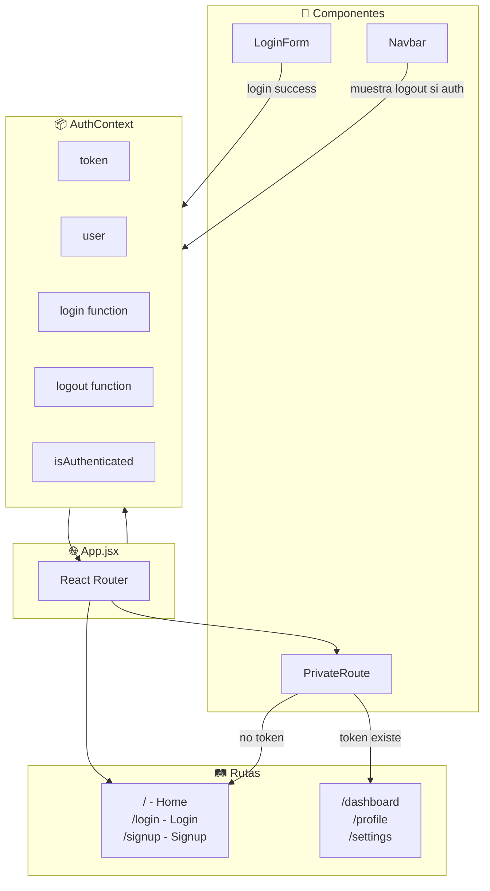
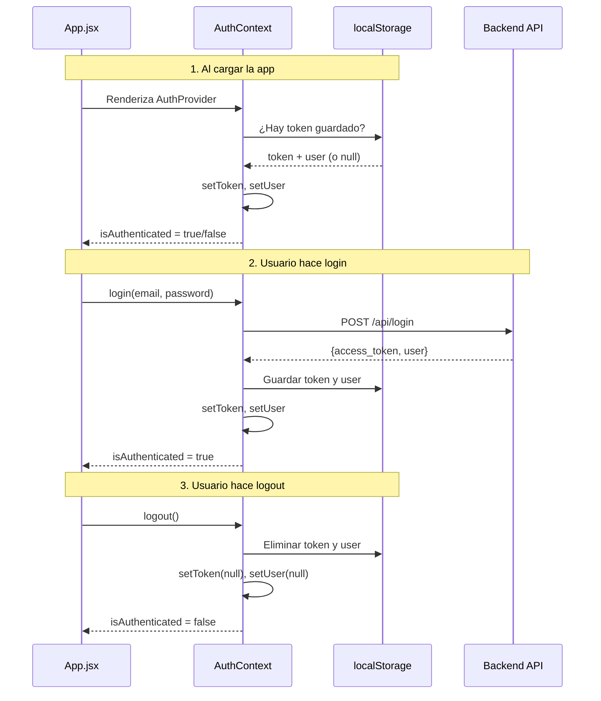
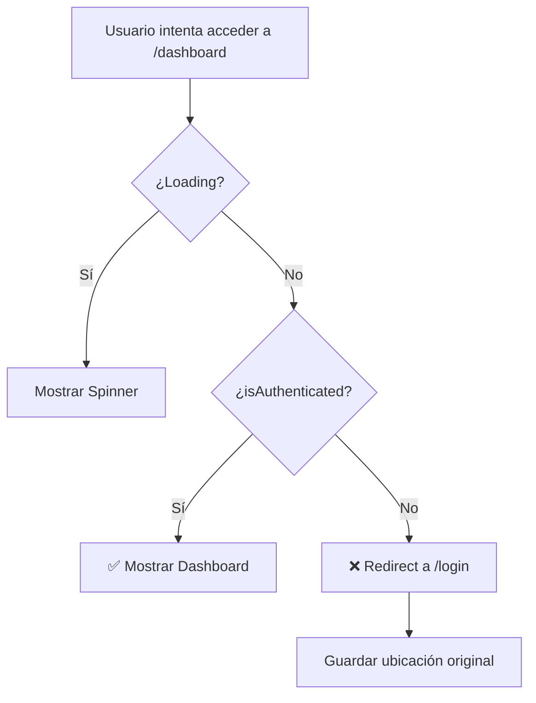
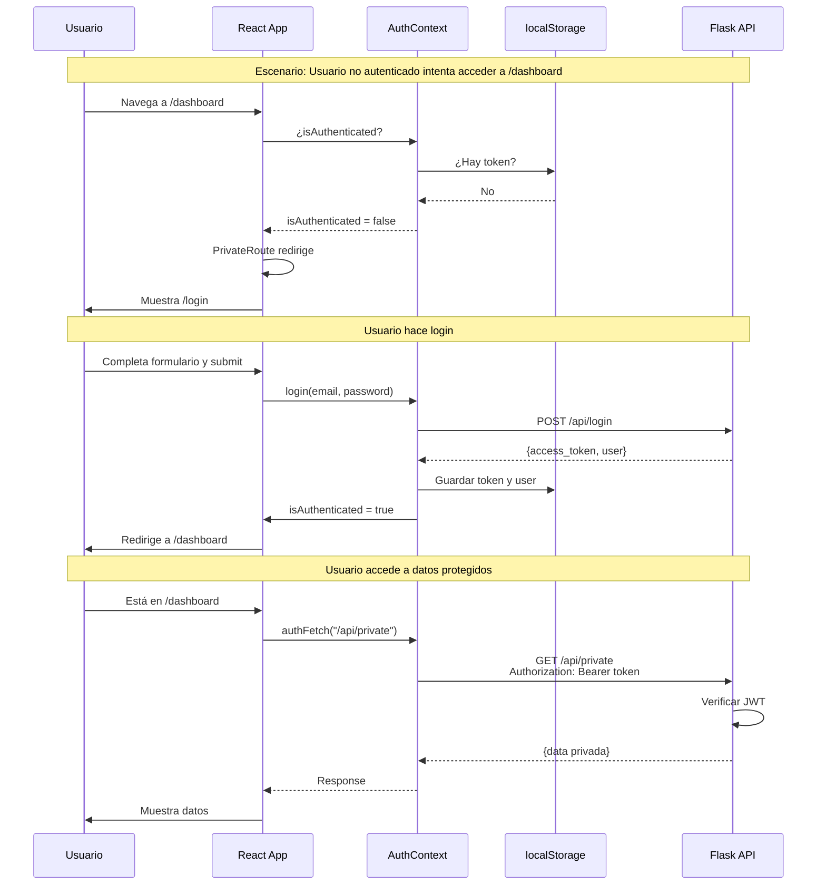

# Step 3: Rutas Protegidas en React

## 🎯 Objetivo

Implementar autenticación en el frontend React:

- Guardar y gestionar el JWT
- Crear un contexto de autenticación
- Proteger rutas que requieren login
- Redirigir usuarios no autenticados

---

## 🗺️ Mapa de componentes



---

## 1️⃣ Estructura del proyecto

```
src/
├── App.jsx
├── main.jsx
├── context/
│   └── AuthContext.jsx       # Estado global de auth
├── components/
│   ├── PrivateRoute.jsx      # Wrapper para rutas protegidas
│   ├── Navbar.jsx
│   └── ...
└── pages/
    ├── Home.jsx              # Pública
    ├── Login.jsx             # Pública
    ├── Signup.jsx            # Pública
    ├── Dashboard.jsx         # 🔒 Protegida
    └── Profile.jsx           # 🔒 Protegida
```

---

## 2️⃣ AuthContext: Estado global de autenticación

### `src/context/AuthContext.jsx`

```jsx
import { createContext, useContext, useState, useEffect } from 'react';

// 1. Crear el contexto
const AuthContext = createContext(null);

// 2. Custom hook para usar el contexto
export const useAuth = () => {
  const context = useContext(AuthContext);
  if (!context) {
    throw new Error('useAuth debe usarse dentro de AuthProvider');
  }
  return context;
};

// 3. Provider que envuelve la app
export const AuthProvider = ({ children }) => {
  const [token, setToken] = useState(null);
  const [user, setUser] = useState(null);
  const [loading, setLoading] = useState(true);

  // Al cargar, verificar si hay token guardado
  useEffect(() => {
    const storedToken = localStorage.getItem('token');
    const storedUser = localStorage.getItem('user');

    if (storedToken && storedUser) {
      setToken(storedToken);
      setUser(JSON.parse(storedUser));
    }
    setLoading(false);
  }, []);

  // Función login
  const login = async (email, password) => {
    const response = await fetch('http://localhost:5000/api/login', {
      method: 'POST',
      headers: {
        'Content-Type': 'application/json',
      },
      body: JSON.stringify({ email, password }),
    });

    const data = await response.json();

    if (!response.ok) {
      throw new Error(data.error || 'Error de login');
    }

    // Guardar en estado y localStorage
    setToken(data.access_token);
    setUser(data.user);
    localStorage.setItem('token', data.access_token);
    localStorage.setItem('user', JSON.stringify(data.user));

    return data;
  };

  // Función logout
  const logout = () => {
    setToken(null);
    setUser(null);
    localStorage.removeItem('token');
    localStorage.removeItem('user');
  };

  // Función para hacer requests autenticadas
  const authFetch = async (url, options = {}) => {
    const headers = {
      ...options.headers,
      Authorization: `Bearer ${token}`,
    };

    const response = await fetch(url, { ...options, headers });

    // Si el token expiró, hacer logout
    if (response.status === 401) {
      logout();
      throw new Error('Sesión expirada');
    }

    return response;
  };

  const value = {
    token,
    user,
    loading,
    isAuthenticated: !!token,
    login,
    logout,
    authFetch,
  };

  return <AuthContext.Provider value={value}>{children}</AuthContext.Provider>;
};

export default AuthContext;
```

### Flujo del AuthContext



---

## 3️⃣ PrivateRoute: Proteger rutas

### `src/components/PrivateRoute.jsx`

```jsx
import { Navigate, useLocation } from 'react-router-dom';
import { useAuth } from '../context/AuthContext';

const PrivateRoute = ({ children }) => {
  const { isAuthenticated, loading } = useAuth();
  const location = useLocation();

  // Mientras carga, mostrar spinner o null
  if (loading) {
    return <div>Cargando...</div>;
  }

  // Si no está autenticado, redirigir a login
  if (!isAuthenticated) {
    // Guardamos la ubicación actual para redirigir después del login
    return <Navigate to="/login" state={{ from: location }} replace />;
  }

  // Si está autenticado, mostrar el contenido
  return children;
};

export default PrivateRoute;
```

### Diagrama de decisión



---

## 4️⃣ Configurar rutas en App.jsx

### `src/App.jsx`

```jsx
import { BrowserRouter, Routes, Route } from 'react-router-dom';
import { AuthProvider } from './context/AuthContext';
import PrivateRoute from './components/PrivateRoute';
import Navbar from './components/Navbar';

// Páginas públicas
import Home from './pages/Home';
import Login from './pages/Login';
import Signup from './pages/Signup';

// Páginas protegidas
import Dashboard from './pages/Dashboard';
import Profile from './pages/Profile';

function App() {
  return (
    <AuthProvider>
      <BrowserRouter>
        <Navbar />
        <Routes>
          {/* Rutas públicas */}
          <Route path="/" element={<Home />} />
          <Route path="/login" element={<Login />} />
          <Route path="/signup" element={<Signup />} />

          {/* Rutas protegidas */}
          <Route
            path="/dashboard"
            element={
              <PrivateRoute>
                <Dashboard />
              </PrivateRoute>
            }
          />
          <Route
            path="/profile"
            element={
              <PrivateRoute>
                <Profile />
              </PrivateRoute>
            }
          />
        </Routes>
      </BrowserRouter>
    </AuthProvider>
  );
}

export default App;
```

---

## 5️⃣ Página de Login

### `src/pages/Login.jsx`

```jsx
import { useState } from 'react';
import { useNavigate, useLocation, Link } from 'react-router-dom';
import { useAuth } from '../context/AuthContext';

const Login = () => {
  const [email, setEmail] = useState('');
  const [password, setPassword] = useState('');
  const [error, setError] = useState('');
  const [loading, setLoading] = useState(false);

  const { login, isAuthenticated } = useAuth();
  const navigate = useNavigate();
  const location = useLocation();

  // Si ya está autenticado, redirigir
  if (isAuthenticated) {
    const from = location.state?.from?.pathname || '/dashboard';
    navigate(from, { replace: true });
    return null;
  }

  const handleSubmit = async (e) => {
    e.preventDefault();
    setError('');
    setLoading(true);

    try {
      await login(email, password);

      // Redirigir a donde venía o al dashboard
      const from = location.state?.from?.pathname || '/dashboard';
      navigate(from, { replace: true });
    } catch (err) {
      setError(err.message);
    } finally {
      setLoading(false);
    }
  };

  return (
    <div className="login-container">
      <h1>Iniciar Sesión</h1>

      {error && <div className="error-message">{error}</div>}

      <form onSubmit={handleSubmit}>
        <div>
          <label htmlFor="email">Email:</label>
          <input
            id="email"
            type="email"
            value={email}
            onChange={(e) => setEmail(e.target.value)}
            required
            disabled={loading}
          />
        </div>

        <div>
          <label htmlFor="password">Contraseña:</label>
          <input
            id="password"
            type="password"
            value={password}
            onChange={(e) => setPassword(e.target.value)}
            required
            disabled={loading}
          />
        </div>

        <button type="submit" disabled={loading}>
          {loading ? 'Cargando...' : 'Entrar'}
        </button>
      </form>

      <p>
        ¿No tienes cuenta? <Link to="/signup">Regístrate</Link>
      </p>
    </div>
  );
};

export default Login;
```

---

## 6️⃣ Navbar con estado de auth

### `src/components/Navbar.jsx`

```jsx
import { Link, useNavigate } from 'react-router-dom';
import { useAuth } from '../context/AuthContext';

const Navbar = () => {
  const { isAuthenticated, user, logout } = useAuth();
  const navigate = useNavigate();

  const handleLogout = () => {
    logout();
    navigate('/');
  };

  return (
    <nav className="navbar">
      <Link to="/" className="logo">
        Mi App
      </Link>

      <div className="nav-links">
        {isAuthenticated ? (
          // Usuario autenticado
          <>
            <span>Hola, {user?.username}</span>
            <Link to="/dashboard">Dashboard</Link>
            <Link to="/profile">Perfil</Link>
            <button onClick={handleLogout}>Cerrar Sesión</button>
          </>
        ) : (
          // Usuario no autenticado
          <>
            <Link to="/login">Iniciar Sesión</Link>
            <Link to="/signup">Registrarse</Link>
          </>
        )}
      </div>
    </nav>
  );
};

export default Navbar;
```

---

## 7️⃣ Página protegida con fetch autenticado

### `src/pages/Dashboard.jsx`

```jsx
import { useState, useEffect } from 'react';
import { useAuth } from '../context/AuthContext';

const Dashboard = () => {
  const { user, authFetch } = useAuth();
  const [data, setData] = useState(null);
  const [error, setError] = useState('');
  const [loading, setLoading] = useState(true);

  useEffect(() => {
    const fetchPrivateData = async () => {
      try {
        // authFetch incluye automáticamente el token
        const response = await authFetch('http://localhost:5000/api/private');
        const result = await response.json();

        if (!response.ok) {
          throw new Error(result.error);
        }

        setData(result);
      } catch (err) {
        setError(err.message);
      } finally {
        setLoading(false);
      }
    };

    fetchPrivateData();
  }, [authFetch]);

  if (loading) return <div>Cargando...</div>;
  if (error) return <div className="error">Error: {error}</div>;

  return (
    <div className="dashboard">
      <h1>Dashboard</h1>
      <p>Bienvenido, {user?.username}!</p>

      <div className="private-data">
        <h2>Datos privados del servidor:</h2>
        <pre>{JSON.stringify(data, null, 2)}</pre>
      </div>
    </div>
  );
};

export default Dashboard;
```

---

## 8️⃣ Flujo completo visualizado



---

## 🔐 Consideraciones de seguridad

### ¿Dónde guardar el token?

| Opción              | Pros                           | Contras                     |
| ------------------- | ------------------------------ | --------------------------- |
| **localStorage**    | Fácil, persiste                | Vulnerable a XSS            |
| **sessionStorage**  | Más seguro, se borra al cerrar | No persiste entre tabs      |
| **Memory (estado)** | Más seguro                     | Se pierde al refrescar      |
| **HttpOnly Cookie** | Más seguro                     | Requiere configuración CORS |

> 💡 Para apps de aprendizaje, `localStorage` está bien. Para producción, considera cookies HttpOnly.

### Protección XSS básica

```jsx
// ❌ NUNCA renderizar HTML del usuario sin sanitizar
<div dangerouslySetInnerHTML={{ __html: userData }} />

// ✅ React escapa automáticamente
<div>{userData}</div>
```

---

## ✅ Checklist de este step

- [ ] Creé un AuthContext con login, logout, token, user
- [ ] El token se guarda en localStorage al hacer login
- [ ] Creé un componente PrivateRoute que redirige si no hay token
- [ ] Mis rutas protegidas están envueltas en PrivateRoute
- [ ] El Navbar muestra opciones diferentes según isAuthenticated
- [ ] Tengo una función authFetch que incluye el token automáticamente
- [ ] El login redirige a la página que el usuario intentaba visitar
