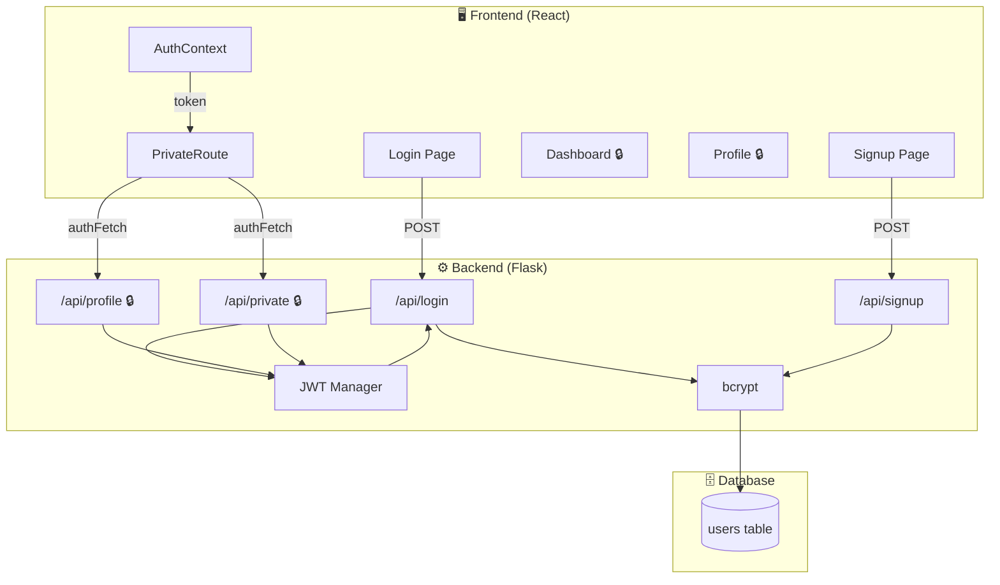
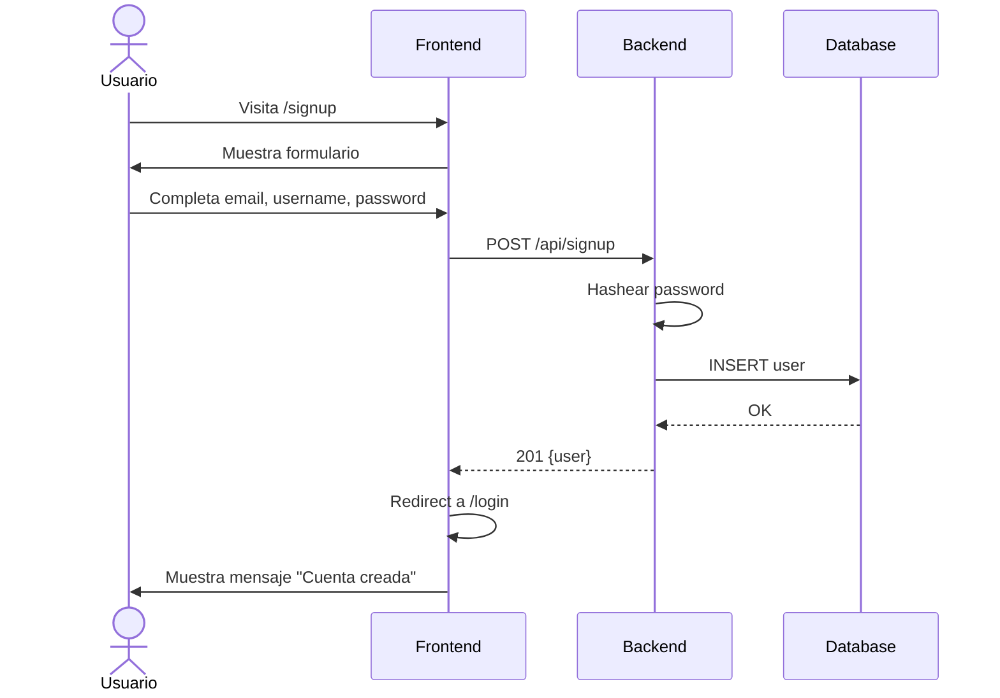
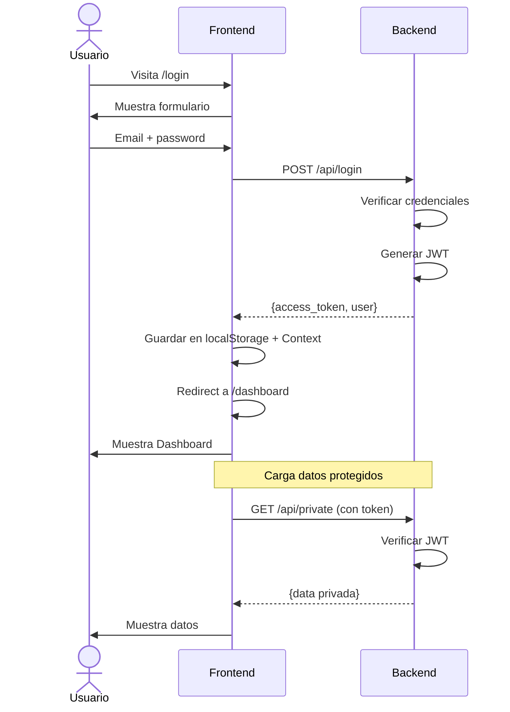
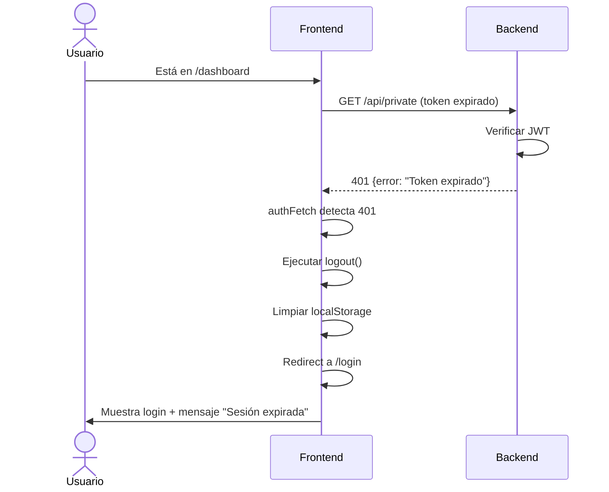

# Step 4: Flujo Completo — Full Stack Auth

## 🎯 Objetivo

Integrar **frontend (React) + backend (Flask)** para tener un sistema de autenticación completo funcionando. Este step es una guía práctica de implementación paso a paso.

---

## 🗺️ Arquitectura completa



---

## 📋 Checklist de implementación

Usa esta lista como guía para implementar auth en tu proyecto:

### Backend (Flask)

- [ ] 1. Instalar dependencias
- [ ] 2. Configurar Flask-JWT-Extended
- [ ] 3. Crear modelo User con bcrypt
- [ ] 4. Crear endpoint `/api/signup`
- [ ] 5. Crear endpoint `/api/login`
- [ ] 6. Crear endpoints protegidos
- [ ] 7. Configurar CORS
- [ ] 8. Probar con cURL/Postman

### Frontend (React)

- [ ] 9. Crear AuthContext
- [ ] 10. Crear PrivateRoute
- [ ] 11. Configurar rutas en App.jsx
- [ ] 12. Crear página Login
- [ ] 13. Crear página Signup
- [ ] 14. Actualizar Navbar
- [ ] 15. Crear página protegida (Dashboard)
- [ ] 16. Probar flujo completo

---

## 🔧 Paso a paso detallado

### Paso 1: Backend - Instalar dependencias

```bash
cd backend
pip install flask flask-sqlalchemy flask-jwt-extended flask-cors bcrypt python-dotenv
pip freeze > requirements.txt
```

### Paso 2: Backend - Configurar app

```python
# app.py
import os
from datetime import timedelta
from flask import Flask
from flask_sqlalchemy import SQLAlchemy
from flask_jwt_extended import JWTManager
from flask_cors import CORS
from dotenv import load_dotenv

load_dotenv()

app = Flask(__name__)

# CORS - permitir requests del frontend
CORS(app, origins=["http://localhost:5173"])  # Puerto de Vite

# Configuración
app.config["SQLALCHEMY_DATABASE_URI"] = os.getenv("DATABASE_URL", "sqlite:///app.db")
app.config["JWT_SECRET_KEY"] = os.getenv("JWT_SECRET_KEY", "dev-secret")
app.config["JWT_ACCESS_TOKEN_EXPIRES"] = timedelta(hours=1)

db = SQLAlchemy(app)
jwt = JWTManager(app)
```

### Paso 3-6: Backend - Modelo y endpoints

Ver [step2-jwt-flask-backend](../step2-jwt-flask-backend/README.md) para el código completo.

### Paso 7: Backend - CORS detallado

```python
from flask_cors import CORS

# Opción simple
CORS(app)

# Opción específica (recomendada)
CORS(app,
     origins=["http://localhost:5173"],  # Tu frontend
     methods=["GET", "POST", "PUT", "DELETE"],
     allow_headers=["Content-Type", "Authorization"])
```

### Paso 8: Backend - Probar endpoints

```bash
# Terminal 1: Iniciar servidor
flask run

# Terminal 2: Probar
# Signup
curl -X POST http://localhost:5000/api/signup \
  -H "Content-Type: application/json" \
  -d '{"email": "test@test.com", "username": "test", "password": "test123"}'

# Login
curl -X POST http://localhost:5000/api/login \
  -H "Content-Type: application/json" \
  -d '{"email": "test@test.com", "password": "test123"}'

# Copiar el access_token y probar endpoint protegido
curl http://localhost:5000/api/profile \
  -H "Authorization: Bearer TU_TOKEN_AQUI"
```

---

### Paso 9-15: Frontend

Ver [step3-rutas-protegidas-react](../step3-rutas-protegidas-react/README.md) para el código completo.

---

## 🧪 Probando el flujo completo

### Escenario 1: Usuario nuevo



### Escenario 2: Login y acceso a dashboard



### Escenario 3: Token expirado



---

## 🛠️ Debugging común

### Error: CORS

**Síntoma**: El frontend no puede conectar con el backend

```
Access to fetch at 'http://localhost:5000/api/login' from origin
'http://localhost:5173' has been blocked by CORS policy
```

**Solución**: Configurar CORS en Flask

```python
from flask_cors import CORS

CORS(app, origins=["http://localhost:5173"])
```

### Error: Token no se envía

**Síntoma**: Endpoints protegidos siempre devuelven 401

**Debug**: Verificar en el Network tab del browser

```
Request Headers:
Authorization: Bearer eyJhbG...  ← Debe estar presente
```

**Solución**: Verificar authFetch incluye el header

```javascript
const authFetch = async (url, options = {}) => {
  const headers = {
    ...options.headers,
    Authorization: `Bearer ${token}`, // ← ¿token está definido?
  };
  // ...
};
```

### Error: Token no persiste al refrescar

**Síntoma**: Al refrescar la página, el usuario se desloguea

**Solución**: Verificar que se lee de localStorage al iniciar

```javascript
useEffect(() => {
  const storedToken = localStorage.getItem('token');
  if (storedToken) {
    setToken(storedToken);
  }
  setLoading(false); // ← Importante: marcar que terminó de cargar
}, []);
```

### Error: Redirect infinito en PrivateRoute

**Síntoma**: La página se queda cargando o hay loop de redirects

**Solución**: Verificar el estado `loading`

```jsx
const PrivateRoute = ({ children }) => {
  const { isAuthenticated, loading } = useAuth();

  // ← Mientras carga, no hacer nada
  if (loading) {
    return <div>Cargando...</div>;
  }

  if (!isAuthenticated) {
    return <Navigate to="/login" />;
  }

  return children;
};
```

---

## 📊 Resumen de endpoints

| Método | Endpoint       | Auth | Descripción                   |
| ------ | -------------- | ---- | ----------------------------- |
| POST   | `/api/signup`  | ❌   | Crear nuevo usuario           |
| POST   | `/api/login`   | ❌   | Obtener JWT                   |
| GET    | `/api/profile` | ✅   | Ver perfil del usuario actual |
| PUT    | `/api/profile` | ✅   | Actualizar perfil             |
| GET    | `/api/private` | ✅   | Endpoint de prueba protegido  |

---

## 📁 Estructura final del proyecto

```
project/
├── backend/
│   ├── app.py                # Flask app principal
│   ├── models.py             # Modelo User
│   ├── requirements.txt
│   ├── .env                  # JWT_SECRET_KEY, DATABASE_URL
│   └── instance/
│       └── app.db            # SQLite database
│
└── frontend/
    ├── src/
    │   ├── App.jsx
    │   ├── main.jsx
    │   ├── context/
    │   │   └── AuthContext.jsx
    │   ├── components/
    │   │   ├── PrivateRoute.jsx
    │   │   └── Navbar.jsx
    │   └── pages/
    │       ├── Home.jsx
    │       ├── Login.jsx
    │       ├── Signup.jsx
    │       ├── Dashboard.jsx
    │       └── Profile.jsx
    ├── package.json
    └── vite.config.js
```

---

## 🚀 Comandos para ejecutar

### Terminal 1: Backend

```bash
cd backend
source .venv/bin/activate
flask run --debug
# Servidor en http://localhost:5000
```

### Terminal 2: Frontend

```bash
cd frontend
npm run dev
# Servidor en http://localhost:5173
```

### Terminal 3: Probar API

```bash
# Ver logs de requests en el terminal del backend
```

---

## ✅ Verificación final

Prueba estos escenarios para verificar que todo funciona:

| #   | Escenario                                | Resultado esperado                  |
| --- | ---------------------------------------- | ----------------------------------- |
| 1   | Visitar `/dashboard` sin login           | Redirect a `/login`                 |
| 2   | Crear cuenta en `/signup`                | Redirect a `/login` con mensaje     |
| 3   | Login con credenciales correctas         | Redirect a `/dashboard`             |
| 4   | Login con credenciales incorrectas       | Mensaje de error                    |
| 5   | Navbar muestra username después de login | ✅                                  |
| 6   | Acceder a `/profile` después de login    | Muestra datos del usuario           |
| 7   | Click en "Cerrar sesión"                 | Redirect a `/`, localStorage limpio |
| 8   | Refrescar página en `/dashboard`         | Sigue autenticado                   |
| 9   | Esperar a que expire el token            | Redirect a `/login`                 |

---

## 🎓 Mejoras opcionales

Una vez que el flujo básico funciona, considera añadir:

1. **Refresh tokens** — Para renovar el access token sin re-login
2. **Roles y permisos** — Admin vs user regular
3. **Verificación de email** — Enviar email de confirmación
4. **Reset de password** — "Olvidé mi contraseña"
5. **OAuth** — Login con Google/GitHub
6. **2FA** — Autenticación de dos factores

---

## ✅ Checklist de este step

- [ ] El backend tiene CORS configurado para el frontend
- [ ] Signup crea usuario y redirige a login
- [ ] Login guarda token y redirige a dashboard
- [ ] Las rutas protegidas muestran datos del backend
- [ ] Logout limpia el estado y redirige
- [ ] El estado persiste al refrescar la página
- [ ] Los errores se manejan correctamente (401, 400, etc.)
