[🇪🇸 Español](README.md) | 🇬🇧 **English**

# Step 3: Protected Routes in React

## 🎯 Goal

Implement authentication in the React frontend:

- Store and manage the JWT
- Create an authentication context
- Protect routes that require login
- Redirect unauthenticated users

---

## 🗺️ Component map

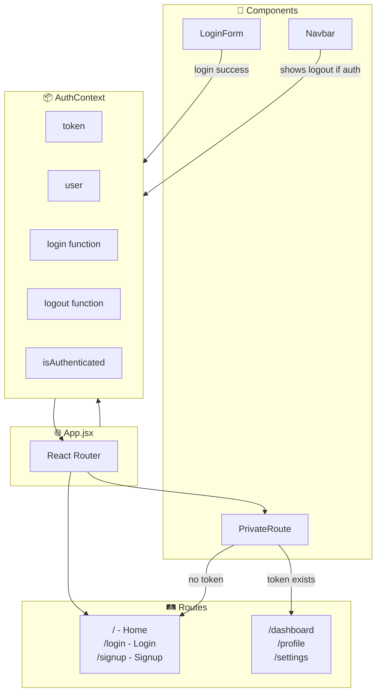

---

## 1️⃣ Project structure

```
src/
├── App.jsx
├── main.jsx
├── context/
│   └── AuthContext.jsx       # Global auth state
├── components/
│   ├── PrivateRoute.jsx      # Wrapper for protected routes
│   ├── Navbar.jsx
│   └── ...
└── pages/
    ├── Home.jsx              # Public
    ├── Login.jsx             # Public
    ├── Signup.jsx            # Public
    ├── Dashboard.jsx         # 🔒 Protected
    └── Profile.jsx           # 🔒 Protected
```

---

## 2️⃣ AuthContext: Global authentication state

### What is `createContext`?

`createContext` is a React function that creates a **global data container**. Think of it as a "magic box" that can be accessed from any component in your application, without manually passing props from parent to child.

```jsx
// Create the "box" (context)
const AuthContext = createContext(null);

// null is the default value if there is no Provider
```

#### What does the default value `null` mean?

The argument we pass to `createContext(null)` is the **fallback value** that is used when a component tries to read the context but is **not wrapped by a Provider**.

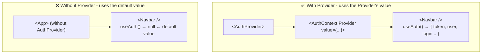

**Why `null` and not an empty object?**

We use `null` intentionally to **detect configuration errors**. In our custom hook `useAuth`:

```jsx
export const useAuth = () => {
  const context = useContext(AuthContext);

  // If context is null, it means there is no Provider
  if (!context) {
    throw new Error('useAuth must be used inside AuthProvider');
  }

  return context;
};
```

#### Line-by-line explanation of `useAuth`:

```jsx
export const useAuth = () => {
//     ↑               ↑
//     |               └── It's an arrow function
//     └── "export" allows importing it from other files
```

```jsx
const context = useContext(AuthContext);
//              ^^^^^^^^^^^^^^^^^^^^^^^^
//              useContext() reads the data from the nearest context
//              Returns whatever is in the Provider's "value"
```

```jsx
if (!context) {
  throw new Error('useAuth must be used inside AuthProvider');
}
// If context is null (because there is no Provider), we throw an error
// This helps detect bugs quickly
```

```jsx
return context;
// We return the data: { token, user, login, logout, ... }
```

**How is it used in practice?**

```jsx
// In any child component of AuthProvider:
const { token, user, login, logout } = useAuth();

// Now you can use:
console.log(user.email); // See user data
login(email, password);  // Log in
logout();                // Log out
```

---

This gives us a **clear error** in development if we forget to wrap our app with `<AuthProvider>`:

```
❌ Error: useAuth must be used inside AuthProvider
```

Instead of a confusing error like "Cannot read property 'token' of null".

| Default value     | Behavior if Provider is missing        |
| ----------------- | -------------------------------------- |
| `null`            | Explicit, easy-to-debug error          |
| `{}`              | Confusing errors: `undefined` in props |
| Complete object   | Works but with fake/empty data         |

**Why do we need it?** Without Context, we would have to pass `token`, `user`, `login`, `logout` as props through ALL intermediate components:

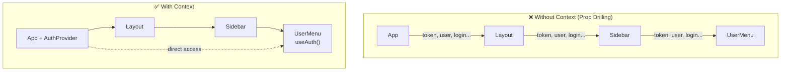

---

### The Provider + Consumer pattern

This is one of the most important patterns in modern React:

| Concept      | Analogy                            | Code                             |
| ------------ | ---------------------------------- | -------------------------------- |
| **Context**  | The "box" or container             | `createContext()`                |
| **Provider** | The one that "fills" the box with data | `<Context.Provider value={...}>` |
| **Consumer** | The one that "reads" the data from the box | `useContext()` or `useAuth()`    |

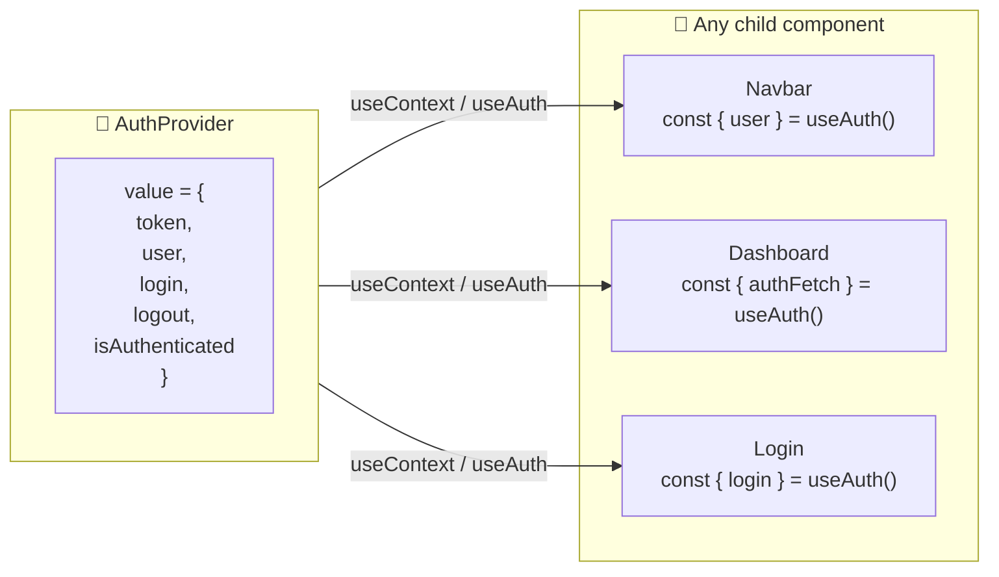

---

### What does `children` mean? — Mind map

The most important line in the pattern is:

```jsx
return <AuthContext.Provider value={value}>{children}</AuthContext.Provider>;
```

**`children`** is a special prop in React that represents **everything you place between the opening and closing tags** of a component:

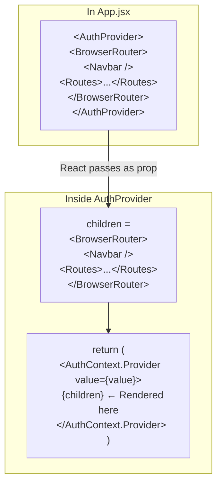

#### Visualization of the component tree:

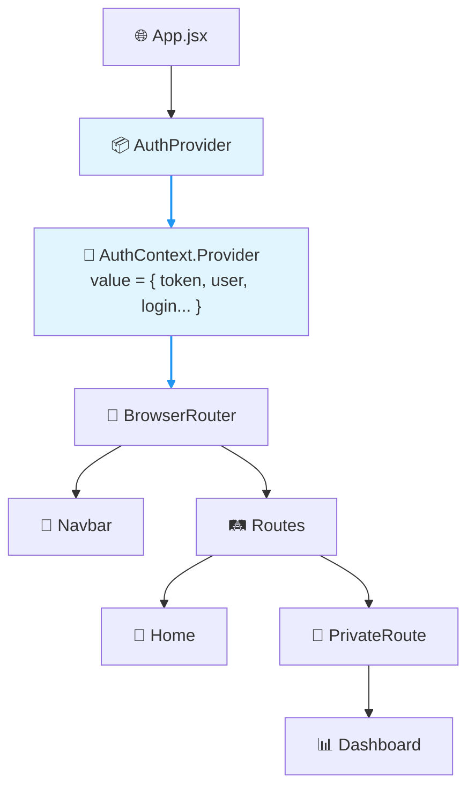

> 💡 **Key**: Everything inside `<AuthProvider>...</AuthProvider>` becomes `children` and has access to the context via `useAuth()`.

#### Real-world analogy:

```
🏠 House (AuthProvider)
   └── 🔌 Electrical grid (AuthContext.Provider value={...})
         └── 🛋️ Living room (BrowserRouter)  ← children
               ├── 💡 Lamp (Navbar) — can use electricity
               ├── 📺 TV (Dashboard) — can use electricity
               └── 🔊 Radio (Login) — can use electricity
```

All the "appliances" (child components) can access the "electricity" (context data) because they are connected to the "electrical grid" (Provider).

---

### What is localStorage?

Before looking at the code, you need to understand where we store the token so it survives when the user refreshes the page.

#### The problem

```jsx
const [token, setToken] = useState('abc123');
// If the user refreshes the page...
// ❌ useState resets → token = null → user logged out
```

#### The solution: localStorage

`localStorage` is a **"storage box"** that lives in the user's browser. Data stored there **persists** even if:

- The user refreshes the page
- The user closes and reopens the browser
- The user shuts down the computer

```mermaid
flowchart LR
    subgraph Browser["🌐 Your Browser"]
        direction TB
        Tab["Your React App"]
        LS["📦 localStorage<br/>token: 'eyJhbG...'<br/>user: '{\"id\":5}'"]
    end

    Tab -->|"setItem('token', '...')"| LS
    LS -->|"getItem('token')"| Tab
```

#### Basic methods

```javascript
// 📥 STORE a value
localStorage.setItem('token', 'abc123');
localStorage.setItem('user', JSON.stringify({ id: 5, name: 'Luis' }));

// 📤 READ a value
const token = localStorage.getItem('token'); // → 'abc123'
const user = JSON.parse(localStorage.getItem('user')); // → {id: 5, name: 'Luis'}

// 🗑️ DELETE a value
localStorage.removeItem('token');

// 🧹 DELETE EVERYTHING
localStorage.clear();
```

> ⚠️ **Only stores strings**: That's why we use `JSON.stringify()` to store objects and `JSON.parse()` to read them.

#### Open DevTools and see it yourself

1. Open Chrome DevTools (F12)
2. Go to **Application** → **Local Storage** → your site
3. You will see the key-value pairs stored

```
┌─────────────────────────────────────────────────┐
│ Application > Local Storage > localhost:5173   │
├──────────┬──────────────────────────────────────┤
│ Key      │ Value                                │
├──────────┼──────────────────────────────────────┤
│ token    │ eyJhbGciOiJIUzI1NiIsInR5cCI6...      │
│ user     │ {"id":5,"email":"luis@example.com"}  │
└──────────┴──────────────────────────────────────┘
```

#### ⚠️ localStorage security

| Aspect                       | Detail                                                                            |
| ---------------------------- | --------------------------------------------------------------------------------- |
| **Vulnerable to XSS**        | If an attacker injects malicious JavaScript into your page, they can read localStorage |
| **For learning apps**        | ✅ It is fine to use localStorage                                                 |
| **For production**           | Consider HttpOnly cookies (more secure but more complex)                          |

---

### `src/context/AuthContext.jsx`

Before looking at the full code, let's understand what each section does:

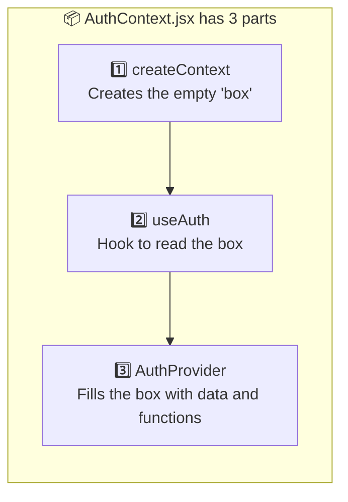

| Part                  | What it does                                          | Key lines                                 |
| --------------------- | ----------------------------------------------------- | ----------------------------------------- |
| `createContext(null)` | Creates the empty context                             | `const AuthContext = createContext(null)` |
| `useAuth()`           | Hook other components use to read the context        | `const { user, login } = useAuth()`       |
| `AuthProvider`        | Component that stores token, user, login(), logout() | Wraps the entire app                      |

---

#### The full code explained

```jsx
import { createContext, useContext, useState, useEffect } from 'react';

// 1. Create the context
const AuthContext = createContext(null);

// 2. Custom hook to use the context
export const useAuth = () => {
  const context = useContext(AuthContext);
  if (!context) {
    throw new Error('useAuth must be used inside AuthProvider');
  }
  return context;
};

// 3. Provider that wraps the app
export const AuthProvider = ({ children }) => {
  const [token, setToken] = useState(null);
  const [user, setUser] = useState(null);
  const [loading, setLoading] = useState(true);
```

##### What does this `useEffect` mean? — Restore session when the page loads

When the user refreshes the page, React restarts and loses all state. This `useEffect` recovers the token stored in localStorage:

```jsx
// On load, check whether there is a stored token
useEffect(() => {
  const storedToken = localStorage.getItem('token');
  const storedUser = localStorage.getItem('user');

  if (storedToken && storedUser) {
    setToken(storedToken);
    setUser(JSON.parse(storedUser));
  }
  setLoading(false);
}, []);
```

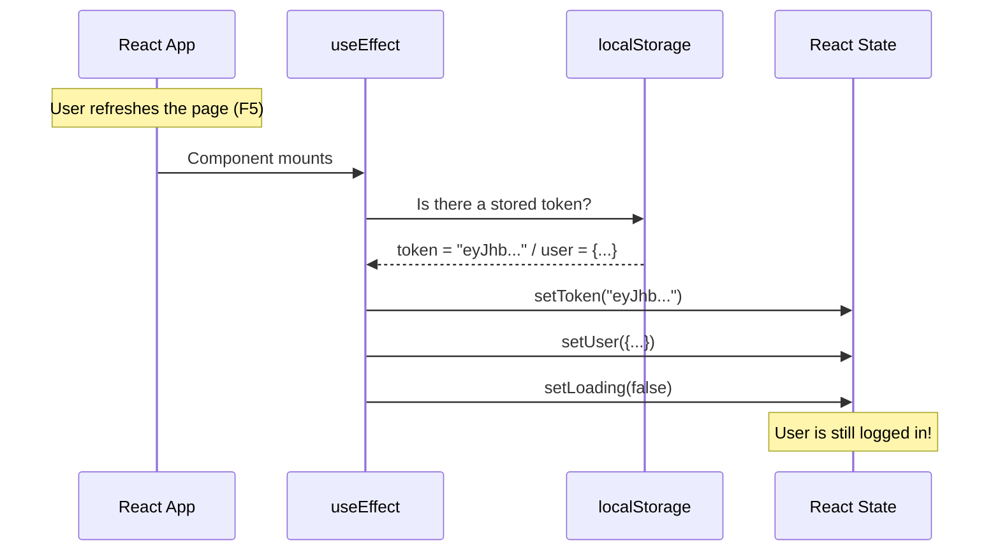

| Line                            | What it does                                  |
| ------------------------------- | --------------------------------------------- |
| `localStorage.getItem('token')` | Reads the stored token (or `null` if none)    |
| `JSON.parse(storedUser)`        | Converts the JSON string to a JavaScript object |
| `setLoading(false)`             | Indicates the check has finished              |
| `}, [])`                        | Empty array = only run once on mount          |

---

##### The `login()` function explained

```jsx
// Login function
const login = async (email, password) => {
  const response = await fetch('http://localhost:5000/api/login', {
    method: 'POST',
    headers: {
      'Content-Type': 'application/json',
    },
    body: JSON.stringify({ email, password }),
  });

  const data = await response.json();

  if (!response.ok) {
    throw new Error(data.error || 'Login error');
  }

  // Save in state and localStorage
  setToken(data.access_token);
  setUser(data.user);
  localStorage.setItem('token', data.access_token);
  localStorage.setItem('user', JSON.stringify(data.user));

  return data;
};
```

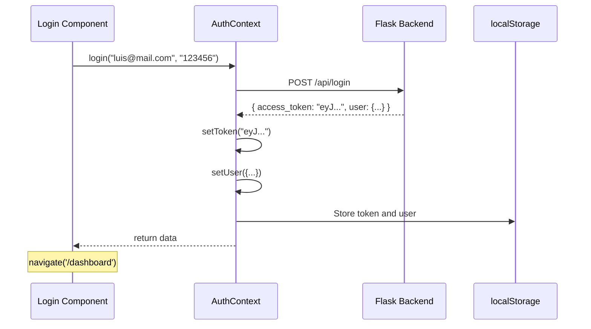

---

```jsx
  // Logout function
  const logout = () => {
    setToken(null);
    setUser(null);
    localStorage.removeItem('token');
    localStorage.removeItem('user');
  };

  // Function to make authenticated requests
  const authFetch = async (url, options = {}) => {
    const headers = {
      ...options.headers,
      Authorization: `Bearer ${token}`,
    };

    const response = await fetch(url, { ...options, headers });

    // If the token expired, log out
    if (response.status === 401) {
      logout();
      throw new Error('Session expired');
    }

    return response;
  };

  const value = {
    token,
    user,
    loading,
    isAuthenticated: !!token,
    login,
    logout,
    authFetch,
  };

  return <AuthContext.Provider value={value}>{children}</AuthContext.Provider>;
};

export default AuthContext;
```

### AuthContext flow

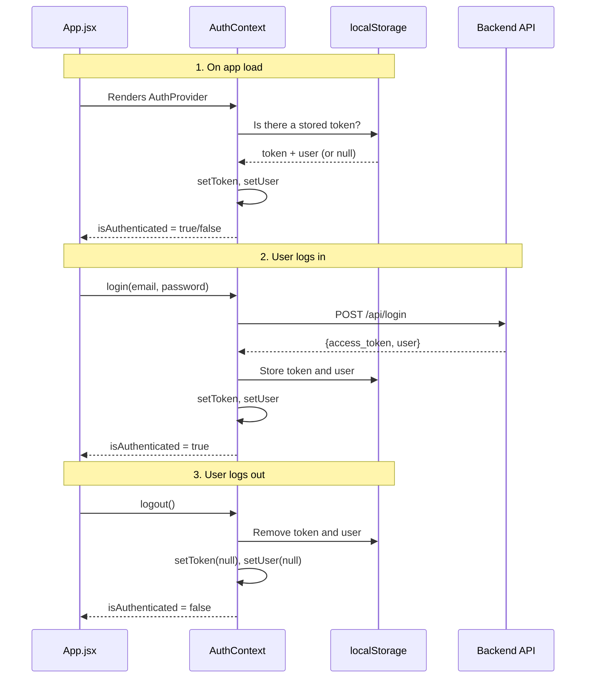

---

## 3️⃣ PrivateRoute: Protect routes

### Before the code: What is `Navigate`?

`Navigate` is a React Router component that **automatically redirects** the user to another page. It is like telling the browser "take the user to this other URL".

```jsx
import { Navigate } from 'react-router-dom';

// If the user is not authenticated, send them to /login
return <Navigate to="/login" />;
```

#### What does each part mean?

```jsx
<Navigate to="/login" state={{ from: location }} replace />
```

| Prop                         | Meaning                                  | Example                                              |
| ---------------------------- | ---------------------------------------- | ---------------------------------------------------- |
| `to="/login"`                | Where to redirect?                       | The user will go to `/login`                         |
| `state={{ from: location }}` | Extra data carried with the redirection  | We save where the user was coming from               |
| `replace`                    | Do not save in history                   | The user can't go back with the "back" button        |

#### Analogy: The building doorman

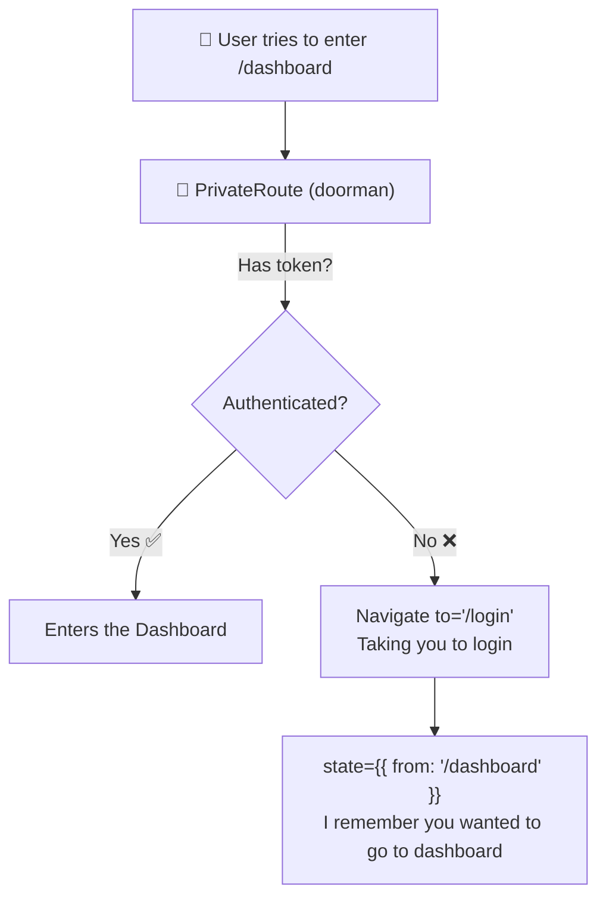

When the user logs in successfully, we can use that `state.from` to take them back to where they originally wanted to go.

---

### `src/components/PrivateRoute.jsx`

```jsx
import { Navigate, useLocation } from 'react-router-dom';
import { useAuth } from '../context/AuthContext';

const PrivateRoute = ({ children }) => {
  const { isAuthenticated, loading } = useAuth();
  const location = useLocation();

  // While loading, show spinner or null
  if (loading) {
    return <div>Loading...</div>;
  }

  // If not authenticated, redirect to login
  if (!isAuthenticated) {
    // Save the current location to redirect after login
    return <Navigate to="/login" state={{ from: location }} replace />;
  }

  // If authenticated, show the content
  return children;
};

export default PrivateRoute;
```

### Decision diagram

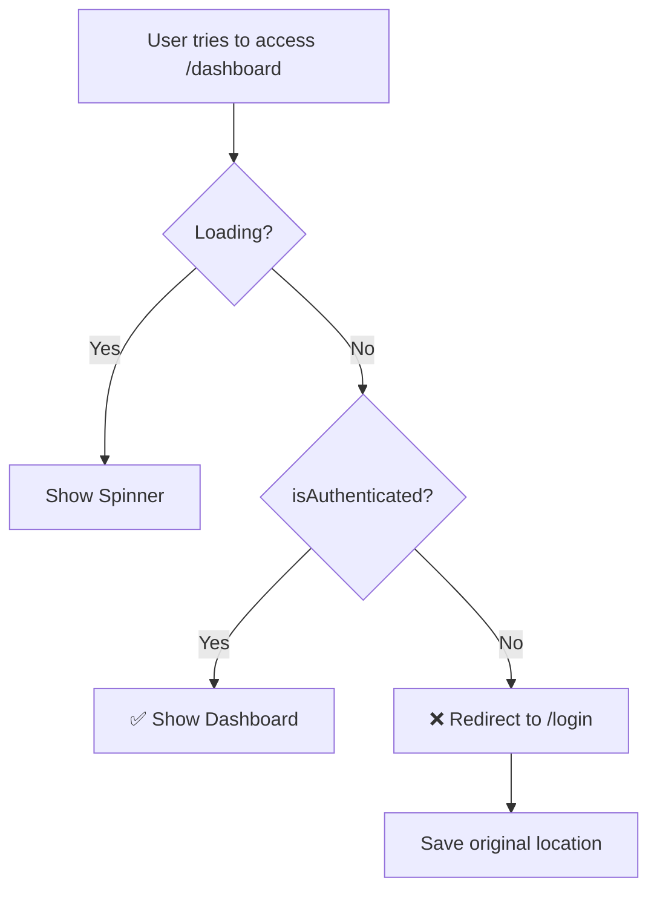

---

## 4️⃣ Configure routes in App.jsx

### `src/App.jsx`

```jsx
import { BrowserRouter, Routes, Route } from 'react-router-dom';
import { AuthProvider } from './context/AuthContext';
import PrivateRoute from './components/PrivateRoute';
import Navbar from './components/Navbar';

// Public pages
import Home from './pages/Home';
import Login from './pages/Login';
import Signup from './pages/Signup';

// Protected pages
import Dashboard from './pages/Dashboard';
import Profile from './pages/Profile';

function App() {
  return (
    <AuthProvider>
      <BrowserRouter>
        <Navbar />
        <Routes>
          {/* Public routes */}
          <Route path="/" element={<Home />} />
          <Route path="/login" element={<Login />} />
          <Route path="/signup" element={<Signup />} />

          {/* Protected routes */}
          <Route
            path="/dashboard"
            element={
              <PrivateRoute>
                <Dashboard />
              </PrivateRoute>
            }
          />
          <Route
            path="/profile"
            element={
              <PrivateRoute>
                <Profile />
              </PrivateRoute>
            }
          />
        </Routes>
      </BrowserRouter>
    </AuthProvider>
  );
}

export default App;
```

---

## 5️⃣ Login page

### Before the code: What are `useNavigate` and `useLocation`?

These are **React Router hooks** that let you control navigation from your JavaScript code.

#### `useNavigate` — Navigate programmatically

`useNavigate` gives you a function to **change pages from your code** (not from a link).

```jsx
import { useNavigate } from 'react-router-dom';

const MyComponent = () => {
  const navigate = useNavigate(); // Get the navigation function

  const goToDashboard = () => {
    navigate('/dashboard'); // Change to /dashboard
  };

  const goBack = () => {
    navigate(-1); // Equivalent to pressing "back" in the browser
  };

  return <button onClick={goToDashboard}>Go to Dashboard</button>;
};
```

#### When to use `useNavigate` vs `<Link>`?

| Situation                                            | What to use         |
| ---------------------------------------------------- | ------------------- |
| Click on a visible button/link                       | `<Link to="/route">` |
| After an action (successful login, form submitted)   | `navigate('/route')` |
| Redirect conditionally                               | `navigate('/route')` |

#### `useLocation` — Know where you are

`useLocation` tells you **which page you are on** and what extra data came with the navigation.

```jsx
import { useLocation } from 'react-router-dom';

const MyComponent = () => {
  const location = useLocation();

  console.log(location.pathname); // "/login"
  console.log(location.state); // { from: "/dashboard" } ← extra data

  return <p>You are at: {location.pathname}</p>;
};
```

#### Full example: Login with smart redirect

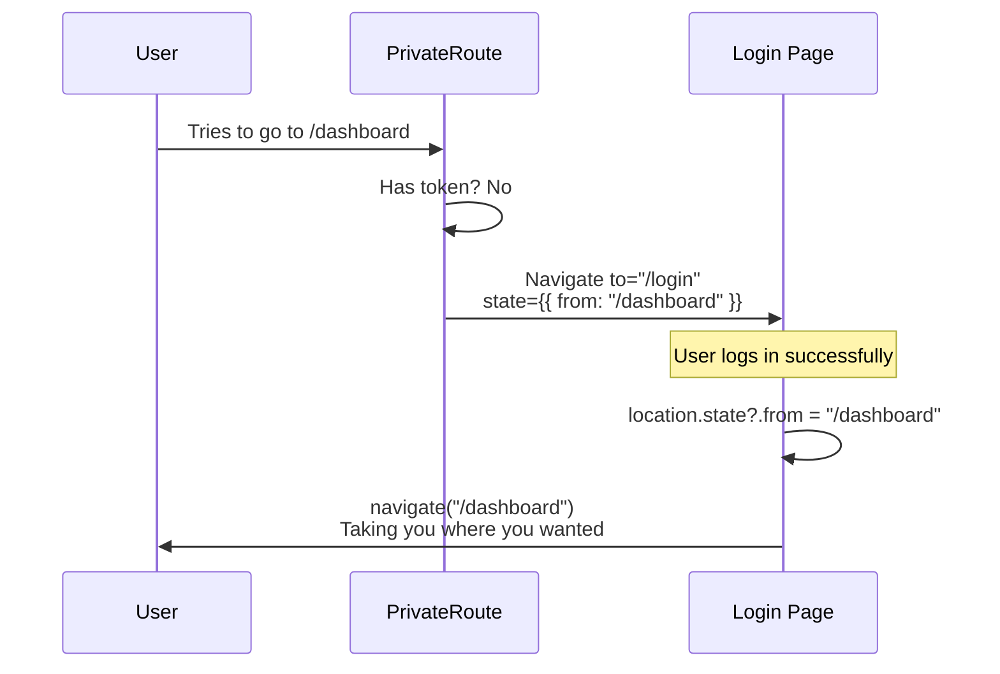

---

### `src/pages/Login.jsx`

```jsx
import { useState } from 'react';
import { useNavigate, useLocation, Link } from 'react-router-dom';
import { useAuth } from '../context/AuthContext';

const Login = () => {
  const [email, setEmail] = useState('');
  const [password, setPassword] = useState('');
  const [error, setError] = useState('');
  const [loading, setLoading] = useState(false);

  const { login, isAuthenticated } = useAuth();
  const navigate = useNavigate();
  const location = useLocation();

  // If already authenticated, redirect
  if (isAuthenticated) {
    const from = location.state?.from?.pathname || '/dashboard';
    navigate(from, { replace: true });
    return null;
  }

  const handleSubmit = async (e) => {
    e.preventDefault();
    setError('');
    setLoading(true);

    try {
      await login(email, password);

      // Redirect to where they came from or to the dashboard
      const from = location.state?.from?.pathname || '/dashboard';
      navigate(from, { replace: true });
    } catch (err) {
      setError(err.message);
    } finally {
      setLoading(false);
    }
  };

  return (
    <div className="login-container">
      <h1>Sign In</h1>

      {error && <div className="error-message">{error}</div>}

      <form onSubmit={handleSubmit}>
        <div>
          <label htmlFor="email">Email:</label>
          <input
            id="email"
            type="email"
            value={email}
            onChange={(e) => setEmail(e.target.value)}
            required
            disabled={loading}
          />
        </div>

        <div>
          <label htmlFor="password">Password:</label>
          <input
            id="password"
            type="password"
            value={password}
            onChange={(e) => setPassword(e.target.value)}
            required
            disabled={loading}
          />
        </div>

        <button type="submit" disabled={loading}>
          {loading ? 'Loading...' : 'Sign in'}
        </button>
      </form>

      <p>
        Don't have an account? <Link to="/signup">Sign up</Link>
      </p>
    </div>
  );
};

export default Login;
```

---

## 6️⃣ Navbar with auth state

### `src/components/Navbar.jsx`

```jsx
import { Link, useNavigate } from 'react-router-dom';
import { useAuth } from '../context/AuthContext';

const Navbar = () => {
  const { isAuthenticated, user, logout } = useAuth();
  const navigate = useNavigate();

  const handleLogout = () => {
    logout();
    navigate('/');
  };

  return (
    <nav className="navbar">
      <Link to="/" className="logo">
        My App
      </Link>

      <div className="nav-links">
        {isAuthenticated ? (
          // Authenticated user
          <>
            <span>Hello, {user?.username}</span>
            <Link to="/dashboard">Dashboard</Link>
            <Link to="/profile">Profile</Link>
            <button onClick={handleLogout}>Sign out</button>
          </>
        ) : (
          // Unauthenticated user
          <>
            <Link to="/login">Sign in</Link>
            <Link to="/signup">Sign up</Link>
          </>
        )}
      </div>
    </nav>
  );
};

export default Navbar;
```

---

## 7️⃣ Protected page with authenticated fetch

### `src/pages/Dashboard.jsx`

```jsx
import { useState, useEffect } from 'react';
import { useAuth } from '../context/AuthContext';

const Dashboard = () => {
  const { user, authFetch } = useAuth();
  const [data, setData] = useState(null);
  const [error, setError] = useState('');
  const [loading, setLoading] = useState(true);

  useEffect(() => {
    const fetchPrivateData = async () => {
      try {
        // authFetch automatically includes the token
        const response = await authFetch('http://localhost:5000/api/private');
        const result = await response.json();

        if (!response.ok) {
          throw new Error(result.error);
        }

        setData(result);
      } catch (err) {
        setError(err.message);
      } finally {
        setLoading(false);
      }
    };

    fetchPrivateData();
  }, [authFetch]);

  if (loading) return <div>Loading...</div>;
  if (error) return <div className="error">Error: {error}</div>;

  return (
    <div className="dashboard">
      <h1>Dashboard</h1>
      <p>Welcome, {user?.username}!</p>

      <div className="private-data">
        <h2>Private data from server:</h2>
        <pre>{JSON.stringify(data, null, 2)}</pre>
      </div>
    </div>
  );
};

export default Dashboard;
```

---

## 8️⃣ Full flow visualized

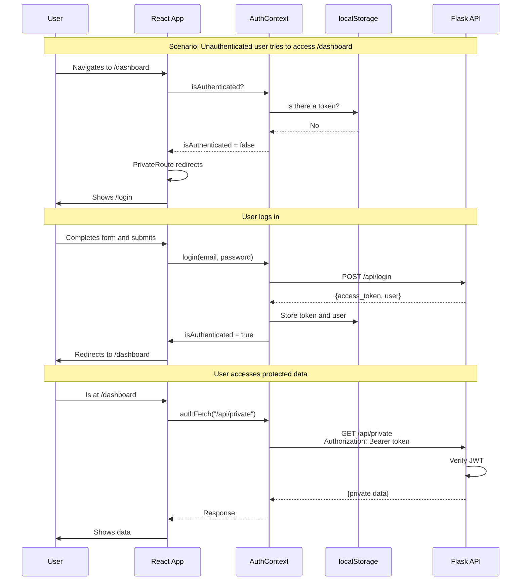

---

## 🔐 Security considerations

### Where to store the token?

| Option              | Pros                              | Cons                          |
| ------------------- | --------------------------------- | ----------------------------- |
| **localStorage**    | Easy, persists                    | Vulnerable to XSS             |
| **sessionStorage**  | More secure, cleared on close     | Does not persist across tabs  |
| **Memory (state)**  | More secure                       | Lost on refresh               |
| **HttpOnly Cookie** | More secure                       | Requires CORS configuration   |

> 💡 For learning apps, `localStorage` is fine. For production, consider HttpOnly cookies.

### Basic XSS protection

```jsx
// ❌ NEVER render user HTML without sanitizing
<div dangerouslySetInnerHTML={{ __html: userData }} />

// ✅ React escapes automatically
<div>{userData}</div>
```

---

## 🧪 Mini-challenges

### Challenge 1: Add `lastLogin` to the context

Modify `AuthContext` to store the date/time of the last login:

```jsx
// After successful login, the context should contain:
{
  token: "...",
  user: {...},
  lastLogin: "2024-03-08T15:30:00"  // ← New
}
```

<details>
<summary>Hint</summary>

1. Add a new state: `const [lastLogin, setLastLogin] = useState(null);`
2. In the `login` function, after storing the token: `setLastLogin(new Date().toISOString());`
3. Add `lastLogin` to the `value` object returned by the Provider

</details>

### Challenge 2: Show "Session started X minutes ago" in the Navbar

Use the `lastLogin` from the previous challenge to show how long the user has been logged in:

```jsx
// In the Navbar:
<span>Session started 5 minutes ago</span>
```

<details>
<summary>Hint</summary>

```jsx
const { lastLogin } = useAuth();

const getMinutesAgo = () => {
  if (!lastLogin) return null;
  const diff = Date.now() - new Date(lastLogin).getTime();
  return Math.floor(diff / 60000); // milliseconds to minutes
};
```

</details>

### Challenge 3: Protected Settings page

Create a new `/settings` page that:

1. Is only accessible if the user is logged in
2. Displays the user's email and username
3. Has a button to log out

<details>
<summary>Basic structure</summary>

```jsx
// src/pages/Settings.jsx
const Settings = () => {
  const { user, logout } = useAuth();
  const navigate = useNavigate();

  const handleLogout = () => {
    logout();
    navigate('/');
  };

  return (
    <div>
      <h1>Settings</h1>
      <p>Email: {user?.email}</p>
      <p>Username: {user?.username}</p>
      <button onClick={handleLogout}>Sign out</button>
    </div>
  );
};
```

Don't forget to add the protected route in `App.jsx`:

```jsx
<Route
  path="/settings"
  element={
    <PrivateRoute>
      <Settings />
    </PrivateRoute>
  }
/>
```

</details>

---

## ✅ Checklist for this step

- [ ] I created an AuthContext with login, logout, token, user
- [ ] The token is stored in localStorage on login
- [ ] I created a PrivateRoute component that redirects if no token exists
- [ ] My protected routes are wrapped in PrivateRoute
- [ ] The Navbar shows different options based on isAuthenticated
- [ ] I have an authFetch function that automatically includes the token
- [ ] The login redirects to the page the user was trying to visit
