# Step 3: Rutas Protegidas en React

## 🎯 Objetivo

Implementar autenticación en el frontend React:

- Guardar y gestionar el JWT
- Crear un contexto de autenticación
- Proteger rutas que requieren login
- Redirigir usuarios no autenticados

---

## 🗺️ Mapa de componentes

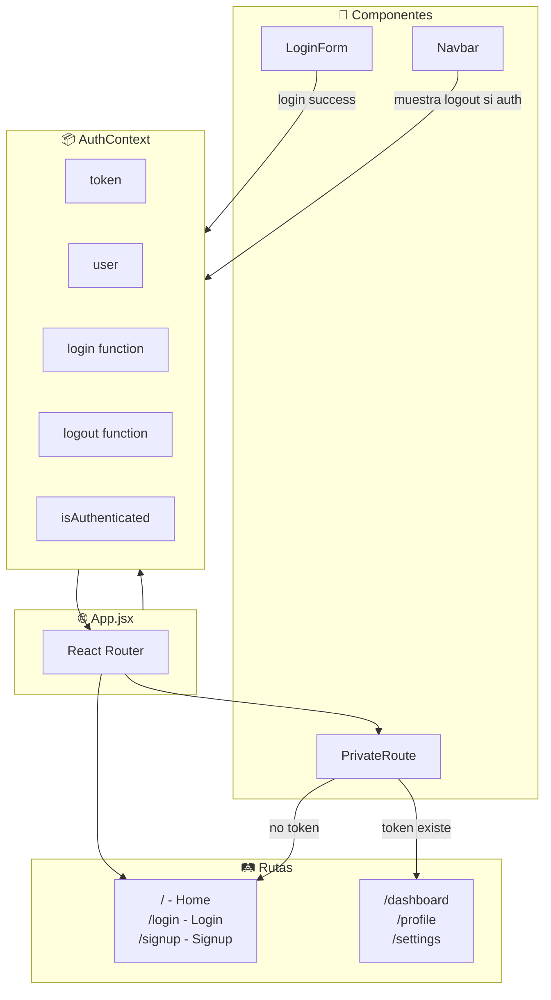

---

## 1️⃣ Estructura del proyecto

```
src/
├── App.jsx
├── main.jsx
├── context/
│   └── AuthContext.jsx       # Estado global de auth
├── components/
│   ├── PrivateRoute.jsx      # Wrapper para rutas protegidas
│   ├── Navbar.jsx
│   └── ...
└── pages/
    ├── Home.jsx              # Pública
    ├── Login.jsx             # Pública
    ├── Signup.jsx            # Pública
    ├── Dashboard.jsx         # 🔒 Protegida
    └── Profile.jsx           # 🔒 Protegida
```

---

## 2️⃣ AuthContext: Estado global de autenticación

### ¿Qué es `createContext`?

`createContext` es una función de React que crea un **contenedor de datos global**. Piénsalo como una "caja mágica" que puede ser accedida por cualquier componente en tu aplicación, sin necesidad de pasar props manualmente de padre a hijo.

```jsx
// Crear la "caja" (contexto)
const AuthContext = createContext(null);

// null es el valor por defecto si no hay Provider
```

#### ¿Qué significa el valor por defecto `null`?

El argumento que pasamos a `createContext(null)` es el **valor de respaldo** que se usa cuando un componente intenta leer el contexto pero **no está envuelto por un Provider**.

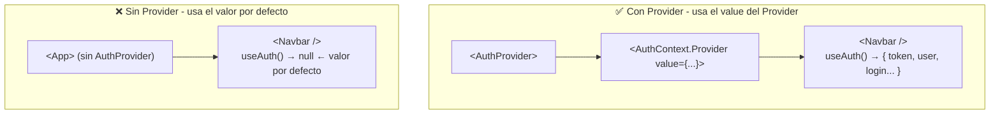

**¿Por qué `null` y no un objeto vacío?**

Usamos `null` intencionalmente para **detectar errores de configuración**. En nuestro custom hook `useAuth`:

```jsx
export const useAuth = () => {
  const context = useContext(AuthContext);

  // Si context es null, significa que no hay Provider
  if (!context) {
    throw new Error('useAuth debe usarse dentro de AuthProvider');
  }

  return context;
};
```

#### Explicación línea por línea del `useAuth`:

```jsx
export const useAuth = () => {
//     ↑               ↑
//     |               └── Es una función flecha (arrow function)
//     └── "export" permite importarla desde otros archivos
```

```jsx
const context = useContext(AuthContext);
//              ^^^^^^^^^^^^^^^^^^^^^^^^
//              useContext() lee los datos del contexto más cercano
//              Retorna lo que está en el "value" del Provider
```

```jsx
if (!context) {
  throw new Error('useAuth debe usarse dentro de AuthProvider');
}
// Si context es null (porque no hay Provider), lanzamos un error
// Esto ayuda a detectar bugs rápidamente
```

```jsx
return context;
// Retornamos los datos: { token, user, login, logout, ... }
```

**¿Cómo se usa en la práctica?**

```jsx
// En cualquier componente hijo de AuthProvider:
const { token, user, login, logout } = useAuth();

// Ahora puedes usar:
console.log(user.email); // Ver datos del usuario
login(email, password); // Hacer login
logout(); // Cerrar sesión
```

---

Esto nos da un **error claro** en desarrollo si olvidamos envolver nuestra app con `<AuthProvider>`:

```
❌ Error: useAuth debe usarse dentro de AuthProvider
```

En lugar de un error confuso como "Cannot read property 'token' of null".

| Valor por defecto | Comportamiento si falta Provider       |
| ----------------- | -------------------------------------- |
| `null`            | Error explícito y fácil de debuggear   |
| `{}`              | Errores confusos: `undefined` en props |
| Objeto completo   | Funciona pero con datos falsos/vacíos  |

**¿Por qué lo necesitamos?** Sin Context, tendríamos que pasar `token`, `user`, `login`, `logout` como props a través de TODOS los componentes intermedios:

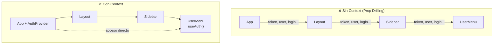

---

### El patrón Provider + Consumer

Este es uno de los patrones más importantes en React moderno:

| Concepto     | Analogía                          | Código                           |
| ------------ | --------------------------------- | -------------------------------- |
| **Context**  | La "caja" o contenedor            | `createContext()`                |
| **Provider** | El que "llena" la caja con datos  | `<Context.Provider value={...}>` |
| **Consumer** | El que "lee" los datos de la caja | `useContext()` o `useAuth()`     |

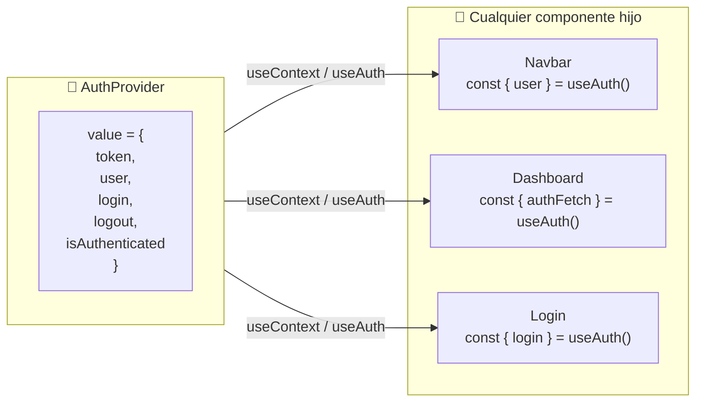

---

### ¿Qué significa `children`? — Mapa mental

La línea más importante del patrón es:

```jsx
return <AuthContext.Provider value={value}>{children}</AuthContext.Provider>;
```

**`children`** es una prop especial en React que representa **todo lo que pones entre las etiquetas de apertura y cierre** de un componente:

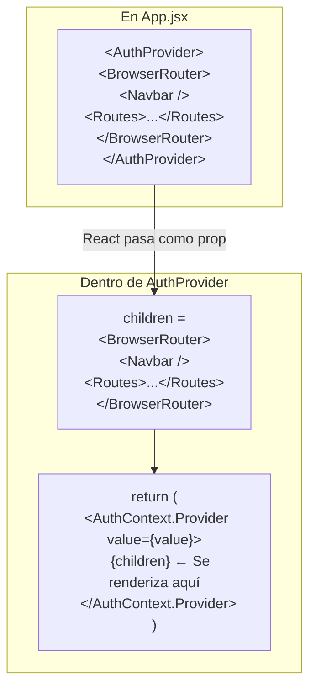

#### Visualización del árbol de componentes:

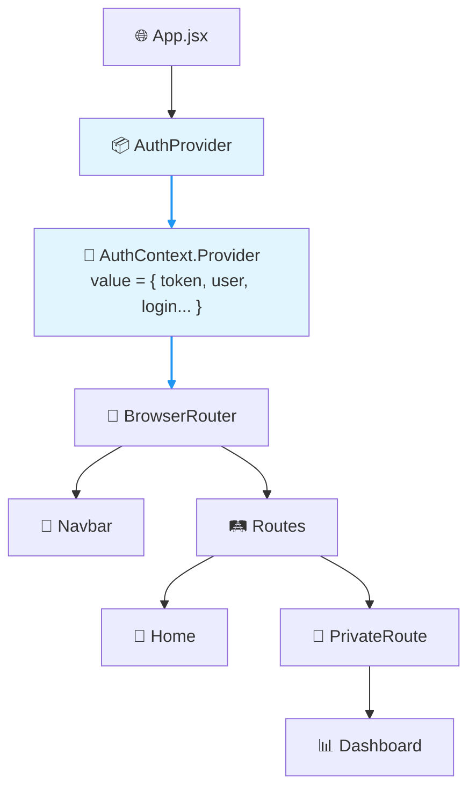

> 💡 **Clave**: Todo lo que está dentro de `<AuthProvider>...</AuthProvider>` se convierte en `children` y tiene acceso al contexto mediante `useAuth()`.

#### Analogía del mundo real:

```
🏠 Casa (AuthProvider)
   └── 🔌 Red eléctrica (AuthContext.Provider value={...})
         └── 🛋️ Sala (BrowserRouter)  ← children
               ├── 💡 Lámpara (Navbar) — puede usar electricidad
               ├── 📺 TV (Dashboard) — puede usar electricidad
               └── 🔊 Radio (Login) — puede usar electricidad
```

Todos los "electrodomésticos" (componentes hijos) pueden acceder a la "electricidad" (datos del contexto) porque están conectados a la "red eléctrica" (Provider).

---

### ¿Qué es localStorage?

Antes de ver el código, necesitas entender dónde guardamos el token para que sobreviva cuando el usuario refresca la página.

#### El problema

```jsx
const [token, setToken] = useState('abc123');
// Si el usuario refresca la página...
// ❌ useState se reinicia → token = null → usuario deslogueado
```

#### La solución: localStorage

`localStorage` es una **"cajita de almacenamiento"** que vive en el navegador del usuario. Los datos guardados ahí **persisten** incluso si:

- El usuario refresca la página
- El usuario cierra y vuelve a abrir el navegador
- El usuario apaga el computador

```mermaid
flowchart LR
    subgraph Navegador["🌐 Tu Navegador"]
        direction TB
        Tab["Tu React App"]
        LS["📦 localStorage<br/>token: 'eyJhbG...'<br/>user: '{\"id\":5}'"]
    end

    Tab -->|"setItem('token', '...')"| LS
    LS -->|"getItem('token')"| Tab
```

#### Métodos básicos

```javascript
// 📥 GUARDAR un valor
localStorage.setItem('token', 'abc123');
localStorage.setItem('user', JSON.stringify({ id: 5, name: 'Luis' }));

// 📤 LEER un valor
const token = localStorage.getItem('token'); // → 'abc123'
const user = JSON.parse(localStorage.getItem('user')); // → {id: 5, name: 'Luis'}

// 🗑️ BORRAR un valor
localStorage.removeItem('token');

// 🧹 BORRAR TODO
localStorage.clear();
```

> ⚠️ **Solo guarda strings**: Por eso usamos `JSON.stringify()` para guardar objetos y `JSON.parse()` para leerlos.

#### Abre DevTools y míralo tú mismo

1. Abre Chrome DevTools (F12)
2. Ve a **Application** → **Local Storage** → tu sitio
3. Verás los pares clave-valor guardados

```
┌─────────────────────────────────────────────────┐
│ Application > Local Storage > localhost:5173   │
├──────────┬──────────────────────────────────────┤
│ Key      │ Value                                │
├──────────┼──────────────────────────────────────┤
│ token    │ eyJhbGciOiJIUzI1NiIsInR5cCI6...      │
│ user     │ {"id":5,"email":"luis@example.com"}  │
└──────────┴──────────────────────────────────────┘
```

#### ⚠️ Seguridad de localStorage

| Aspecto                      | Detalle                                                                           |
| ---------------------------- | --------------------------------------------------------------------------------- |
| **Vulnerable a XSS**         | Si un atacante inyecta JavaScript malicioso en tu página, puede leer localStorage |
| **Para apps de aprendizaje** | ✅ Está bien usar localStorage                                                    |
| **Para producción**          | Considera HttpOnly cookies (más seguro pero más complejo)                         |

---

### `src/context/AuthContext.jsx`

Antes de ver el código completo, entendamos qué hace cada sección:

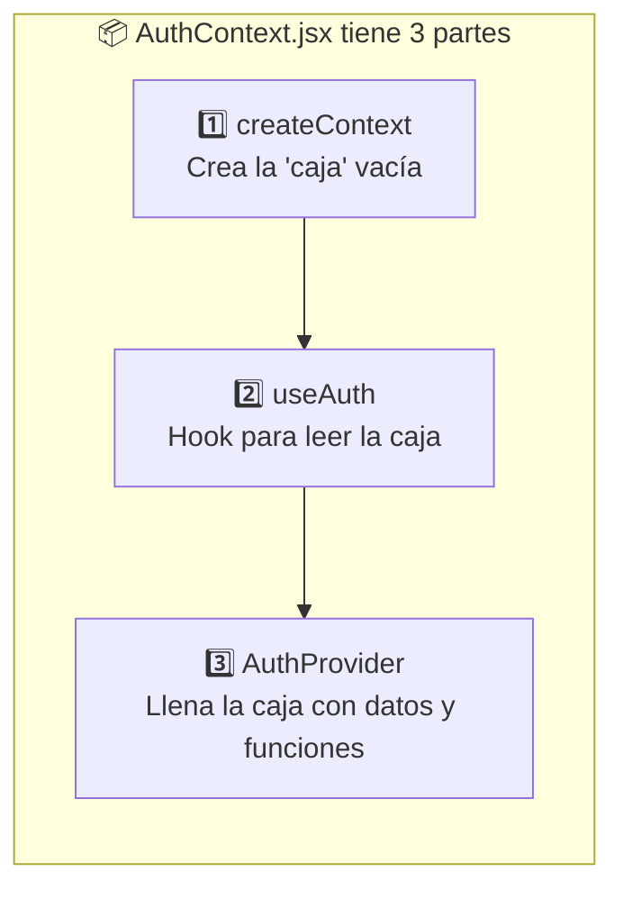

| Parte                 | ¿Qué hace?                                            | Líneas clave                              |
| --------------------- | ----------------------------------------------------- | ----------------------------------------- |
| `createContext(null)` | Crea el contexto vacío                                | `const AuthContext = createContext(null)` |
| `useAuth()`           | Hook que otros componentes usan para leer el contexto | `const { user, login } = useAuth()`       |
| `AuthProvider`        | Componente que guarda token, user, login(), logout()  | Envuelve toda la app                      |

---

#### El código completo explicado

```jsx
import { createContext, useContext, useState, useEffect } from 'react';

// 1. Crear el contexto
const AuthContext = createContext(null);

// 2. Custom hook para usar el contexto
export const useAuth = () => {
  const context = useContext(AuthContext);
  if (!context) {
    throw new Error('useAuth debe usarse dentro de AuthProvider');
  }
  return context;
};

// 3. Provider que envuelve la app
export const AuthProvider = ({ children }) => {
  const [token, setToken] = useState(null);
  const [user, setUser] = useState(null);
  const [loading, setLoading] = useState(true);
```

##### ¿Qué significa este `useEffect`? — Restaurar sesión al cargar la página

Cuando el usuario refresca la página, React se reinicia y pierde todo el estado. Este `useEffect` recupera el token guardado en localStorage:

```jsx
// Al cargar, verificar si hay token guardado
useEffect(() => {
  const storedToken = localStorage.getItem('token');
  const storedUser = localStorage.getItem('user');

  if (storedToken && storedUser) {
    setToken(storedToken);
    setUser(JSON.parse(storedUser));
  }
  setLoading(false);
}, []);
```

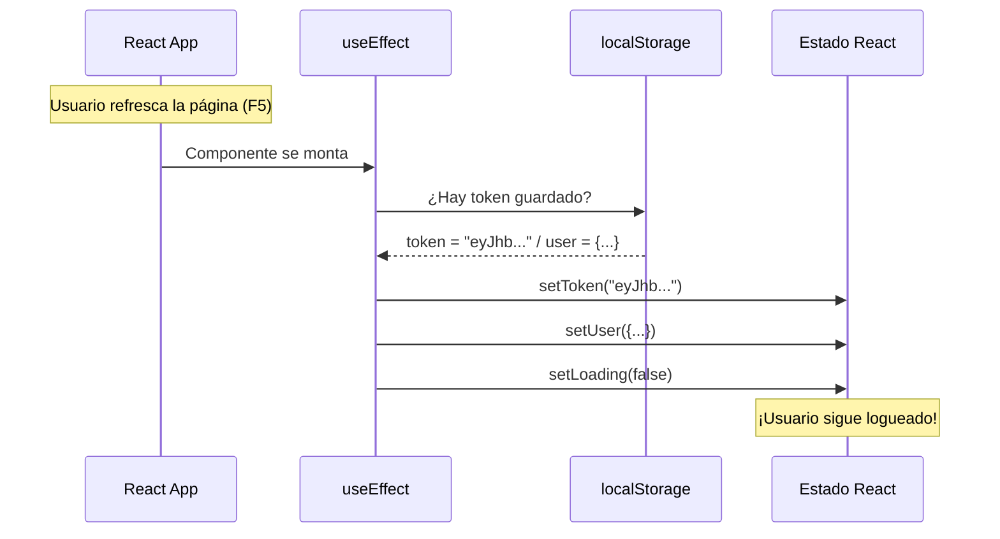

| Línea                           | ¿Qué hace?                                    |
| ------------------------------- | --------------------------------------------- |
| `localStorage.getItem('token')` | Lee el token guardado (o `null` si no existe) |
| `JSON.parse(storedUser)`        | Convierte el string JSON a objeto JavaScript  |
| `setLoading(false)`             | Indica que ya terminó de verificar            |
| `}, [])`                        | Array vacío = solo ejecutar una vez al montar |

---

##### La función `login()` explicada

```jsx
// Función login
const login = async (email, password) => {
  const response = await fetch('http://localhost:5000/api/login', {
    method: 'POST',
    headers: {
      'Content-Type': 'application/json',
    },
    body: JSON.stringify({ email, password }),
  });

  const data = await response.json();

  if (!response.ok) {
    throw new Error(data.error || 'Error de login');
  }

  // Guardar en estado y localStorage
  setToken(data.access_token);
  setUser(data.user);
  localStorage.setItem('token', data.access_token);
  localStorage.setItem('user', JSON.stringify(data.user));

  return data;
};
```

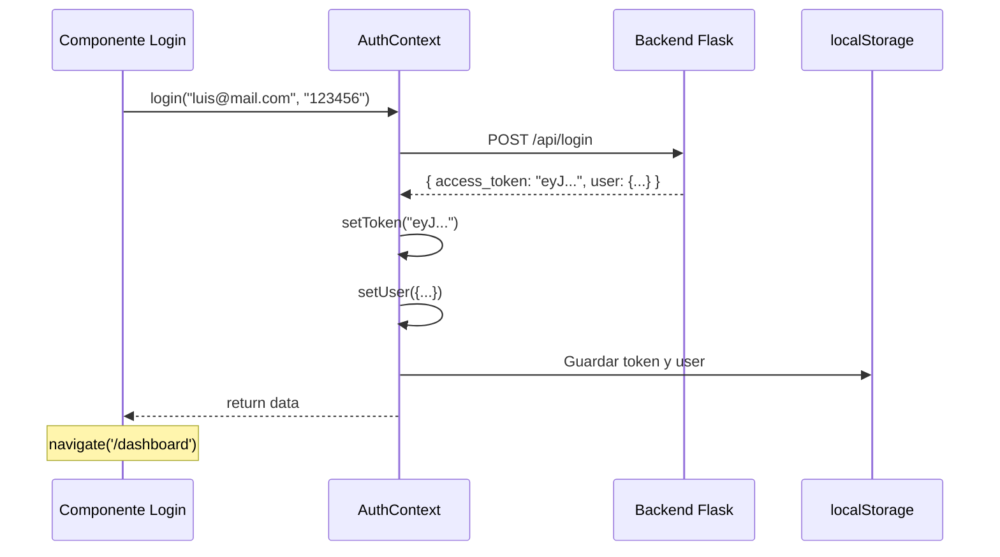

---

```jsx
  // Función logout
  const logout = () => {
    setToken(null);
    setUser(null);
    localStorage.removeItem('token');
    localStorage.removeItem('user');
  };

  // Función para hacer requests autenticadas
  const authFetch = async (url, options = {}) => {
    const headers = {
      ...options.headers,
      Authorization: `Bearer ${token}`,
    };

    const response = await fetch(url, { ...options, headers });

    // Si el token expiró, hacer logout
    if (response.status === 401) {
      logout();
      throw new Error('Sesión expirada');
    }

    return response;
  };

  const value = {
    token,
    user,
    loading,
    isAuthenticated: !!token,
    login,
    logout,
    authFetch,
  };

  return <AuthContext.Provider value={value}>{children}</AuthContext.Provider>;
};

export default AuthContext;
```

### Flujo del AuthContext

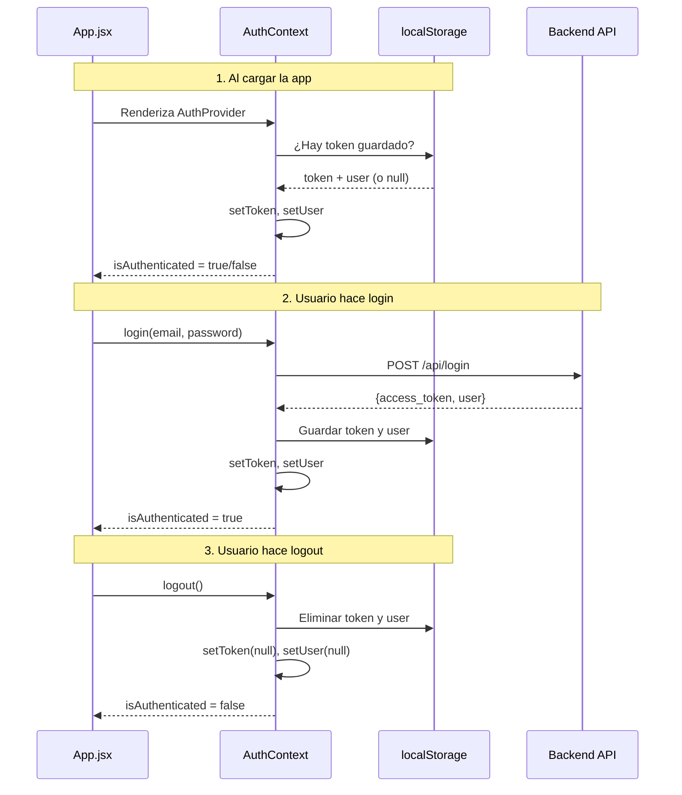

---

## 3️⃣ PrivateRoute: Proteger rutas

### Antes del código: ¿Qué es `Navigate`?

`Navigate` es un componente de React Router que **redirige automáticamente** al usuario a otra página. Es como decirle al navegador "lleva al usuario a esta otra URL".

```jsx
import { Navigate } from 'react-router-dom';

// Si el usuario no está autenticado, lo mandamos a /login
return <Navigate to="/login" />;
```

#### ¿Qué significa cada parte?

```jsx
<Navigate to="/login" state={{ from: location }} replace />
```

| Prop                         | Significado                               | Ejemplo                                              |
| ---------------------------- | ----------------------------------------- | ---------------------------------------------------- |
| `to="/login"`                | ¿A dónde redirigir?                       | El usuario irá a `/login`                            |
| `state={{ from: location }}` | Datos extra que viajan con la redirección | Guardamos de dónde venía el usuario                  |
| `replace`                    | No guardar en historial                   | El usuario no puede volver atrás con el botón "back" |

#### Analogía: El portero del edificio

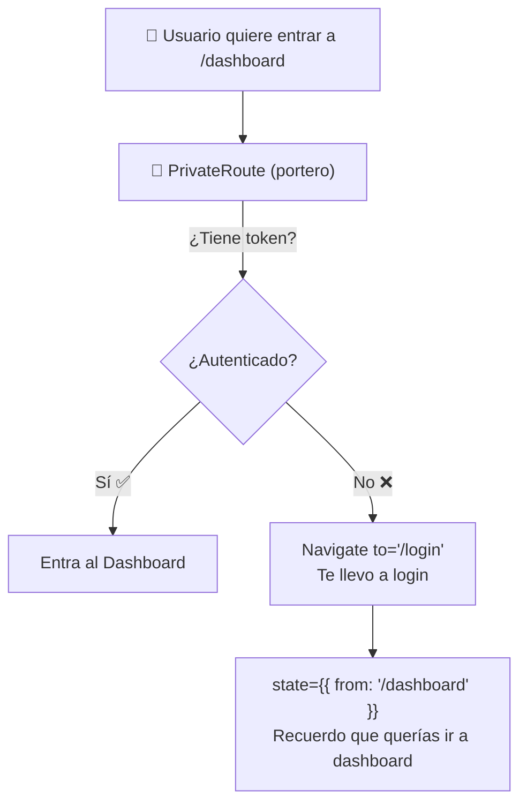

Cuando el usuario haga login exitoso, podemos usar ese `state.from` para llevarlo de vuelta a donde quería ir originalmente.

---

### `src/components/PrivateRoute.jsx`

```jsx
import { Navigate, useLocation } from 'react-router-dom';
import { useAuth } from '../context/AuthContext';

const PrivateRoute = ({ children }) => {
  const { isAuthenticated, loading } = useAuth();
  const location = useLocation();

  // Mientras carga, mostrar spinner o null
  if (loading) {
    return <div>Cargando...</div>;
  }

  // Si no está autenticado, redirigir a login
  if (!isAuthenticated) {
    // Guardamos la ubicación actual para redirigir después del login
    return <Navigate to="/login" state={{ from: location }} replace />;
  }

  // Si está autenticado, mostrar el contenido
  return children;
};

export default PrivateRoute;
```

### Diagrama de decisión

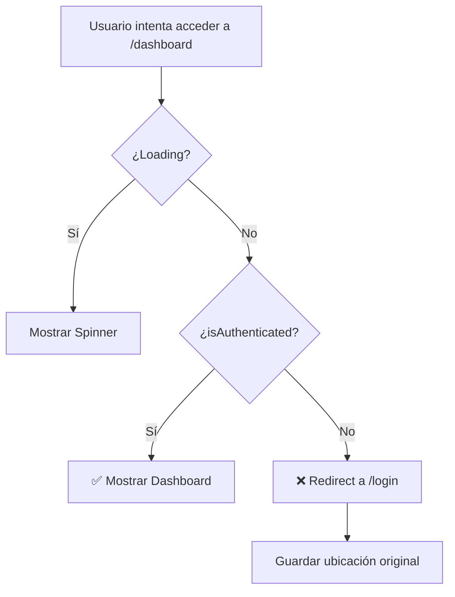

---

## 4️⃣ Configurar rutas en App.jsx

### `src/App.jsx`

```jsx
import { BrowserRouter, Routes, Route } from 'react-router-dom';
import { AuthProvider } from './context/AuthContext';
import PrivateRoute from './components/PrivateRoute';
import Navbar from './components/Navbar';

// Páginas públicas
import Home from './pages/Home';
import Login from './pages/Login';
import Signup from './pages/Signup';

// Páginas protegidas
import Dashboard from './pages/Dashboard';
import Profile from './pages/Profile';

function App() {
  return (
    <AuthProvider>
      <BrowserRouter>
        <Navbar />
        <Routes>
          {/* Rutas públicas */}
          <Route path="/" element={<Home />} />
          <Route path="/login" element={<Login />} />
          <Route path="/signup" element={<Signup />} />

          {/* Rutas protegidas */}
          <Route
            path="/dashboard"
            element={
              <PrivateRoute>
                <Dashboard />
              </PrivateRoute>
            }
          />
          <Route
            path="/profile"
            element={
              <PrivateRoute>
                <Profile />
              </PrivateRoute>
            }
          />
        </Routes>
      </BrowserRouter>
    </AuthProvider>
  );
}

export default App;
```

---

## 5️⃣ Página de Login

### Antes del código: ¿Qué son `useNavigate` y `useLocation`?

Estos son **hooks de React Router** que te permiten controlar la navegación desde tu código JavaScript.

#### `useNavigate` — Navegar programáticamente

`useNavigate` te da una función para **cambiar de página desde tu código** (no desde un link).

```jsx
import { useNavigate } from 'react-router-dom';

const MiComponente = () => {
  const navigate = useNavigate(); // Obtener la función de navegación

  const irAlDashboard = () => {
    navigate('/dashboard'); // Cambiar a /dashboard
  };

  const volverAtras = () => {
    navigate(-1); // Equivalente a presionar "atrás" en el navegador
  };

  return <button onClick={irAlDashboard}>Ir al Dashboard</button>;
};
```

#### ¿Cuándo usar `useNavigate` vs `<Link>`?

| Situación                                           | Qué usar            |
| --------------------------------------------------- | ------------------- |
| Click en un botón/link visible                      | `<Link to="/ruta">` |
| Después de una acción (login exitoso, form enviado) | `navigate('/ruta')` |
| Redirigir condicionalmente                          | `navigate('/ruta')` |

#### `useLocation` — Saber dónde estás

`useLocation` te dice **en qué página estás** y qué datos extra vinieron con la navegación.

```jsx
import { useLocation } from 'react-router-dom';

const MiComponente = () => {
  const location = useLocation();

  console.log(location.pathname); // "/login"
  console.log(location.state); // { from: "/dashboard" } ← datos extra

  return <p>Estás en: {location.pathname}</p>;
};
```

#### Ejemplo completo: Login con redirección inteligente

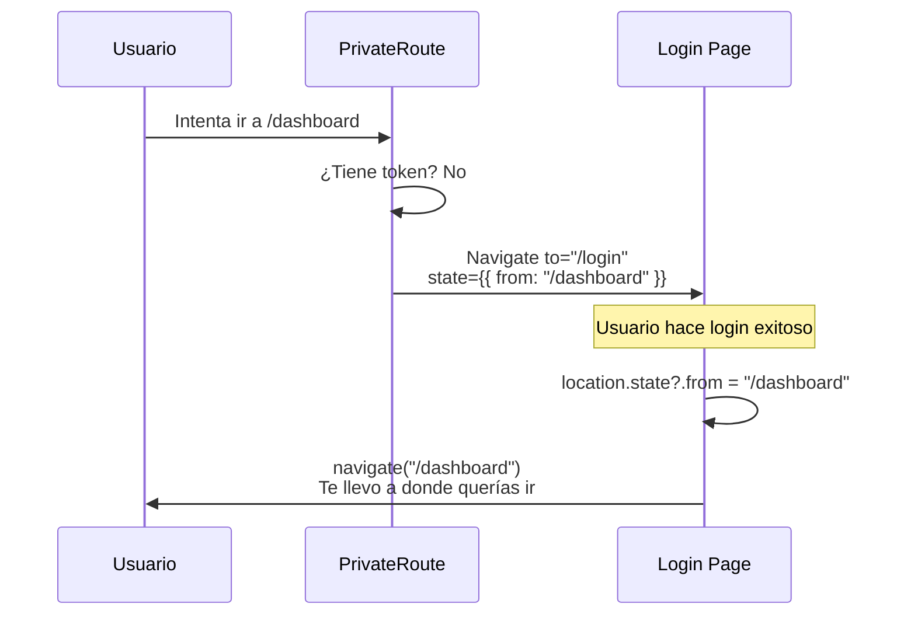

---

### `src/pages/Login.jsx`

```jsx
import { useState } from 'react';
import { useNavigate, useLocation, Link } from 'react-router-dom';
import { useAuth } from '../context/AuthContext';

const Login = () => {
  const [email, setEmail] = useState('');
  const [password, setPassword] = useState('');
  const [error, setError] = useState('');
  const [loading, setLoading] = useState(false);

  const { login, isAuthenticated } = useAuth();
  const navigate = useNavigate();
  const location = useLocation();

  // Si ya está autenticado, redirigir
  if (isAuthenticated) {
    const from = location.state?.from?.pathname || '/dashboard';
    navigate(from, { replace: true });
    return null;
  }

  const handleSubmit = async (e) => {
    e.preventDefault();
    setError('');
    setLoading(true);

    try {
      await login(email, password);

      // Redirigir a donde venía o al dashboard
      const from = location.state?.from?.pathname || '/dashboard';
      navigate(from, { replace: true });
    } catch (err) {
      setError(err.message);
    } finally {
      setLoading(false);
    }
  };

  return (
    <div className="login-container">
      <h1>Iniciar Sesión</h1>

      {error && <div className="error-message">{error}</div>}

      <form onSubmit={handleSubmit}>
        <div>
          <label htmlFor="email">Email:</label>
          <input
            id="email"
            type="email"
            value={email}
            onChange={(e) => setEmail(e.target.value)}
            required
            disabled={loading}
          />
        </div>

        <div>
          <label htmlFor="password">Contraseña:</label>
          <input
            id="password"
            type="password"
            value={password}
            onChange={(e) => setPassword(e.target.value)}
            required
            disabled={loading}
          />
        </div>

        <button type="submit" disabled={loading}>
          {loading ? 'Cargando...' : 'Entrar'}
        </button>
      </form>

      <p>
        ¿No tienes cuenta? <Link to="/signup">Regístrate</Link>
      </p>
    </div>
  );
};

export default Login;
```

---

## 6️⃣ Navbar con estado de auth

### `src/components/Navbar.jsx`

```jsx
import { Link, useNavigate } from 'react-router-dom';
import { useAuth } from '../context/AuthContext';

const Navbar = () => {
  const { isAuthenticated, user, logout } = useAuth();
  const navigate = useNavigate();

  const handleLogout = () => {
    logout();
    navigate('/');
  };

  return (
    <nav className="navbar">
      <Link to="/" className="logo">
        Mi App
      </Link>

      <div className="nav-links">
        {isAuthenticated ? (
          // Usuario autenticado
          <>
            <span>Hola, {user?.username}</span>
            <Link to="/dashboard">Dashboard</Link>
            <Link to="/profile">Perfil</Link>
            <button onClick={handleLogout}>Cerrar Sesión</button>
          </>
        ) : (
          // Usuario no autenticado
          <>
            <Link to="/login">Iniciar Sesión</Link>
            <Link to="/signup">Registrarse</Link>
          </>
        )}
      </div>
    </nav>
  );
};

export default Navbar;
```

---

## 7️⃣ Página protegida con fetch autenticado

### `src/pages/Dashboard.jsx`

```jsx
import { useState, useEffect } from 'react';
import { useAuth } from '../context/AuthContext';

const Dashboard = () => {
  const { user, authFetch } = useAuth();
  const [data, setData] = useState(null);
  const [error, setError] = useState('');
  const [loading, setLoading] = useState(true);

  useEffect(() => {
    const fetchPrivateData = async () => {
      try {
        // authFetch incluye automáticamente el token
        const response = await authFetch('http://localhost:5000/api/private');
        const result = await response.json();

        if (!response.ok) {
          throw new Error(result.error);
        }

        setData(result);
      } catch (err) {
        setError(err.message);
      } finally {
        setLoading(false);
      }
    };

    fetchPrivateData();
  }, [authFetch]);

  if (loading) return <div>Cargando...</div>;
  if (error) return <div className="error">Error: {error}</div>;

  return (
    <div className="dashboard">
      <h1>Dashboard</h1>
      <p>Bienvenido, {user?.username}!</p>

      <div className="private-data">
        <h2>Datos privados del servidor:</h2>
        <pre>{JSON.stringify(data, null, 2)}</pre>
      </div>
    </div>
  );
};

export default Dashboard;
```

---

## 8️⃣ Flujo completo visualizado

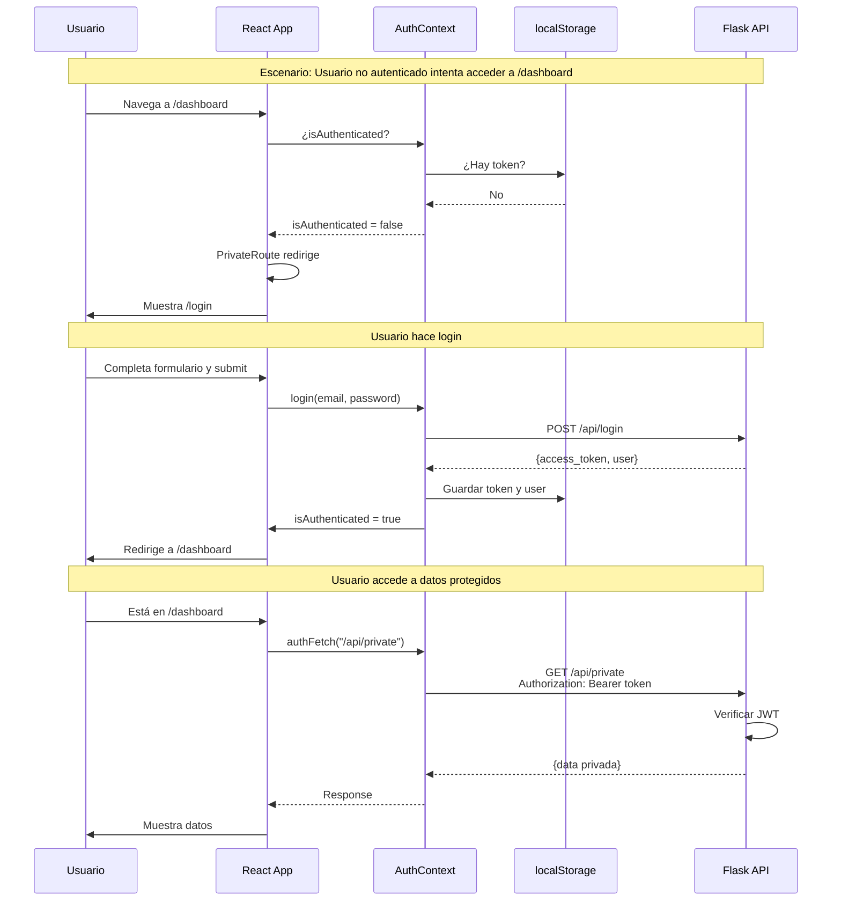

---

## 🔐 Consideraciones de seguridad

### ¿Dónde guardar el token?

| Opción              | Pros                           | Contras                     |
| ------------------- | ------------------------------ | --------------------------- |
| **localStorage**    | Fácil, persiste                | Vulnerable a XSS            |
| **sessionStorage**  | Más seguro, se borra al cerrar | No persiste entre tabs      |
| **Memory (estado)** | Más seguro                     | Se pierde al refrescar      |
| **HttpOnly Cookie** | Más seguro                     | Requiere configuración CORS |

> 💡 Para apps de aprendizaje, `localStorage` está bien. Para producción, considera cookies HttpOnly.

### Protección XSS básica

```jsx
// ❌ NUNCA renderizar HTML del usuario sin sanitizar
<div dangerouslySetInnerHTML={{ __html: userData }} />

// ✅ React escapa automáticamente
<div>{userData}</div>
```

---

## 🧪 Mini-retos

### Reto 1: Agrega `lastLogin` al contexto

Modifica el `AuthContext` para guardar la fecha/hora del último login:

```jsx
// Después de login exitoso, el contexto debería tener:
{
  token: "...",
  user: {...},
  lastLogin: "2024-03-08T15:30:00"  // ← Nuevo
}
```

<details>
<summary>Pista</summary>

1. Agrega un nuevo estado: `const [lastLogin, setLastLogin] = useState(null);`
2. En la función `login`, después de guardar el token: `setLastLogin(new Date().toISOString());`
3. Agrega `lastLogin` al objeto `value` que retorna el Provider

</details>

### Reto 2: Muestra "Sesión iniciada hace X minutos" en el Navbar

Usa el `lastLogin` del reto anterior para mostrar cuánto tiempo lleva el usuario logueado:

```jsx
// En el Navbar:
<span>Sesión iniciada hace 5 minutos</span>
```

<details>
<summary>Pista</summary>

```jsx
const { lastLogin } = useAuth();

const getMinutesAgo = () => {
  if (!lastLogin) return null;
  const diff = Date.now() - new Date(lastLogin).getTime();
  return Math.floor(diff / 60000); // milisegundos a minutos
};
```

</details>

### Reto 3: Página de Settings protegida

Crea una nueva página `/settings` que:

1. Solo sea accesible si el usuario está logueado
2. Muestre el email y username del usuario
3. Tenga un botón para hacer logout

<details>
<summary>Estructura básica</summary>

```jsx
// src/pages/Settings.jsx
const Settings = () => {
  const { user, logout } = useAuth();
  const navigate = useNavigate();

  const handleLogout = () => {
    logout();
    navigate('/');
  };

  return (
    <div>
      <h1>Configuración</h1>
      <p>Email: {user?.email}</p>
      <p>Username: {user?.username}</p>
      <button onClick={handleLogout}>Cerrar sesión</button>
    </div>
  );
};
```

No olvides agregar la ruta protegida en `App.jsx`:

```jsx
<Route
  path="/settings"
  element={
    <PrivateRoute>
      <Settings />
    </PrivateRoute>
  }
/>
```

</details>

---

## ✅ Checklist de este step

- [ ] Creé un AuthContext con login, logout, token, user
- [ ] El token se guarda en localStorage al hacer login
- [ ] Creé un componente PrivateRoute que redirige si no hay token
- [ ] Mis rutas protegidas están envueltas en PrivateRoute
- [ ] El Navbar muestra opciones diferentes según isAuthenticated
- [ ] Tengo una función authFetch que incluye el token automáticamente
- [ ] El login redirige a la página que el usuario intentaba visitar
