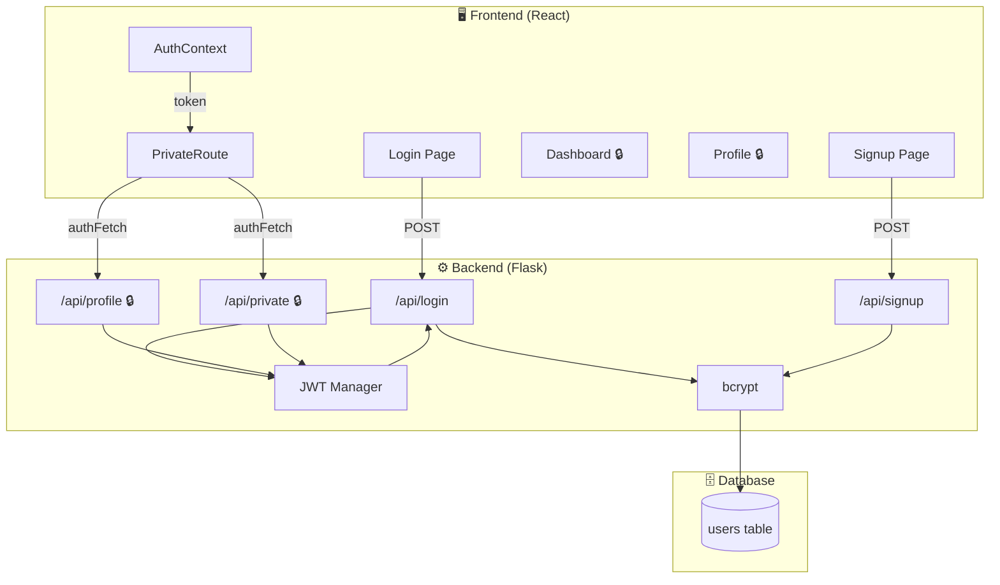
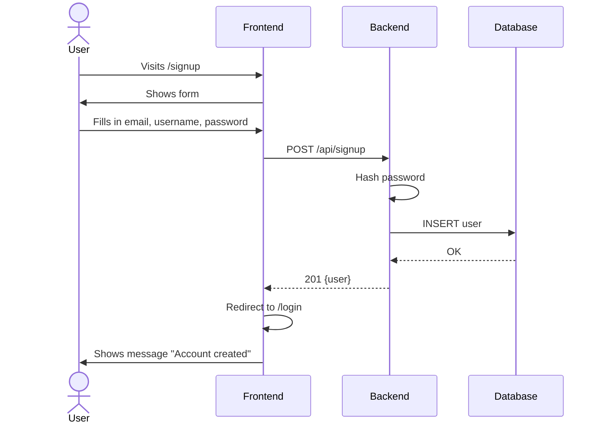
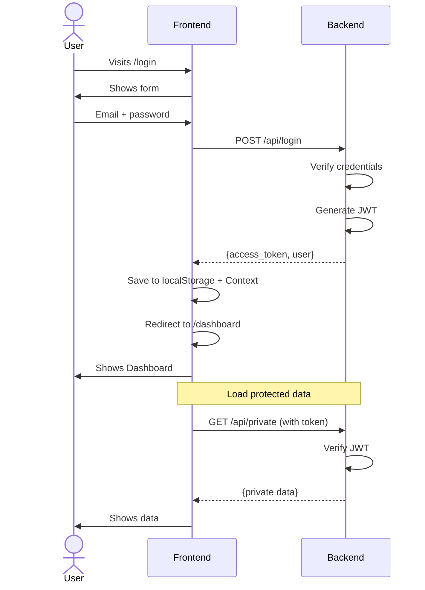
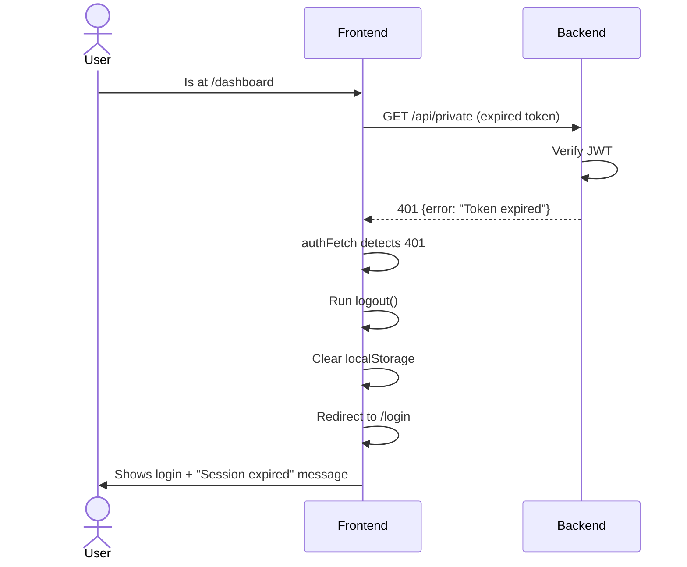

[🇪🇸 Español](README.md) | 🇬🇧 **English**

# Step 4: Full Flow — Full Stack Auth

## 🎯 Goal

Integrate **frontend (React) + backend (Flask)** to have a complete authentication system working. This step is a practical step-by-step implementation guide.

---

## 🗺️ Full architecture



---

## 📋 Implementation checklist

Use this list as a guide to implement auth in your project:

### Backend (Flask)

- [ ] 1. Install dependencies
- [ ] 2. Configure Flask-JWT-Extended
- [ ] 3. Create User model with bcrypt
- [ ] 4. Create `/api/signup` endpoint
- [ ] 5. Create `/api/login` endpoint
- [ ] 6. Create protected endpoints
- [ ] 7. Configure CORS
- [ ] 8. Test with cURL/Postman

### Frontend (React)

- [ ] 9. Create AuthContext
- [ ] 10. Create PrivateRoute
- [ ] 11. Configure routes in App.jsx
- [ ] 12. Create Login page
- [ ] 13. Create Signup page
- [ ] 14. Update Navbar
- [ ] 15. Create protected page (Dashboard)
- [ ] 16. Test the full flow

---

## 🔧 Detailed step by step

### Step 1: Backend - Install dependencies

```bash
cd backend
pip install flask flask-sqlalchemy flask-jwt-extended flask-cors bcrypt python-dotenv
pip freeze > requirements.txt
```

### Step 2: Backend - Configure app

```python
# app.py
import os
from datetime import timedelta
from flask import Flask
from flask_sqlalchemy import SQLAlchemy
from flask_jwt_extended import JWTManager
from flask_cors import CORS
from dotenv import load_dotenv

load_dotenv()

app = Flask(__name__)

# CORS - allow requests from the frontend
CORS(app, origins=["http://localhost:5173"])  # Vite port

# Configuration
app.config["SQLALCHEMY_DATABASE_URI"] = os.getenv("DATABASE_URL", "sqlite:///app.db")
app.config["JWT_SECRET_KEY"] = os.getenv("JWT_SECRET_KEY", "dev-secret")
app.config["JWT_ACCESS_TOKEN_EXPIRES"] = timedelta(hours=1)

db = SQLAlchemy(app)
jwt = JWTManager(app)
```

### Step 3-6: Backend - Model and endpoints

See [step3-jwt-flask-backend](../step3-jwt-flask-backend/README.md) for the full code.

### Step 7: Backend - CORS in detail

```python
from flask_cors import CORS

# Simple option
CORS(app)

# Specific option (recommended)
CORS(app,
     origins=["http://localhost:5173"],  # Your frontend
     methods=["GET", "POST", "PUT", "DELETE"],
     allow_headers=["Content-Type", "Authorization"])
```

### Step 8: Backend - Test endpoints

```bash
# Terminal 1: Start server
flask run

# Terminal 2: Test
# Signup
curl -X POST http://localhost:5000/api/signup \
  -H "Content-Type: application/json" \
  -d '{"email": "test@test.com", "username": "test", "password": "test123"}'

# Login
curl -X POST http://localhost:5000/api/login \
  -H "Content-Type: application/json" \
  -d '{"email": "test@test.com", "password": "test123"}'

# Copy the access_token and test the protected endpoint
curl http://localhost:5000/api/profile \
  -H "Authorization: Bearer YOUR_TOKEN_HERE"
```

---

### Step 9-15: Frontend

See [step4-rutas-protegidas-react](../step4-rutas-protegidas-react/README.md) for the full code.

---

## 🧪 Testing the full flow

### Scenario 1: New user



### Scenario 2: Login and access to dashboard



### Scenario 3: Expired token



---

## 🛠️ Common debugging

### Error: CORS

**Symptom**: The frontend cannot connect to the backend

```
Access to fetch at 'http://localhost:5000/api/login' from origin
'http://localhost:5173' has been blocked by CORS policy
```

**Solution**: Configure CORS in Flask

```python
from flask_cors import CORS

CORS(app, origins=["http://localhost:5173"])
```

### Error: Token is not sent

**Symptom**: Protected endpoints always return 401

**Debug**: Check the browser Network tab

```
Request Headers:
Authorization: Bearer eyJhbG...  ← Must be present
```

**Solution**: Verify authFetch includes the header

```javascript
const authFetch = async (url, options = {}) => {
  const headers = {
    ...options.headers,
    Authorization: `Bearer ${token}`, // ← Is token defined?
  };
  // ...
};
```

### Error: Token does not persist on refresh

**Symptom**: When refreshing the page, the user is logged out

**Solution**: Verify that it is read from localStorage on startup

```javascript
useEffect(() => {
  const storedToken = localStorage.getItem('token');
  if (storedToken) {
    setToken(storedToken);
  }
  setLoading(false); // ← Important: mark loading as finished
}, []);
```

### Error: Infinite redirect in PrivateRoute

**Symptom**: The page hangs loading or there is a redirect loop

**Solution**: Check the `loading` state

```jsx
const PrivateRoute = ({ children }) => {
  const { isAuthenticated, loading } = useAuth();

  // ← While loading, do nothing
  if (loading) {
    return <div>Loading...</div>;
  }

  if (!isAuthenticated) {
    return <Navigate to="/login" />;
  }

  return children;
};
```

---

## 📊 Endpoint summary

| Method | Endpoint       | Auth | Description                    |
| ------ | -------------- | ---- | ------------------------------ |
| POST   | `/api/signup`  | ❌   | Create new user                |
| POST   | `/api/login`   | ❌   | Get JWT                        |
| GET    | `/api/profile` | ✅   | View current user's profile    |
| PUT    | `/api/profile` | ✅   | Update profile                 |
| GET    | `/api/private` | ✅   | Protected test endpoint        |

---

## 📁 Final project structure

```
project/
├── backend/
│   ├── app.py                # Main Flask app
│   ├── models.py             # User model
│   ├── requirements.txt
│   ├── .env                  # JWT_SECRET_KEY, DATABASE_URL
│   └── instance/
│       └── app.db            # SQLite database
│
└── frontend/
    ├── src/
    │   ├── App.jsx
    │   ├── main.jsx
    │   ├── context/
    │   │   └── AuthContext.jsx
    │   ├── components/
    │   │   ├── PrivateRoute.jsx
    │   │   └── Navbar.jsx
    │   └── pages/
    │       ├── Home.jsx
    │       ├── Login.jsx
    │       ├── Signup.jsx
    │       ├── Dashboard.jsx
    │       └── Profile.jsx
    ├── package.json
    └── vite.config.js
```

---

## 🚀 Commands to run

### Terminal 1: Backend

```bash
cd backend
source .venv/bin/activate
flask run --debug
# Server at http://localhost:5000
```

### Terminal 2: Frontend

```bash
cd frontend
npm run dev
# Server at http://localhost:5173
```

### Terminal 3: Test API

```bash
# See request logs in the backend terminal
```

---

## ✅ Final verification

Test these scenarios to make sure everything works:

| #   | Scenario                                  | Expected result                       |
| --- | ----------------------------------------- | ------------------------------------- |
| 1   | Visit `/dashboard` without login          | Redirect to `/login`                  |
| 2   | Create account at `/signup`               | Redirect to `/login` with message     |
| 3   | Login with correct credentials            | Redirect to `/dashboard`              |
| 4   | Login with incorrect credentials          | Error message                         |
| 5   | Navbar shows username after login         | ✅                                    |
| 6   | Access `/profile` after login             | Shows user data                       |
| 7   | Click on "Sign out"                       | Redirect to `/`, localStorage cleared |
| 8   | Refresh page on `/dashboard`              | Still authenticated                   |
| 9   | Wait for the token to expire              | Redirect to `/login`                  |

---

## 🎓 Optional improvements

Once the basic flow works, consider adding:

1. **Refresh tokens** — To renew the access token without re-login
2. **Roles and permissions** — Admin vs regular user
3. **Email verification** — Send confirmation email
4. **Password reset** — "Forgot my password"
5. **OAuth** — Login with Google/GitHub
6. **2FA** — Two-factor authentication

---

## ✅ Checklist for this step

- [ ] The backend has CORS configured for the frontend
- [ ] Signup creates a user and redirects to login
- [ ] Login stores the token and redirects to the dashboard
- [ ] Protected routes show data from the backend
- [ ] Logout clears state and redirects
- [ ] State persists when refreshing the page
- [ ] Errors are handled correctly (401, 400, etc.)
