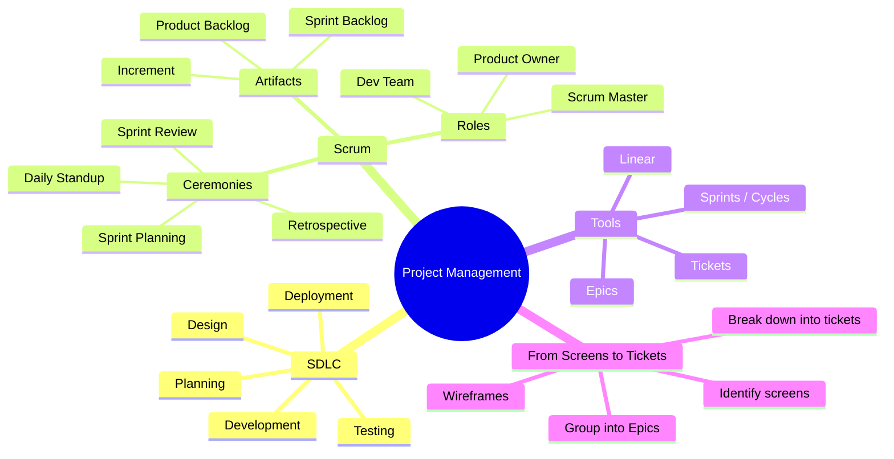

[🇪🇸 Español](README.md) | 🇬🇧 **English**

# 📋 Day 29: Software Project Management

## 📚 Context

Before diving into coding your final project, you need to learn how to **plan and organize** work the way a professional team would. A good project doesn't start with code — it starts with a plan.

---

## 🎯 Goals for the day

By the end of this day you should be able to:

- Explain the phases of the Software Development Life Cycle (SDLC)
- Understand what Scrum is, its roles, artifacts, and ceremonies
- Use a project management tool (Linear) to organize your work
- Convert a screen design into Epics and actionable tickets
- Plan realistic sprints for your final project

---

## 🗺️ Mind Map: Project Management



---

## 🗂️ Structure of the day

```text
day_29/
├── README.md
├── step0-sdlc/
│   └── README.md          # Software Development Life Cycle
├── step1-scrum/
│   └── README.md          # Scrum: roles, artifacts, and ceremonies
├── step2-herramientas-gestion/
│   └── README.md          # Management with Linear
├── step3-de-pantallas-a-tickets/
│   └── README.md          # Methodology: screens → epics → tickets
└── step4-ejemplo-proyecto-ficticio/
    └── README.md          # Full example: PetMatch
```

---

## 🧭 Suggested study order

1. `step0-sdlc` — Understand the full lifecycle of a project
2. `step1-scrum` — Learn the methodology you'll use
3. `step2-herramientas-gestion` — Set up your working tool
4. `step3-de-pantallas-a-tickets` — Learn how to break down work
5. `step4-ejemplo-proyecto-ficticio` — See everything applied to a real project

---

## ✅ End-of-day checklist

- [ ] I can name the phases of the SDLC
- [ ] I can explain the 3 Scrum roles
- [ ] I know the Scrum artifacts and ceremonies
- [ ] I have my Linear workspace (or similar tool) set up
- [ ] I can turn a design's screens into epics and tickets
- [ ] I understand how to estimate tickets with sizes (S, M, L)
- [ ] I have reviewed the full PetMatch example and can replicate the process for my project
