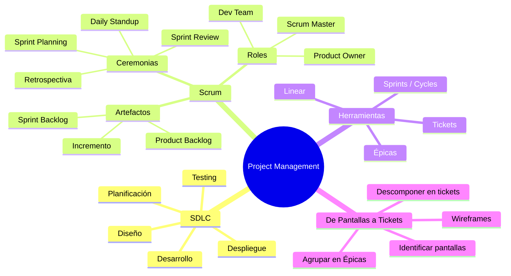

# 📋 Día 29: Gestión de Proyectos de Software

## 📚 Contexto

Antes de lanzarte a programar tu proyecto final, necesitas aprender a **planificar y organizar** el trabajo como lo haría un equipo profesional. Un buen proyecto no empieza con código — empieza con un plan.

---

## 🎯 Objetivos del día

Al terminar este día deberías poder:

- Explicar las fases del ciclo de desarrollo de software (SDLC)
- Entender qué es Scrum, sus roles, artefactos y ceremonias
- Usar una herramienta de gestión (Linear) para organizar tu trabajo
- Convertir un diseño de pantallas en Épicas y tickets accionables
- Planificar sprints realistas para tu proyecto final

---

## 🗺️ Mapa Mental: Gestión de Proyectos



---

## 🗂️ Estructura del día

```text
day_29/
├── README.md
├── step0-sdlc/
│   └── README.md          # Ciclo de desarrollo de software
├── step1-scrum/
│   └── README.md          # Scrum: roles, artefactos y ceremonias
├── step2-herramientas-gestion/
│   └── README.md          # Gestión con Linear
├── step3-de-pantallas-a-tickets/
│   └── README.md          # Metodología: pantallas → épicas → tickets
└── step4-ejemplo-proyecto-ficticio/
    └── README.md          # Ejemplo completo: PetMatch
```

---

## 🧭 Orden sugerido de estudio

1. `step0-sdlc` — Entender el ciclo completo de un proyecto
2. `step1-scrum` — Aprender la metodología que usarás
3. `step2-herramientas-gestion` — Configurar tu herramienta de trabajo
4. `step3-de-pantallas-a-tickets` — Aprender a descomponer trabajo
5. `step4-ejemplo-proyecto-ficticio` — Ver todo aplicado a un proyecto real

---

## ✅ Checklist de cierre del día

- [ ] Puedo nombrar las fases del SDLC
- [ ] Sé explicar los 3 roles de Scrum
- [ ] Conozco los artefactos y ceremonias de Scrum
- [ ] Tengo mi workspace en Linear (o herramienta similar) configurado
- [ ] Sé convertir pantallas de un diseño en épicas y tickets
- [ ] Entiendo cómo estimar tickets con tallas (S, M, L)
- [ ] He visto el ejemplo completo de PetMatch y puedo replicar el proceso para mi proyecto
