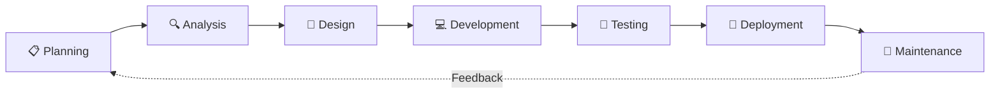
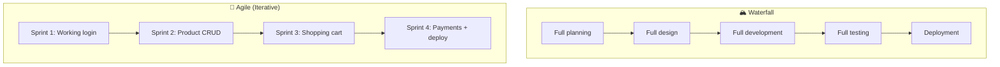

[🇪🇸 Español](README.md) | 🇬🇧 **English**

# Step 0: The Software Development Life Cycle (SDLC)

## 🎯 Goal

Understand **what phases a software project goes through** from the initial idea to users actually using it, and why skipping phases causes problems.

---

## 🤔 Why does this matter?

Imagine you decide to build a house. Would you start laying bricks without blueprints? Probably not. Yet many developers start coding without being clear on **what** they're going to build or **how** they're going to organize it.

The **SDLC** (Software Development Life Cycle) is simply the sequence of phases a software project follows. It's not a rigid recipe — it's a guide that helps you avoid forgetting critical steps.

---

## 🔄 The Phases of the SDLC

### 1. 📋 Planning

**Key question:** *What are we going to build, and why?*

- Define the project's scope
- Identify who the users are
- Set goals and priorities
- Estimate timelines (at a high level)

> 💡 **In your final project:** This phase is when you define your idea, the main features, and make a general list of what the app will do.

### 2. 🔍 Analysis

**Key question:** *What exactly does the user need?*

- Detail the functional requirements (what the app does)
- Detail the non-functional requirements (performance, security)
- Identify data entities and relationships

> 💡 **In your final project:** Here you define your data models, what endpoints you need, and what screens the app will have.

### 3. 🎨 Design

**Key question:** *How will it look and how will it be structured?*

- Database design (ER diagram)
- API design (endpoints)
- Wireframes or mockups of the screens
- System architecture (frontend + backend)

> 💡 **In your final project:** You sketch your screens (even on paper), define your database schema, and list your endpoints.

### 4. 💻 Development

**Key question:** *How do I build it?*

- Write the code (frontend and backend)
- Follow the plan defined in the previous phases
- Work incrementally (don't try to do everything at once)

> 💡 **In your final project:** This is where you code, but already knowing exactly what to do thanks to the previous phases.

### 5. 🧪 Testing

**Key question:** *Does it actually work?*

- Verify that each feature does what's expected
- Test edge cases and errors
- Make sure nothing broke when adding new code

> 💡 **In your final project:** Test every endpoint, every screen, every full flow (signup → login → use the app).

### 6. 🚀 Deployment

**Key question:** *How do I make it available to users?*

- Set up the production server
- Deploy the application
- Configure domains, SSL, environment variables

> 💡 **In your final project:** Publish your app on a service like Render, Railway, or similar.

### 7. 🔧 Maintenance

**Key question:** *How do I keep it running and improve it?*

- Fix bugs reported by users
- Add new features
- Optimize performance

> 💡 **In your final project:** After delivery, you might keep improving your project for your portfolio.

---

## ⚔️ Waterfall vs Agile

There are two main approaches to moving through these phases:

| Aspect | Waterfall | Agile |
|--------|-----------|-------|
| **Approach** | The whole project at once | Incremental deliveries |
| **Planning** | Done upfront | Adapted each sprint |
| **Feedback** | At the end of the project | After each sprint |
| **Changes** | Hard and expensive | Expected and welcome |
| **Risk** | High (problems discovered late) | Low (problems found early) |
| **Best for** | Projects with fixed requirements | Projects that evolve |

> 💡 **In today's industry, almost every team uses some variant of Agile.** The most popular Agile framework is **Scrum**, which we'll cover in the next step.

---

## 🏗️ Analogy: Building a House vs Building Software

| Phase | Building a House | Building Software |
|-------|------------------|-------------------|
| Planning | "I want a 3-bedroom house with a garden" | "I want a pet adoption app" |
| Analysis | Study the land, permits, materials | Define data models, endpoints, screens |
| Design | The architect's blueprints | Wireframes, ER diagram, endpoint list |
| Development | Bricklayers building | Programmers writing code |
| Testing | Inspection: do the pipes work? | QA: does login work? Does the API respond well? |
| Deployment | Handing over the keys | Pushing to production |
| Maintenance | Repairs, renovations | Bug fixes, new features |

---

## 🧠 Question to reflect on

Why do you think so many software projects fail?

The most common reasons are:

1. **Requirements weren't well defined** (incomplete analysis phase)
2. **The work wasn't planned** (coding started without a plan)
3. **Nothing was prioritized** (everything was attempted at once)
4. **Time wasn't estimated correctly** (excessive optimism)
5. **The team didn't communicate well** (everyone did their own thing without coordination)

All of these have something in common: **the early phases of the SDLC were skipped or done poorly**.

---

## ✅ Step checklist

- [ ] I can name the 7 phases of the SDLC
- [ ] I understand the difference between Waterfall and Agile
- [ ] I know what phase of my final project I'm in at any moment
