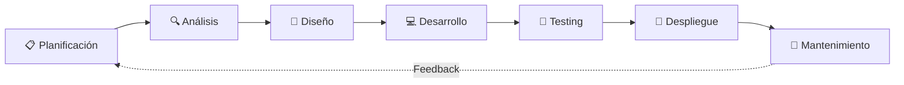
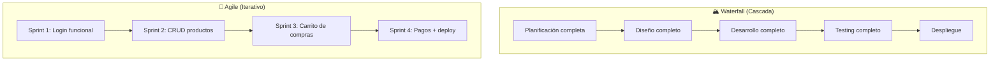

# Step 0: El Ciclo de Desarrollo de Software (SDLC)

## 🎯 Objetivo

Entender **qué fases atraviesa un proyecto de software** desde la idea inicial hasta que los usuarios lo están usando, y por qué saltarse fases genera problemas.

---

## 🤔 ¿Por qué importa esto?

Imagina que decides construir una casa. ¿Empezarías poniendo ladrillos sin tener planos? Probablemente no. Sin embargo, muchos desarrolladores empiezan a programar sin tener claro **qué** van a construir ni **cómo** lo van a organizar.

El **SDLC** (Software Development Life Cycle) es simplemente la secuencia de fases que sigue un proyecto de software. No es una receta rígida — es una guía que te ayuda a no olvidar pasos críticos.

---

## 🔄 Las Fases del SDLC

### 1. 📋 Planificación

**Pregunta clave:** *¿Qué vamos a construir y por qué?*

- Definir el alcance del proyecto
- Identificar quiénes son los usuarios
- Establecer objetivos y prioridades
- Estimar tiempos (a alto nivel)

> 💡 **En tu proyecto final:** Esta fase es cuando defines tu idea, las funcionalidades principales y haces un listado general de lo que la app va a hacer.

### 2. 🔍 Análisis

**Pregunta clave:** *¿Qué necesita exactamente el usuario?*

- Detallar los requisitos funcionales (qué hace la app)
- Detallar los requisitos no funcionales (rendimiento, seguridad)
- Identificar las entidades y relaciones de datos

> 💡 **En tu proyecto final:** Aquí defines tus modelos de datos, qué endpoints necesitas y qué pantallas va a tener la app.

### 3. 🎨 Diseño

**Pregunta clave:** *¿Cómo se va a ver y cómo se va a estructurar?*

- Diseño de la base de datos (diagrama ER)
- Diseño de la API (endpoints)
- Wireframes o mockups de las pantallas
- Arquitectura del sistema (frontend + backend)

> 💡 **En tu proyecto final:** Dibujas tus pantallas (aunque sea en papel), defines tu esquema de base de datos y listas tus endpoints.

### 4. 💻 Desarrollo

**Pregunta clave:** *¿Cómo lo construyo?*

- Escribir el código (frontend y backend)
- Seguir el plan definido en las fases anteriores
- Trabajar de forma incremental (no intentar hacer todo de golpe)

> 💡 **En tu proyecto final:** Aquí es donde programas, pero ya sabiendo exactamente qué tienes que hacer gracias a las fases anteriores.

### 5. 🧪 Testing

**Pregunta clave:** *¿Funciona correctamente?*

- Probar que cada funcionalidad hace lo esperado
- Probar casos límite y errores
- Verificar que no se rompió nada al añadir código nuevo

> 💡 **En tu proyecto final:** Prueba cada endpoint, cada pantalla, cada flujo completo (registro → login → usar la app).

### 6. 🚀 Despliegue

**Pregunta clave:** *¿Cómo lo pongo disponible para los usuarios?*

- Configurar el servidor de producción
- Desplegar la aplicación
- Configurar dominios, SSL, variables de entorno

> 💡 **En tu proyecto final:** Publicar tu app en un servicio como Render, Railway o similar.

### 7. 🔧 Mantenimiento

**Pregunta clave:** *¿Cómo lo mantengo funcionando y lo mejoro?*

- Corregir bugs que reporten los usuarios
- Añadir nuevas funcionalidades
- Optimizar rendimiento

> 💡 **En tu proyecto final:** Después de la entrega, podrías seguir mejorando tu proyecto para tu portfolio.

---

## ⚔️ Waterfall vs Agile

Hay dos grandes enfoques para recorrer estas fases:

| Aspecto | Waterfall | Agile |
|---------|-----------|-------|
| **Enfoque** | Todo el proyecto de una vez | Entregas incrementales |
| **Planificación** | Completa al inicio | Se adapta en cada sprint |
| **Feedback** | Al final del proyecto | Después de cada sprint |
| **Cambios** | Difíciles y costosos | Esperados y bienvenidos |
| **Riesgo** | Alto (descubres problemas tarde) | Bajo (detectas problemas pronto) |
| **Ideal para** | Proyectos con requisitos fijos | Proyectos que evolucionan |

> 💡 **En la industria actual, casi todos los equipos usan alguna variante de Agile.** El framework más popular dentro de Agile es **Scrum**, que veremos en el siguiente step.

---

## 🏗️ Analogía: Construir una Casa vs Construir Software

| Fase | Construir una Casa | Construir Software |
|------|--------------------|--------------------|
| Planificación | "Quiero una casa de 3 habitaciones con jardín" | "Quiero una app de adopción de mascotas" |
| Análisis | Estudiar el terreno, permisos, materiales | Definir modelos de datos, endpoints, pantallas |
| Diseño | Planos del arquitecto | Wireframes, diagrama ER, lista de endpoints |
| Desarrollo | Albañiles construyendo | Programadores escribiendo código |
| Testing | Inspección: ¿las tuberías funcionan? | QA: ¿el login funciona? ¿la API responde bien? |
| Despliegue | Entrega de llaves | Publicar en producción |
| Mantenimiento | Reparaciones, reformas | Bug fixes, nuevas features |

---

## 🧠 Pregunta para reflexionar

¿Por qué crees que muchos proyectos de software fallan?

Las razones más comunes son:

1. **No se definieron bien los requisitos** (fase de análisis incompleta)
2. **No se planificó el trabajo** (se empezó a programar sin un plan)
3. **No se priorizó** (se intentó hacer todo al mismo tiempo)
4. **No se estimó correctamente el tiempo** (optimismo excesivo)
5. **No se comunicó bien el equipo** (cada uno haciendo lo suyo sin coordinación)

Todas estas razones tienen algo en común: **se saltaron o hicieron mal las fases iniciales del SDLC**.

---

## ✅ Checklist de este step

- [ ] Puedo nombrar las 7 fases del SDLC
- [ ] Entiendo la diferencia entre Waterfall y Agile
- [ ] Sé en qué fase de mi proyecto final estoy en cada momento
