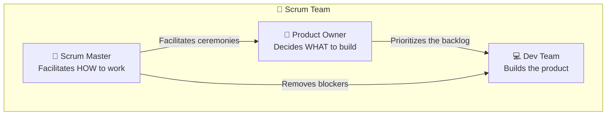
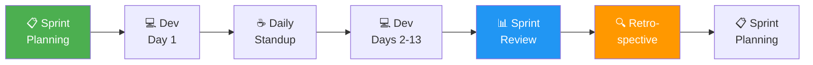
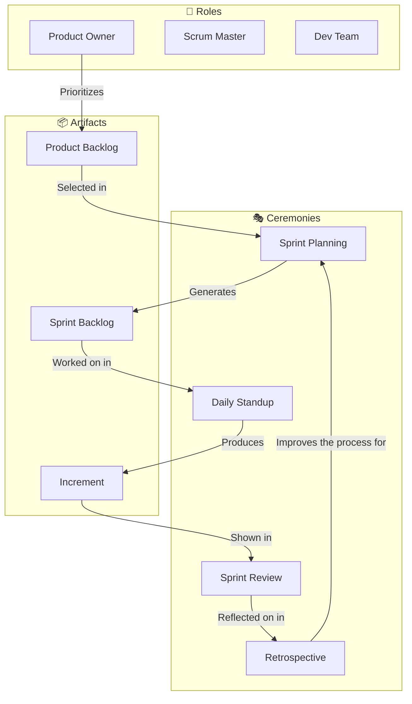

[🇪🇸 Español](README.md) | 🇬🇧 **English**

# Step 1: Scrum — Roles, Artifacts, and Ceremonies

## 🎯 Goal

Understand **how Scrum works** as a framework for organizing teamwork, and how to apply it (in a simplified way) to your final project.

---

## 🤔 What is Scrum?

Scrum is an **agile work framework** (not a rigid methodology) that organizes development into short cycles called **Sprints**. The core idea is simple:

> Instead of trying to build everything at once, you build **working pieces** every 1–2 weeks.

### Analogy: The Restaurant

Picture a restaurant. They don't prepare every dish on the menu all at once and serve them at the end of the night. Instead:

- The **Product Owner** is like the restaurant owner: decides what dishes are on the menu and which ones are priority
- The **Scrum Master** is like the head waiter: makes sure the team flows without blockers
- The **development team** are the cooks: they execute the work
- Each **Sprint** is like a service shift: at the end, dishes are finished and served
- The **Daily Standup** is the quick huddle before service: what does each person have? Does anyone need anything?

---

## 👥 The 3 Scrum Roles



| Role | Responsibility | In your final project |
|------|----------------|-----------------------|
| **Product Owner** | Defines what gets built and in what order. The voice of the user. | You: decide what features your app has |
| **Scrum Master** | Facilitates ceremonies, removes blockers, protects the team. | Your mentor or yourself: make sure the process is followed |
| **Dev Team** | Builds the product. Self-organizes to complete the sprint. | You (and your teammate if working in a team) |

> 💡 **In a solo project**, you take on all 3 roles. What matters is that you understand each one's mindset: prioritize like a PO, unblock like an SM, and execute like a Dev.

---

## 📦 The 3 Scrum Artifacts

The artifacts are the "pieces of information" Scrum uses to maintain transparency:

### 1. Product Backlog

The **complete, prioritized list** of everything the application needs.

```
📋 PRODUCT BACKLOG (PetMatch)
─────────────────────────────────────────
Priority │ Ticket                          │ Size
─────────┼─────────────────────────────────┼──────
High     │ As a user I want to sign up     │ M
High     │ As a user I want to log in      │ M
High     │ As a user I want to see pets    │ L
Medium   │ As a user I want to filter      │ M
Medium   │ As a user I want favorites      │ M
Low      │ As an admin I want stats        │ L
```

**Characteristics:**
- Lives throughout the **entire project**
- Is **reordered** continuously based on priority
- The **Product Owner** is responsible for maintaining it

### 2. Sprint Backlog

The **subset of the Product Backlog** the team commits to completing in the current sprint.

```
📋 SPRINT BACKLOG — Sprint 1 (2 weeks)
─────────────────────────────────────────
Status     │ Ticket                          │ Assignee
───────────┼─────────────────────────────────┼─────────
✅ Done    │ Create User and Pet models      │ Dev 1
🔄 In Progress │ Endpoint POST /api/signup   │ Dev 1
📋 To Do   │ Endpoint POST /api/login        │ Dev 2
📋 To Do   │ Signup screen (React)           │ Dev 2
```

**Characteristics:**
- Contains only what will be done **in this sprint**
- The team updates it **daily**
- Nobody adds work mid-sprint (in theory)

### 3. Increment

The **tangible result** of the sprint: a working version of the product with the new features integrated.

> The PetMatch Sprint 1 increment would be: "A user can sign up and log in. They can see the home screen (even if it's still empty)."

---

## 🔄 The Sprint Cycle



A typical sprint lasts **1 to 4 weeks** (most commonly: 2 weeks).

---

## 🎭 The 4 Scrum Ceremonies

### 1. Sprint Planning

| Detail | Value |
|--------|-------|
| **When** | At the start of each sprint |
| **Duration** | 1–2 hours (for a 2-week sprint) |
| **Who** | The whole Scrum team |
| **Goal** | Decide which tickets enter the sprint |

**What happens in a Sprint Planning?**
1. The PO presents the highest-priority tickets from the Product Backlog
2. The team discusses and estimates the complexity of each
3. The team picks the tickets they can complete in the sprint
4. The **sprint goal** is defined (a sentence summarizing what will be achieved)

> 💡 **In your final project:** Before starting to code each week, decide which tickets you'll tackle. Don't overload yourself.

### 2. Daily Standup

| Detail | Value |
|--------|-------|
| **When** | Every day, same time |
| **Duration** | 15 minutes max |
| **Who** | Dev Team (PO and SM optional) |
| **Goal** | Sync the team |

Each person answers 3 questions:

```
1. What did I do yesterday?
2. What am I doing today?
3. Do I have any blockers?
```

> 💡 **In your final (solo) project:** You can do a "daily" with yourself: write in 2 minutes what you did, what you'll do, and whether you're blocked. It's surprisingly useful.

### 3. Sprint Review

| Detail | Value |
|--------|-------|
| **When** | At the end of the sprint |
| **Duration** | 30–60 minutes |
| **Who** | The whole team + stakeholders |
| **Goal** | Show what was built and gather feedback |

**What happens?**
- The team **demos** what they built
- Stakeholders give feedback
- The Product Backlog is updated if there are changes

> 💡 **In your final project:** This is when you show your progress to the mentor and get feedback.

### 4. Retrospective

| Detail | Value |
|--------|-------|
| **When** | After the Sprint Review |
| **Duration** | 30–45 minutes |
| **Who** | Just the Scrum team |
| **Goal** | Improve the process |

You answer:

```
✅ What went well?
❌ What went badly?
🔧 What can we improve?
```

> 💡 **In your final project:** Reflect: did I commit to too many tickets? Did I underestimate complexity? Did I lose time by not planning well?

---

## 📊 Visual Summary: All of Scrum at a Glance



---

## 🧠 Question to reflect on

<details>
<summary>How would you apply Scrum if you're working solo on your final project?</summary>

Although Scrum is designed for teams, you can adapt the concepts:

1. **Product Backlog:** Build your full feature list in Linear
2. **Sprint Planning:** Each week, pick 3–5 realistic tickets
3. **Daily Standup:** 2 minutes each day writing down your progress
4. **Sprint Review:** Show your progress to your mentor weekly
5. **Retrospective:** Ask yourself what you can improve

What **doesn't** make sense to do alone:
- You don't need a formal Scrum Master
- The Daily doesn't need to be standing or 15 minutes long

What matters is keeping the **discipline of planning, executing, and inspecting**.

</details>

---

## ✅ Step checklist

- [ ] I can explain the 3 Scrum roles
- [ ] I know the 3 artifacts (Product Backlog, Sprint Backlog, Increment)
- [ ] I understand the 4 ceremonies and what each one is for
- [ ] I know how to adapt Scrum to my solo project
