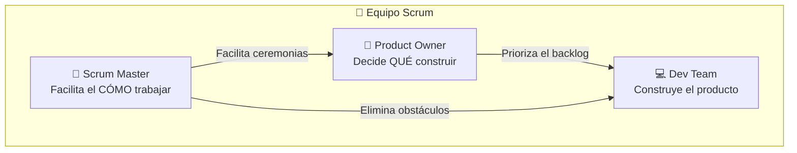
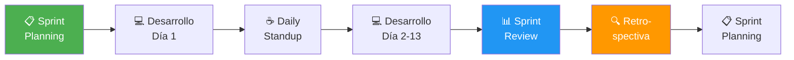
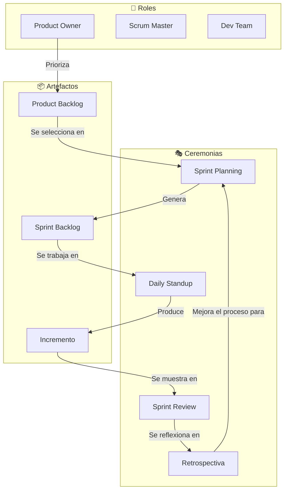

# Step 1: Scrum — Roles, Artefactos y Ceremonias

## 🎯 Objetivo

Entender **cómo funciona Scrum** como framework para organizar el trabajo en equipo, y cómo aplicarlo (de forma simplificada) a tu proyecto final.

---

## 🤔 ¿Qué es Scrum?

Scrum es un **framework de trabajo ágil** (no una metodología rígida) que organiza el desarrollo en ciclos cortos llamados **Sprints**. La idea central es simple:

> En vez de intentar construir todo de una vez, construyes **pedacitos funcionales** cada 1-2 semanas.

### Analogía: El Restaurante

Imagina un restaurante. No preparan todos los platos del menú de una vez y los sirven al final de la noche. En cambio:

- El **Product Owner** es como el dueño del restaurante: decide qué platos están en el menú y cuáles son prioritarios
- El **Scrum Master** es como el jefe de sala: se asegura de que el equipo fluya sin bloqueos
- El **equipo de desarrollo** son los cocineros: ejecutan el trabajo
- Cada **Sprint** es como un turno de servicio: al final, hay platos terminados y servidos
- El **Daily Standup** es la reunión rápida antes del servicio: ¿qué tiene cada uno? ¿alguien necesita algo?

---

## 👥 Los 3 Roles de Scrum



| Rol | Responsabilidad | En tu proyecto final |
|-----|-----------------|----------------------|
| **Product Owner** | Define qué se construye y en qué orden. Es la voz del usuario. | Tú mismo: decides qué funcionalidades tiene tu app |
| **Scrum Master** | Facilita las ceremonias, elimina bloqueos, protege al equipo. | Tu mentor o tú mismo: te aseguras de seguir el proceso |
| **Dev Team** | Construye el producto. Se auto-organiza para completar el sprint. | Tú (y tu compañero si trabajas en equipo) |

> 💡 **En un proyecto individual**, tú asumes los 3 roles. Lo importante es que entiendas la mentalidad de cada uno: priorizar como PO, desbloquear como SM, y ejecutar como Dev.

---

## 📦 Los 3 Artefactos de Scrum

Los artefactos son las "piezas de información" que Scrum usa para mantener la transparencia:

### 1. Product Backlog (Lista del Producto)

Es la **lista completa y priorizada** de todo lo que necesita la aplicación.

```
📋 PRODUCT BACKLOG (PetMatch)
─────────────────────────────────────────
Prioridad │ Ticket                          │ Talla
──────────┼─────────────────────────────────┼──────
Alta      │ Como usuario quiero registrarme │ M
Alta      │ Como usuario quiero hacer login │ M
Alta      │ Como usuario quiero ver mascotas│ L
Media     │ Como usuario quiero filtrar     │ M
Media     │ Como usuario quiero favoritos   │ M
Baja      │ Como admin quiero estadísticas  │ L
```

**Características:**
- Vive durante **todo el proyecto**
- Se **reordena** continuamente según prioridad
- El **Product Owner** es responsable de mantenerla

### 2. Sprint Backlog (Lista del Sprint)

Es el **subconjunto del Product Backlog** que el equipo se compromete a completar en el sprint actual.

```
📋 SPRINT BACKLOG — Sprint 1 (2 semanas)
─────────────────────────────────────────
Estado     │ Ticket                          │ Asignado
───────────┼─────────────────────────────────┼─────────
✅ Done    │ Crear modelos User y Pet        │ Dev 1
🔄 In Progress │ Endpoint POST /api/signup   │ Dev 1
📋 To Do   │ Endpoint POST /api/login        │ Dev 2
📋 To Do   │ Pantalla de registro (React)    │ Dev 2
```

**Características:**
- Solo contiene lo que se hará **en este sprint**
- El equipo la actualiza **diariamente**
- Nadie puede añadir trabajo a mitad de sprint (en teoría)

### 3. Incremento

Es el **resultado tangible** del sprint: una versión funcional del producto con las nuevas funcionalidades integradas.

> El incremento del Sprint 1 de PetMatch sería: "Un usuario puede registrarse y hacer login. Puede ver la pantalla de inicio (aunque aún esté vacía)."

---

## 🔄 El Ciclo del Sprint



Un sprint típico dura **1 a 4 semanas** (lo más común: 2 semanas).

---

## 🎭 Las 4 Ceremonias de Scrum

### 1. Sprint Planning (Planificación del Sprint)

| Detalle | Valor |
|---------|-------|
| **Cuándo** | Al inicio de cada sprint |
| **Duración** | 1-2 horas (para sprint de 2 semanas) |
| **Quién** | Todo el equipo Scrum |
| **Objetivo** | Decidir qué tickets entran en el sprint |

**¿Qué pasa en un Sprint Planning?**
1. El PO presenta los tickets más prioritarios del Product Backlog
2. El equipo discute y estima la complejidad de cada uno
3. El equipo selecciona los tickets que puede completar en el sprint
4. Se define el **objetivo del sprint** (una frase que resume qué se logrará)

> 💡 **En tu proyecto final:** Antes de empezar a programar cada semana, decide qué tickets vas a abordar. No te sobrecargues.

### 2. Daily Standup (Reunión Diaria)

| Detalle | Valor |
|---------|-------|
| **Cuándo** | Todos los días, misma hora |
| **Duración** | 15 minutos máximo |
| **Quién** | Dev Team (PO y SM opcionales) |
| **Objetivo** | Sincronizar al equipo |

Cada persona responde 3 preguntas:

```
1. ¿Qué hice ayer?
2. ¿Qué voy a hacer hoy?
3. ¿Tengo algún bloqueo?
```

> 💡 **En tu proyecto final (individual):** Puedes hacer un "daily" contigo mismo: escribe en 2 minutos qué hiciste, qué vas a hacer y si estás bloqueado en algo. Es sorprendentemente útil.

### 3. Sprint Review (Revisión del Sprint)

| Detalle | Valor |
|---------|-------|
| **Cuándo** | Al final del sprint |
| **Duración** | 30-60 minutos |
| **Quién** | Todo el equipo + stakeholders |
| **Objetivo** | Mostrar lo construido y recoger feedback |

**¿Qué pasa?**
- El equipo hace una **demo** de lo que construyó
- Los stakeholders dan feedback
- Se actualiza el Product Backlog si hay cambios

> 💡 **En tu proyecto final:** Es cuando le muestras tu avance al mentor y recibes feedback.

### 4. Retrospectiva

| Detalle | Valor |
|---------|-------|
| **Cuándo** | Después del Sprint Review |
| **Duración** | 30-45 minutos |
| **Quién** | Solo el equipo Scrum |
| **Objetivo** | Mejorar el proceso |

Se responde:

```
✅ ¿Qué salió bien?
❌ ¿Qué salió mal?
🔧 ¿Qué podemos mejorar?
```

> 💡 **En tu proyecto final:** Reflexiona: ¿me comprometí con demasiados tickets? ¿Subestimé la complejidad? ¿Perdí tiempo por no planificar bien?

---

## 📊 Resumen Visual: Todo Scrum en un Vistazo



---

## 🧠 Pregunta para reflexionar

<details>
<summary>¿Cómo aplicarías Scrum si trabajas solo en tu proyecto final?</summary>

Aunque Scrum está diseñado para equipos, puedes adaptar los conceptos:

1. **Product Backlog:** Haz tu lista completa de funcionalidades en Linear
2. **Sprint Planning:** Cada semana, elige 3-5 tickets realistas
3. **Daily Standup:** 2 minutos cada día escribiendo tu progreso
4. **Sprint Review:** Muestra tu avance al mentor semanalmente
5. **Retrospectiva:** Pregúntate qué puedes mejorar

Lo que **NO** tiene sentido hacer solo:
- No necesitas un Scrum Master formal
- El Daily no tiene que ser de pie ni durar 15 minutos

Lo importante es mantener la **disciplina de planificar, ejecutar e inspeccionar**.

</details>

---

## ✅ Checklist de este step

- [ ] Puedo explicar los 3 roles de Scrum
- [ ] Conozco los 3 artefactos (Product Backlog, Sprint Backlog, Incremento)
- [ ] Entiendo las 4 ceremonias y para qué sirve cada una
- [ ] Sé cómo adaptar Scrum a mi proyecto individual
