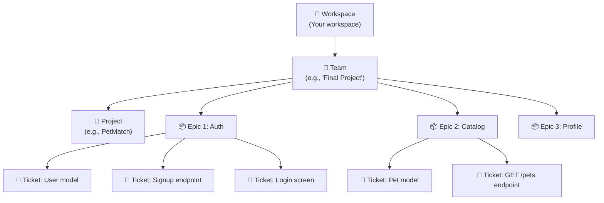

[🇪🇸 Español](README.md) | 🇬🇧 **English**

# Step 2: Project Management Tools — Linear

## 🎯 Goal

Learn how to use **Linear** as a tool to manage your project: create a workspace, organize the work into Epics and tickets, and plan sprints (Cycles).

---

## 🤔 Why use a project management tool?

Keeping tasks "in your head" or in an unsorted list has several problems:

- You don't know **what to prioritize**
- You can't see **how much progress you've made**
- You can't **communicate your progress** to others
- It's easy to **forget tasks** or **underestimate the work**

A tool like Linear gives you:

| Benefit | Without a tool | With Linear |
|---------|----------------|-------------|
| Organization | List in a notebook | Epics, tickets, statuses |
| Priority | "Everything is urgent" | Clear priorities (Urgent, High, Medium, Low) |
| Progress | "I think I'm doing fine..." | Sprint progress bar |
| Communication | "I'm doing stuff" | Board with To Do / In Progress / Done |

---

## 🔧 Getting Started with Linear

### 1. Create an account

1. Go to [linear.app](https://linear.app)
2. Create an account (you can use your GitHub or Google account)
3. Create a **Workspace** (for example: "My Final Project")

### 2. Create a Project

A **Project** in Linear groups all the work related to a specific goal.

- Name: `PetMatch` (or your project's name)
- Description: short summary of what the app does
- Status: "In Progress"

### 3. Understand Linear's hierarchy



---

## 📦 Epics (Projects or Labels)

An **Epic** is a large block of work that groups related tickets. In Linear you can represent epics in two ways:

1. **As Projects** (recommended for larger projects)
2. **As Labels** (more flexible for smaller projects)

### Examples of Epics for a full-stack project:

| Epic | Description | Typical tickets |
|------|-------------|-----------------|
| **Auth** | Everything related to signup and login | User model, signup, login, JWT, login screen, signup screen |
| **Catalog** | Main app functionality | Main model, CRUD endpoints, list, detail, filters |
| **Profile/Favorites** | Authenticated user features | Profile, edit profile, favorites, history |
| **Admin** | Admin panel (if applicable) | Admin dashboard, admin CRUD, stats |
| **Infrastructure** | Technical setup | Initial config, deploy, CI/CD, README |

---

## 🎫 Anatomy of a Good Ticket

A well-written ticket has:

```
📌 Title: Create endpoint POST /api/signup

📝 Description:
  Create the user signup endpoint that receives email and password,
  hashes the password with bcrypt, saves the user to the DB, and
  returns a JWT.

✅ Acceptance criteria:
  - [ ] Receives { email, password } in the body
  - [ ] Validates that the email doesn't already exist
  - [ ] Hashes the password with bcrypt
  - [ ] Saves the user to the DB
  - [ ] Returns a valid JWT
  - [ ] Returns 400 if data is missing
  - [ ] Returns 409 if the email already exists

📏 Size: M
🏷️ Epic: Auth
🔢 Priority: High
```

### Sizes for Estimating

Instead of estimating in hours (very hard and imprecise), we use **t-shirt sizes**:

| Size | Meaning | Example |
|------|---------|---------|
| **S** (Small) | Simple task, < 2 hours | Add a field to the model |
| **M** (Medium) | Medium task, half a day | Create an endpoint with validations |
| **L** (Large) | Complex task, 1+ day | Full screen with form and validations |
| **XL** (Extra Large) | Too big — **must be split** | "Do the whole backend" → NO |

> ⚠️ **If a ticket is XL, break it down.** A ticket should be completable in at most 1–2 days.

---

## 🔄 Cycles (Sprints in Linear)

In Linear, sprints are called **Cycles**:

1. Go to the **Cycles** section in your team
2. Create a new Cycle (for example: "Sprint 1 — March 16–30")
3. Drag tickets from the backlog into the Cycle
4. During the sprint, move tickets between statuses:

```
📋 Backlog → 📌 Todo → 🔄 In Progress → ✅ Done
```

### Tips for planning a Cycle:

- **Don't pack in too many tickets.** Completing 5 out of 5 beats 5 out of 15.
- **Mix sizes:** 2 M tickets + 3 S tickets is better than 2 L tickets.
- **Prioritize what creates value:** working login > pretty button.
- **Leave margin** for bugs and unexpected issues.

---

## 📊 Useful Views in Linear

Linear offers several ways to look at your work:

### Board View (Kanban Board)

```
┌──────────┬──────────────┬──────────┐
│ 📋 To Do │ 🔄 In Progress│ ✅ Done  │
├──────────┼──────────────┼──────────┤
│ Endpoint │ User model   │ DB setup │
│ signup   │              │          │
│          │ Login        │ Flask    │
│ Endpoint │ screen       │ config   │
│ login    │              │          │
└──────────┴──────────────┴──────────┘
```

### List View
Ideal for seeing all tasks with their properties (size, priority, assignee, epic).

### Timeline View
For seeing how tasks are distributed over time.

---

## 🧠 Question to reflect on

<details>
<summary>How many tickets should my final project have?</summary>

It depends on complexity, but as a reference:

- **Simple project** (3–4 screens): 15–25 tickets
- **Medium project** (5–7 screens): 25–40 tickets
- **Complex project** (8+ screens): 40+ tickets

A good rule of thumb: each screen should generate between 3–6 tickets:
- 1 ticket for the data model(s)
- 1–2 tickets for the endpoints
- 1–2 tickets for the React screen
- 1 ticket to connect frontend with backend

</details>

---

## ✅ Step checklist

- [ ] I have my Linear account created
- [ ] I understand the hierarchy: Workspace → Team → Project → Epics → Tickets
- [ ] I know how to write a good ticket (title, description, criteria, size)
- [ ] I understand how to use Cycles to plan sprints
- [ ] I know the different views (Board, List, Timeline)
