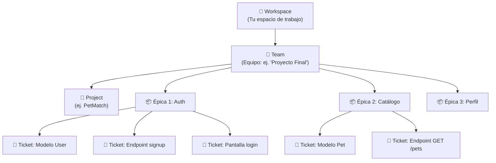

# Step 2: Herramientas de Gestión — Linear

## 🎯 Objetivo

Aprender a usar **Linear** como herramienta para gestionar tu proyecto: crear un workspace, organizar el trabajo en Épicas y tickets, y planificar sprints (Cycles).

---

## 🤔 ¿Por qué usar una herramienta de gestión?

Tener las tareas "en la cabeza" o en una lista desordenada tiene varios problemas:

- No sabes **qué priorizar**
- No ves **cuánto llevas avanzado**
- No puedes **comunicar tu progreso** a otros
- Es fácil **olvidar tareas** o **subestimar el trabajo**

Una herramienta como Linear te da:

| Beneficio | Sin herramienta | Con Linear |
|-----------|-----------------|------------|
| Organización | Lista en un cuaderno | Épicas, tickets, estados |
| Prioridad | "Todo es urgente" | Prioridades claras (Urgent, High, Medium, Low) |
| Progreso | "Creo que voy bien..." | Barra de progreso por sprint |
| Comunicación | "Estoy haciendo cosas" | Board con To Do / In Progress / Done |

---

## 🔧 Primeros Pasos con Linear

### 1. Crear una cuenta

1. Ve a [linear.app](https://linear.app)
2. Crea una cuenta (puedes usar tu cuenta de GitHub o Google)
3. Crea un **Workspace** (por ejemplo: "Mi Proyecto Final")

### 2. Crear un Proyecto

Un **Proyecto** en Linear agrupa todo el trabajo relacionado con un objetivo concreto.

- Nombre: `PetMatch` (o el nombre de tu proyecto)
- Descripción: breve resumen de lo que hace la app
- Estado: "In Progress"

### 3. Entender la jerarquía de Linear



---

## 📦 Épicas (Projects o Labels)

Una **Épica** es un bloque grande de trabajo que agrupa tickets relacionados. En Linear puedes representar épicas de dos formas:

1. **Como Projects** (recomendado para proyectos grandes)
2. **Como Labels** (más flexible para proyectos pequeños)

### Ejemplos de Épicas para un proyecto full-stack:

| Épica | Descripción | Tickets típicos |
|-------|-------------|-----------------|
| **Auth** | Todo lo relacionado con registro y login | Modelo User, signup, login, JWT, pantalla login, pantalla registro |
| **Catálogo** | Funcionalidad principal de la app | Modelo principal, CRUD endpoints, listado, detalle, filtros |
| **Perfil/Favoritos** | Funcionalidades del usuario autenticado | Perfil, editar perfil, favoritos, historial |
| **Admin** | Panel de administración (si aplica) | Dashboard admin, CRUD desde admin, estadísticas |
| **Infraestructura** | Setup técnico | Config inicial, deploy, CI/CD, README |

---

## 🎫 Anatomía de un Buen Ticket

Un ticket bien escrito tiene:

```
📌 Título: Crear endpoint POST /api/signup

📝 Descripción:
  Crear el endpoint de registro de usuario que reciba email y password,
  hashee la contraseña con bcrypt, guarde el usuario en la BD y
  devuelva un JWT.

✅ Criterios de aceptación:
  - [ ] Recibe { email, password } en el body
  - [ ] Valida que el email no exista ya
  - [ ] Hashea la contraseña con bcrypt
  - [ ] Guarda el usuario en la BD
  - [ ] Devuelve un JWT válido
  - [ ] Devuelve 400 si faltan datos
  - [ ] Devuelve 409 si el email ya existe

📏 Talla: M
🏷️ Épica: Auth
🔢 Prioridad: Alta
```

### Tallas para Estimar

En vez de estimar en horas (que es muy difícil y poco preciso), usamos **tallas de camiseta**:

| Talla | Significado | Ejemplo |
|-------|-------------|---------|
| **S** (Small) | Tarea simple, < 2 horas | Añadir un campo al modelo |
| **M** (Medium) | Tarea media, medio día | Crear un endpoint con validaciones |
| **L** (Large) | Tarea compleja, 1+ día | Pantalla completa con formulario y validaciones |
| **XL** (Extra Large) | Demasiado grande, **hay que dividirla** | "Hacer todo el backend" → NO |

> ⚠️ **Si un ticket es XL, divídelo.** Un ticket debería poder completarse en un máximo de 1-2 días.

---

## 🔄 Cycles (Sprints en Linear)

En Linear, los sprints se llaman **Cycles**:

1. Ve a la sección **Cycles** en tu equipo
2. Crea un nuevo Cycle (por ejemplo: "Sprint 1 — 16 al 30 marzo")
3. Arrastra tickets del backlog al Cycle
4. Durante el sprint, mueve los tickets entre estados:

```
📋 Backlog → 📌 Todo → 🔄 In Progress → ✅ Done
```

### Consejos para planificar un Cycle:

- **No metas demasiados tickets.** Es mejor completar 5 de 5 que 5 de 15.
- **Mezcla tallas:** 2 tickets M + 3 tickets S es mejor que 2 tickets L.
- **Prioriza lo que genera valor:** login funcional > botón bonito.
- **Deja margen** para bugs y problemas inesperados.

---

## 📊 Vistas Útiles en Linear

Linear te ofrece varias formas de ver tu trabajo:

### Board View (Tablero Kanban)

```
┌──────────┬──────────────┬──────────┐
│ 📋 To Do │ 🔄 In Progress│ ✅ Done  │
├──────────┼──────────────┼──────────┤
│ Endpoint │ Modelo User  │ Setup DB │
│ signup   │              │          │
│          │ Pantalla     │ Config   │
│ Endpoint │ login        │ Flask    │
│ login    │              │          │
└──────────┴──────────────┴──────────┘
```

### List View (Lista)
Ideal para ver todas las tareas con sus propiedades (talla, prioridad, asignado, épica).

### Timeline View
Para ver cómo se distribuyen las tareas en el tiempo.

---

## 🧠 Pregunta para reflexionar

<details>
<summary>¿Cuántos tickets debería tener mi proyecto final?</summary>

Depende de la complejidad, pero como referencia:

- **Proyecto simple** (3-4 pantallas): 15-25 tickets
- **Proyecto medio** (5-7 pantallas): 25-40 tickets
- **Proyecto complejo** (8+ pantallas): 40+ tickets

Un buen indicador es que cada pantalla genere entre 3-6 tickets:
- 1 ticket para el/los modelo(s) de datos
- 1-2 tickets para los endpoints
- 1-2 tickets para la pantalla de React
- 1 ticket para conectar frontend con backend

</details>

---

## ✅ Checklist de este step

- [ ] Tengo mi cuenta de Linear creada
- [ ] Entiendo la jerarquía: Workspace → Team → Project → Épicas → Tickets
- [ ] Sé cómo escribir un buen ticket (título, descripción, criterios, talla)
- [ ] Entiendo cómo usar Cycles para planificar sprints
- [ ] Conozco las diferentes vistas (Board, List, Timeline)
