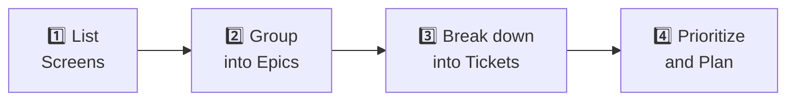
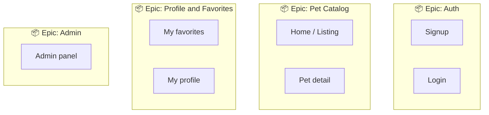
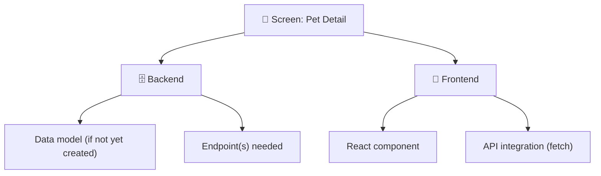
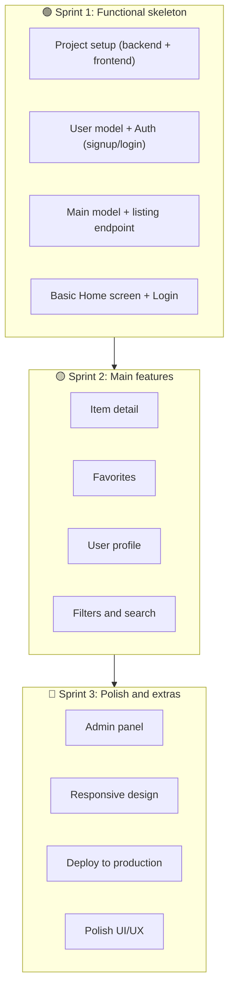

[🇪🇸 Español](README.md) | 🇬🇧 **English**

# Step 3: From Screens to Tickets

## 🎯 Goal

Learn the **practical methodology** to turn a project idea into an organized backlog: starting from the screens your app needs, grouping them into Epics, and breaking them down into actionable tickets.

---

## 🤔 The Common Problem

Most students (and many professionals) start a project like this:

```
❌ "I'm going to build a pet app"
   → Opens the editor
   → Starts coding the model
   → Halfway through: "what fields did I need?"
   → Starts the login screen
   → Realizes there's no endpoint yet
   → Bounces between frontend and backend with no plan
   → Result: messy code, half-finished features, frustration
```

The alternative:

```
✅ "I'm going to build a pet app"
   → Define the screens (5 minutes sketching)
   → Group them into Epics
   → Break them down into tickets
   → Prioritize and plan the first sprint
   → Code with a clear plan
   → Result: steady progress, nothing forgotten
```

---

## 📐 The Process: 4 Steps



---

## 1️⃣ Step 1: List the Screens

Think of your app the way a user would use it. **What screens will they see?**

Sketch them (on paper, in Excalidraw, or simply list the names):

```
PetMatch screens:
─────────────────
1. Landing / Home (pet listing)
2. Signup
3. Login
4. Pet detail
5. My favorites
6. My profile
7. Admin panel (pet management)
```

### Tips for listing screens:

- Think about the **user flow**: what do they see first? Where do they navigate?
- Don't forget "invisible" screens: signup, login, 404, loading states
- If a screen is very complex, it can be split (e.g., "Listing" and "Listing with filters")

---

## 2️⃣ Step 2: Group into Epics

Look at your screens and group those that are related. Each group becomes an **Epic**.



### General rule for Epics:

- Each epic should have **3–8 tickets**
- If it has more than 10, it can probably be split
- If it has fewer than 3, it can probably be merged with another

---

## 3️⃣ Step 3: Break Down into Tickets

Now, for each screen within each Epic, think about **what work it needs at each layer**:



### The Per-Screen Formula:

For each screen, ask yourself these questions:

| Layer | Question | Resulting ticket |
|-------|----------|------------------|
| **Model** | Do I need a new model or change an existing one? | "Create Pet model with fields: name, species, age, image_url, description" |
| **Backend** | What endpoints does this screen need? | "Create GET /api/pets/:id that returns the detail of a pet" |
| **Frontend** | What React component(s) do I need? | "Create PetDetail component that displays a pet's info" |
| **Integration** | How does the frontend connect to the backend? | "Wire PetDetail to GET /api/pets/:id using fetch" |

> 💡 **You don't always need all 4 layers.** An "About Us" screen only needs a React component (no model or endpoint).

---

## 4️⃣ Step 4: Prioritize and Plan Sprints

Now that you have all the tickets, order them by priority using this rule:

### The "Functional Skeleton" Principle

> **Sprint 1 should produce an app that "works" end-to-end, even if it has very few features.**



### Prioritization rules:

1. **First, the things that unblock other things** (models, auth, config)
2. **Then the core features** (the reason the app exists)
3. **Then the secondary features** (nice-to-have)
4. **Polish at the end** (design, animations, optimizations)

---

## ⚠️ Common Mistakes

| Mistake | Why it's a problem | What to do instead |
|---------|--------------------|--------------------|
| Ticket too big | "Do the whole backend" isn't a ticket, it's a project | Break it into tickets of at most 1–2 days |
| Ticket too vague | "Improve the app" isn't actionable | Be specific: "Add email validation in POST /api/signup" |
| No acceptance criteria | You don't know when it's "done" | Write 3–5 concrete checkboxes |
| Everything in Sprint 1 | You overload yourself and finish nothing | Max 5–8 tickets per sprint |
| Only backend or only frontend tickets | At sprint end you have nothing working | Mix them: each sprint should have something visible |

---

## 🧠 Quick Exercise

<details>
<summary>Practice: break down this screen into tickets</summary>

**Screen:** Pet listing with a search bar

Think about which tickets you'd need...

**Suggested answer:**

1. **[Backend]** Create `Pet` model (name, species, breed, age, image_url, description, available) — Size S
2. **[Backend]** Create endpoint `GET /api/pets` that returns the list of available pets — Size M
3. **[Backend]** Add query param `?search=` to `GET /api/pets` for filtering by name — Size S
4. **[Frontend]** Create `PetList` component with cards for each pet — Size M
5. **[Frontend]** Create `SearchBar` component and wire it to the query param — Size S
6. **[Integration]** Connect `PetList` with `GET /api/pets` using fetch in useEffect — Size S

Total: 6 tickets (2S + 2M + 2S) = doable in ~3–4 days

</details>

---

## ✅ Step checklist

- [ ] I can list the screens of my project
- [ ] I can group screens into Epics
- [ ] I can break each screen into tickets (model, backend, frontend, integration)
- [ ] I understand how to prioritize tickets for Sprint 1
- [ ] I can identify and avoid common ticketing mistakes
