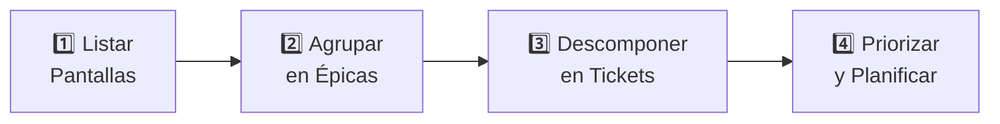
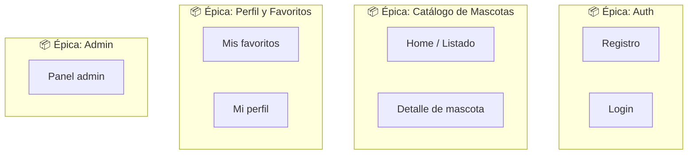
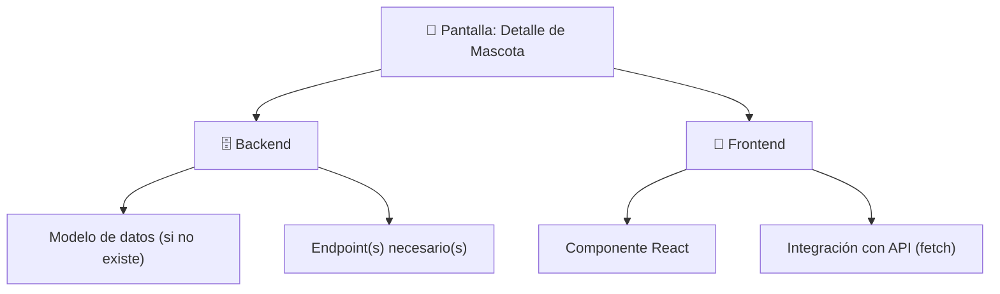
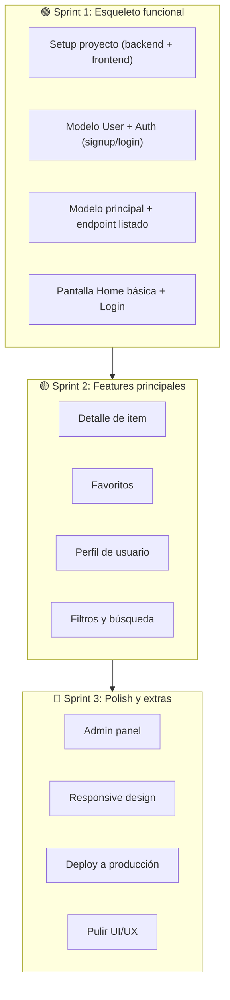

# Step 3: De Pantallas a Tickets

## 🎯 Objetivo

Aprender la **metodología práctica** para convertir una idea de proyecto en un backlog organizado: partiendo de las pantallas que necesita tu app, agrupando en Épicas, y descomponiendo en tickets accionables.

---

## 🤔 El Problema Común

La mayoría de estudiantes (y muchos profesionales) arrancan un proyecto así:

```
❌ "Voy a hacer una app de mascotas"
   → Abre el editor
   → Empieza a programar el modelo
   → A mitad camino: "¿qué campos necesitaba?"
   → Empieza la pantalla de login
   → Se da cuenta de que no tiene el endpoint
   → Va y viene entre frontend y backend sin un plan
   → Resultado: código desordenado, features a medias, frustración
```

La alternativa:

```
✅ "Voy a hacer una app de mascotas"
   → Define las pantallas (5 minutos dibujando)
   → Agrupa en Épicas
   → Descompone en tickets
   → Prioriza y planifica el primer sprint
   → Programa con un plan claro
   → Resultado: avance constante, nada se olvida
```

---

## 📐 El Proceso: 4 Pasos



---

## 1️⃣ Paso 1: Listar las Pantallas

Piensa en tu app como un usuario la usaría. **¿Qué pantallas va a ver?**

Dibújalas (en papel, en Excalidraw, o simplemente lista los nombres):

```
Pantallas de PetMatch:
──────────────────────
1. Landing / Home (listado de mascotas)
2. Registro
3. Login
4. Detalle de mascota
5. Mis favoritos
6. Mi perfil
7. Panel admin (gestión de mascotas)
```

### Tips para listar pantallas:

- Piensa en el **flujo del usuario**: ¿qué ve primero? ¿a dónde navega?
- No olvides pantallas "invisibles": registro, login, 404, loading states
- Si una pantalla es muy compleja, puede dividirse (ej: "Listado" y "Listado con filtros")

---

## 2️⃣ Paso 2: Agrupar en Épicas

Mira tus pantallas y agrupa las que estén relacionadas. Cada grupo se convierte en una **Épica**.



### Regla general para Épicas:

- Cada épica debería tener **3-8 tickets**
- Si tiene más de 10, probablemente se puede dividir
- Si tiene menos de 3, probablemente se puede fusionar con otra

---

## 3️⃣ Paso 3: Descomponer en Tickets

Ahora, por cada pantalla dentro de cada Épica, piensa en **qué trabajo necesita en cada capa**:



### La Fórmula por Pantalla:

Para cada pantalla, hazte estas preguntas:

| Capa | Pregunta | Ticket resultante |
|------|----------|-------------------|
| **Modelo** | ¿Necesito un modelo nuevo o modificar uno existente? | "Crear modelo Pet con campos: name, species, age, image_url, description" |
| **Backend** | ¿Qué endpoints necesita esta pantalla? | "Crear GET /api/pets/:id que devuelva el detalle de una mascota" |
| **Frontend** | ¿Qué componente(s) de React necesito? | "Crear componente PetDetail que muestre la info de una mascota" |
| **Integración** | ¿Cómo se conecta el frontend con el backend? | "Conectar PetDetail con GET /api/pets/:id usando fetch" |

> 💡 **No siempre necesitas las 4 capas.** Una pantalla de "About Us" solo necesita un componente de React (no modelo ni endpoint).

---

## 4️⃣ Paso 4: Priorizar y Planificar Sprints

Ahora que tienes todos los tickets, ordénalos por prioridad usando esta regla:

### El Principio del "Esqueleto Funcional"

> **Sprint 1 debería producir una app que "funcione" de punta a punta, aunque tenga pocas funcionalidades.**



### Reglas de priorización:

1. **Primero lo que desbloquea otras cosas** (modelos, auth, config)
2. **Luego las funcionalidades core** (la razón de ser de la app)
3. **Después las funcionalidades secundarias** (nice-to-have)
4. **Al final el polish** (diseño, animaciones, optimizaciones)

---

## ⚠️ Errores Comunes

| Error | Por qué es un problema | Qué hacer en su lugar |
|-------|------------------------|-----------------------|
| Ticket demasiado grande | "Hacer todo el backend" no es un ticket, es un proyecto | Divide en tickets de máximo 1-2 días |
| Ticket demasiado vago | "Mejorar la app" no es accionable | Sé específico: "Añadir validación de email en POST /api/signup" |
| Sin criterios de aceptación | No sabes cuándo está "terminado" | Escribe 3-5 checkboxes concretos |
| Todo en Sprint 1 | Te sobrecargues y no terminas nada | Máximo 5-8 tickets por sprint |
| Solo tickets de backend o solo de frontend | Al final del sprint no tienes nada funcional | Mezcla: cada sprint debería tener algo visible |

---

## 🧠 Ejercicio Rápido

<details>
<summary>Practica: descompón esta pantalla en tickets</summary>

**Pantalla:** Listado de mascotas con buscador

Piensa qué tickets necesitarías...

**Respuesta sugerida:**

1. **[Backend]** Crear modelo `Pet` (name, species, breed, age, image_url, description, available) — Talla S
2. **[Backend]** Crear endpoint `GET /api/pets` que devuelva lista de mascotas disponibles — Talla M
3. **[Backend]** Añadir query param `?search=` a `GET /api/pets` para filtrar por nombre — Talla S
4. **[Frontend]** Crear componente `PetList` con tarjetas para cada mascota — Talla M
5. **[Frontend]** Crear componente `SearchBar` y conectar con query param — Talla S
6. **[Integración]** Conectar `PetList` con `GET /api/pets` usando fetch en useEffect — Talla S

Total: 6 tickets (2S + 2M + 2S) = alcanzable en ~3-4 días

</details>

---

## ✅ Checklist de este step

- [ ] Sé listar las pantallas de mi proyecto
- [ ] Puedo agrupar pantallas en Épicas
- [ ] Puedo descomponer cada pantalla en tickets (modelo, backend, frontend, integración)
- [ ] Entiendo cómo priorizar tickets para el Sprint 1
- [ ] Sé identificar y evitar los errores comunes de ticketing
