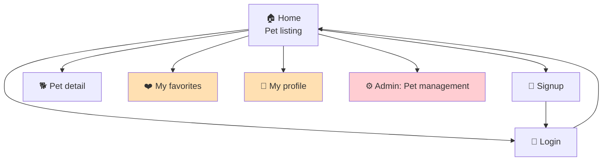
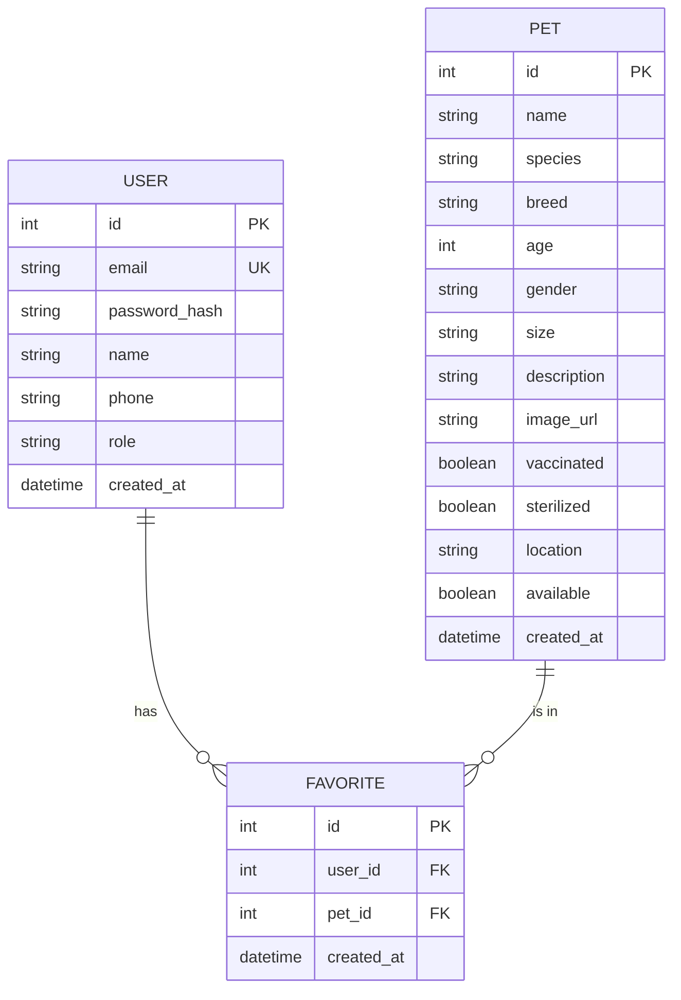
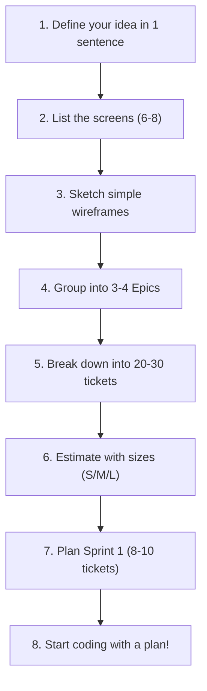

[🇪🇸 Español](README.md) | 🇬🇧 **English**

# Step 4: Full Example — PetMatch (Pet Adoption)

## 🎯 Goal

See **the full management process** applied to a complete fictional project: from the initial idea to a backlog ready to start coding. Use this example as a **template** to organize your own final project.

---

## 🐾 The Idea: PetMatch

**PetMatch** is a web application that connects pets up for adoption with people looking to adopt. Shelters publish available pets and users can browse, filter, and save their favorites.

### Main features:

- User signup and login
- Listing of pets available for adoption
- Detail of each pet with photos and description
- Save pets to favorites
- User profile
- Admin panel to manage pets

---

## 📱 The Screens

### Navigation map:



> The screens in orange require authentication. The screen in red requires the admin role.

---

### Simplified wireframes:

#### 1. Home (Pet listing)

```
┌─────────────────────────────────────────┐
│  🐾 PetMatch          [Login] [Signup]  │
├─────────────────────────────────────────┤
│  🔍 [Search pet...        ] [Filter ▾]  │
├─────────────────────────────────────────┤
│ ┌─────────┐ ┌─────────┐ ┌─────────┐    │
│ │  🐕     │ │  🐈     │ │  🐰     │    │
│ │  Luna   │ │  Milo   │ │  Coco   │    │
│ │  2 yrs  │ │  1 yr   │ │  6 mos  │    │
│ │  Dog    │ │  Cat    │ │  Rabbit │    │
│ │  [❤️] [View]│ │  [❤️] [View]│ │  [❤️] [View]│    │
│ └─────────┘ └─────────┘ └─────────┘    │
│                                         │
│  [← Previous]   Page 1 of 3   [Next →]  │
└─────────────────────────────────────────┘
```

> **Tickets that build this screen:**
>
> | # | Ticket | Layer | Why |
> |---|--------|-------|-----|
> | 8 | Create `Pet` model | Backend | The data for each pet card comes from this model |
> | 9 | Endpoint `GET /api/pets` | Backend | The screen calls this endpoint to get the list (includes `?search=` and `?species=`) |
> | 11 | Initial data seed | Backend | Without seed data, the screen would be empty |
> | 12 | Home screen (listing) | Frontend | The React component that renders the grid of cards, search bar, and filters |
> | 14 | Wire listing to API | Frontend | The `useEffect` + `fetch` that feeds the screen with real data |
> | 22 | Favorite button on card | Frontend | The heart [❤️] on each card |

---

#### 2. Pet detail

```
┌─────────────────────────────────────────┐
│  🐾 PetMatch    [← Back] [❤️ Favorite] │
├─────────────────────────────────────────┤
│  ┌──────────────────┐                   │
│  │                  │   Luna            │
│  │    📷 Photo      │   Dog - Labrador  │
│  │                  │   2 yrs - Female  │
│  └──────────────────┘   📍 Madrid       │
│                                         │
│  Description:                           │
│  Luna is a very affectionate Labrador   │
│  looking for an active family...        │
│                                         │
│  Details:                               │
│  • Vaccinated: ✅                        │
│  • Spayed: ✅                            │
│  • Size: Large                          │
│                                         │
│  [📩 Contact shelter]                    │
└─────────────────────────────────────────┘
```

> **Tickets that build this screen:**
>
> | # | Ticket | Layer | Why |
> |---|--------|-------|-----|
> | 8 | Create `Pet` model | Backend | The fields (breed, vaccinated, sterilized, etc.) are shown here |
> | 10 | Endpoint `GET /api/pets/:id` | Backend | The screen requests the detail of a specific pet by ID |
> | 13 | Pet detail screen | Frontend | The React component that renders photo, data, and description |
> | 16 | Endpoint `POST /api/favorites/:pet_id` | Backend | The [❤️ Favorite] button calls this endpoint to save it |
> | 22 | Favorite button on card and detail | Frontend | The favorite button shown top-right |

---

#### 3. Login / Signup

```
┌─────────────────────────────────────────┐
│  🐾 PetMatch                            │
├─────────────────────────────────────────┤
│                                         │
│        Log In                           │
│                                         │
│     📧 [Email              ]            │
│     🔒 [Password           ]            │
│                                         │
│     [    Sign in    ]                   │
│                                         │
│     Don't have an account? Sign up      │
│                                         │
└─────────────────────────────────────────┘
```

> **Tickets that build this screen:**
>
> | # | Ticket | Layer | Why |
> |---|--------|-------|-----|
> | 1 | Create `User` model | Backend | The form data (email, password) is saved in this model |
> | 2 | Endpoint `POST /api/signup` | Backend | The Signup form sends its data here |
> | 3 | Endpoint `POST /api/login` | Backend | The Login form sends credentials here |
> | 5 | Signup screen | Frontend | The React component with email, password, name form |
> | 6 | Login screen | Frontend | The React component with email and password form |
> | 7 | Auth Context and PrivateRoute | Frontend | Stores the JWT received and manages session state |

---

#### 4. My Favorites (requires auth)

```
┌─────────────────────────────────────────┐
│  🐾 PetMatch       [Profile] [Logout]  │
├─────────────────────────────────────────┤
│  ❤️ My Favorites (3)                    │
├─────────────────────────────────────────┤
│ ┌─────────┐ ┌─────────┐ ┌─────────┐    │
│ │  🐕     │ │  🐈     │ │  🐕     │    │
│ │  Luna   │ │  Milo   │ │  Rocky  │    │
│ │  [❌ Remove] [View]│ │  [❌ Remove] [View]│ │  [❌ Remove] [View]│    │
│ └─────────┘ └─────────┘ └─────────┘    │
└─────────────────────────────────────────┘
```

> **Tickets that build this screen:**
>
> | # | Ticket | Layer | Why |
> |---|--------|-------|-----|
> | 15 | Create `Favorite` model | Backend | Table that stores the user-to-favorite-pet relationship |
> | 18 | Endpoint `GET /api/favorites` | Backend | The screen calls this endpoint to list the user's favorites |
> | 17 | Endpoint `DELETE /api/favorites/:pet_id` | Backend | The [❌ Remove] button calls this endpoint |
> | 20 | My Favorites screen | Frontend | The React component that displays the favorites list |
> | 7 | Auth Context and PrivateRoute | Frontend | Protects this route: redirects to /login if there's no session |

---

#### 5. My Profile (requires auth)

```
┌─────────────────────────────────────────┐
│  🐾 PetMatch       [Favorites] [Logout]│
├─────────────────────────────────────────┤
│  👤 My Profile                          │
│                                         │
│  Name:    [Juan García         ]        │
│  Email:   [juan@email.com      ]        │
│  Phone:   [+34 612 345 678    ]        │
│                                         │
│  [   Save changes   ]                   │
│                                         │
│  [🗑️ Delete my account]                  │
└─────────────────────────────────────────┘
```

> **Tickets that build this screen:**
>
> | # | Ticket | Layer | Why |
> |---|--------|-------|-----|
> | 1 | Create `User` model | Backend | Fields name, email, phone come from this model |
> | 4 | Endpoint `GET /api/user/profile` | Backend | When the screen loads, current user data is fetched |
> | 19 | Endpoint `PUT /api/user/profile` | Backend | The [Save changes] button sends the edited data to this endpoint |
> | 21 | My Profile screen | Frontend | The React component with the editable form |
> | 7 | Auth Context and PrivateRoute | Frontend | Protects this route and provides the JWT for calls |

---

#### 6. Admin: Pet management (requires admin role)

```
┌─────────────────────────────────────────┐
│  🐾 PetMatch Admin        [Logout]      │
├─────────────────────────────────────────┤
│  ⚙️ Pet Management        [+ Add]       │
├─────────────────────────────────────────┤
│  Name    │ Species │ Status    │ Actions│
│  ────────┼─────────┼───────────┼────────│
│  Luna    │ Dog     │ Available │ [✏️] [🗑️]│
│  Milo    │ Cat     │ Adopted   │ [✏️] [🗑️]│
│  Coco    │ Rabbit  │ Available │ [✏️] [🗑️]│
│  Rocky   │ Dog     │ Pending   │ [✏️] [🗑️]│
└─────────────────────────────────────────┘
```

> **Tickets that build this screen:**
>
> | # | Ticket | Layer | Why |
> |---|--------|-------|-----|
> | 9 | Endpoint `GET /api/pets` | Backend | The table lists all pets (reuses the catalog endpoint) |
> | 23 | Endpoint `POST /api/pets` | Backend | The [+ Add] button sends the new pet form data |
> | 24 | Endpoint `PUT /api/pets/:id` | Backend | The [✏️] button opens the edit form and saves changes |
> | 25 | Endpoint `DELETE /api/pets/:id` | Backend | The [🗑️] button calls this endpoint to delete the pet |
> | 26 | Admin screen: pet listing | Frontend | The React component with the management table |
> | 27 | Create/edit pet modal/form | Frontend | The form opened by [+ Add] or [✏️] |
> | 28 | Protect admin routes in frontend | Frontend | Verify the user has the admin role before showing this screen |

---

## 🔗 Traceability Matrix: Screen → Tickets

This table summarizes **which tickets each screen needs** to be fully functional. Use it as a quick reference to verify nothing is missing.

| Screen | Required tickets | Epic(s) involved |
|--------|------------------|------------------|
| **1. Home (Listing)** | #8 Pet model, #9 GET /pets, #11 Data seed, #12 Home screen, #14 Wire to API, #22 Favorite button | Catalog, Favorites |
| **2. Pet detail** | #8 Pet model, #10 GET /pets/:id, #13 Detail screen, #16 POST favorites, #22 Favorite button | Catalog, Favorites |
| **3. Signup** | #1 User model, #2 POST /signup, #5 Signup screen, #7 Auth Context | Auth |
| **3. Login** | #1 User model, #3 POST /login, #6 Login screen, #7 Auth Context | Auth |
| **4. My Favorites** | #15 Favorite model, #17 DELETE favorites, #18 GET favorites, #20 Favorites screen, #7 PrivateRoute | Favorites, Auth |
| **5. My Profile** | #1 User model, #4 GET /profile, #19 PUT /profile, #21 Profile screen, #7 PrivateRoute | Auth, Profile |
| **6. Admin** | #9 GET /pets, #23 POST /pets, #24 PUT /pets/:id, #25 DELETE /pets/:id, #26 Admin screen, #27 Create/edit modal, #28 Protect admin route | Admin, Catalog |

> **How to read this table:** If a ticket appears in several screens (e.g., #8 Pet model appears in Home, Detail, and Admin), it's a **cross-cutting** ticket — completing it advances multiple screens at once. That makes it a good candidate for early prioritization.

---

## 📦 Epics and Tickets

### Epic 1: Authentication (Auth)

> Everything needed for a user to sign up, log in, and stay authenticated.

| # | Ticket | Layer | Size | Screen(s) | Description |
|---|--------|-------|------|-----------|-------------|
| 1 | Create `User` model | Backend | S | Login, Signup, Profile | Fields: id, email, password_hash, name, phone, role (user/admin), created_at |
| 2 | Endpoint `POST /api/signup` | Backend | M | Signup | Receives email+password, hashes with bcrypt, saves to DB, returns JWT |
| 3 | Endpoint `POST /api/login` | Backend | M | Login | Receives email+password, verifies credentials, returns JWT |
| 4 | Endpoint `GET /api/user/profile` | Backend | S | Profile | Protected route. Returns the authenticated user's data |
| 5 | Signup screen | Frontend | M | Signup | Form with email, password, name. Calls POST /api/signup |
| 6 | Login screen | Frontend | M | Login | Form with email, password. Stores JWT in localStorage/context |
| 7 | Auth Context and PrivateRoute | Frontend | M | Favorites, Profile, Admin | Context that manages auth state. PrivateRoute component that redirects to /login |

**Epic 1 total:** 7 tickets (2S + 5M)

---

### Epic 2: Pet Catalog

> Main functionality: list, view detail, and search for pets available for adoption.

| # | Ticket | Layer | Size | Screen(s) | Description |
|---|--------|-------|------|-----------|-------------|
| 8 | Create `Pet` model | Backend | S | Home, Detail | Fields: id, name, species, breed, age, gender, size, description, image_url, vaccinated, sterilized, location, available, created_at |
| 9 | Endpoint `GET /api/pets` | Backend | M | Home, Admin | Returns list of available pets. Accepts query params: ?search=, ?species=, ?size= |
| 10 | Endpoint `GET /api/pets/:id` | Backend | S | Detail | Returns detail of a specific pet |
| 11 | Initial data seed | Backend | S | Home, Detail | Script that creates 10–15 sample pets in the DB |
| 12 | Home screen (listing) | Frontend | L | Home | Grid of pet cards. Includes search bar and basic filters |
| 13 | Pet detail screen | Frontend | M | Detail | Shows all pet info, photo, favorite button |
| 14 | Wire listing to API | Frontend | S | Home | useEffect + fetch to GET /api/pets, manage loading and error states |

**Epic 2 total:** 7 tickets (3S + 3M + 1L)

---

### Epic 3: Profile and Favorites

> Authenticated-user features: save favorites and manage profile.

| # | Ticket | Layer | Size | Screen(s) | Description |
|---|--------|-------|------|-----------|-------------|
| 15 | Create `Favorite` model | Backend | S | Favorites | Join table: user_id + pet_id (many-to-many relationship) |
| 16 | Endpoint `POST /api/favorites/:pet_id` | Backend | S | Home, Detail | Add a pet to favorites (requires auth) |
| 17 | Endpoint `DELETE /api/favorites/:pet_id` | Backend | S | Favorites | Remove a pet from favorites (requires auth) |
| 18 | Endpoint `GET /api/favorites` | Backend | S | Favorites | Returns the user's favorite pets (requires auth) |
| 19 | Endpoint `PUT /api/user/profile` | Backend | M | Profile | Update user's name, phone (requires auth) |
| 20 | My Favorites screen | Frontend | M | Favorites | Lists the saved pets. Button to remove from favorites |
| 21 | My Profile screen | Frontend | M | Profile | Editable form with user data. Save button |
| 22 | Favorite button on card and detail | Frontend | S | Home, Detail | Heart that toggles state. Wired to POST/DELETE |

**Epic 3 total:** 8 tickets (5S + 3M)

---

### Epic 4: Administration (optional, Sprint 3)

> Panel for an admin to manage the pet catalog.

| # | Ticket | Layer | Size | Screen(s) | Description |
|---|--------|-------|------|-----------|-------------|
| 23 | Endpoint `POST /api/pets` | Backend | M | Admin | Create new pet (requires admin role) |
| 24 | Endpoint `PUT /api/pets/:id` | Backend | M | Admin | Edit existing pet (requires admin role) |
| 25 | Endpoint `DELETE /api/pets/:id` | Backend | S | Admin | Delete pet (requires admin role) |
| 26 | Admin screen: pet listing | Frontend | M | Admin | Table with all pets. Edit and delete buttons |
| 27 | Create/edit pet modal/form | Frontend | M | Admin | Reusable form for creating and editing |
| 28 | Protect admin routes in frontend | Frontend | S | Admin | Check admin role before showing the panel |

**Epic 4 total:** 6 tickets (2S + 4M)

---

## 🗓️ Sprint Planning

### Sprint 1: Functional Skeleton (Weeks 1–2)

**Goal:** *A user can sign up, log in, and see the pet listing.*

| # | Ticket | Epic | Size |
|---|--------|------|------|
| 1 | Create `User` model | Auth | S |
| 8 | Create `Pet` model | Catalog | S |
| 2 | Endpoint POST /api/signup | Auth | M |
| 3 | Endpoint POST /api/login | Auth | M |
| 9 | Endpoint GET /api/pets | Catalog | M |
| 10 | Endpoint GET /api/pets/:id | Catalog | S |
| 11 | Initial data seed | Catalog | S |
| 5 | Signup screen | Auth | M |
| 6 | Login screen | Auth | M |
| 7 | Auth Context and PrivateRoute | Auth | M |

**Load:** 10 tickets (4S + 6M)

**At the end of Sprint 1 you have:** an app where a user signs up, logs in, and sees a list of pets. Basic, but works end-to-end.

---

### Sprint 2: Main Features (Weeks 3–4)

**Goal:** *The user can view a pet's detail, save favorites, and edit their profile.*

| # | Ticket | Epic | Size |
|---|--------|------|------|
| 12 | Home screen (full listing) | Catalog | L |
| 13 | Pet detail screen | Catalog | M |
| 14 | Wire listing to API | Catalog | S |
| 15 | Create Favorite model | Favorites | S |
| 16 | Endpoint POST /api/favorites/:pet_id | Favorites | S |
| 17 | Endpoint DELETE /api/favorites/:pet_id | Favorites | S |
| 18 | Endpoint GET /api/favorites | Favorites | S |
| 19 | Endpoint PUT /api/user/profile | Profile | M |
| 20 | My Favorites screen | Favorites | M |
| 21 | My Profile screen | Profile | M |
| 22 | Favorite button | Favorites | S |

**Load:** 11 tickets (6S + 4M + 1L)

**At the end of Sprint 2 you have:** a fully functional app with all the main features for the end user.

---

### Sprint 3: Admin + Polish + Deploy (Week 5)

**Goal:** *Working admin panel, deployed app, and polished look.*

| # | Ticket | Epic | Size |
|---|--------|------|------|
| 4 | Endpoint GET /api/user/profile | Auth | S |
| 23 | Endpoint POST /api/pets | Admin | M |
| 24 | Endpoint PUT /api/pets/:id | Admin | M |
| 25 | Endpoint DELETE /api/pets/:id | Admin | S |
| 26 | Admin screen: listing | Admin | M |
| 27 | Create/edit pet modal | Admin | M |
| 28 | Protect admin routes | Admin | S |

**Load:** 7 tickets (3S + 4M)

**At the end of Sprint 3 you have:** a complete app with admin, deployed and ready to present.

---

## 📊 How It Would Look in Linear (Board simulation)

### Board View — Sprint 1, Day 5:

```
┌────────────────┬────────────────┬────────────────┐
│   📋 To Do     │  🔄 In Progress│   ✅ Done       │
├────────────────┼────────────────┼────────────────┤
│                │                │                │
│ #5 Signup      │ #9 GET /pets   │ #1 User model  │
│    screen      │                │                │
│                │ #6 Login       │ #8 Pet model   │
│ #7 Auth        │    screen      │                │
│    Context     │                │ #2 POST signup │
│                │                │                │
│ #10 GET        │                │ #3 POST login  │
│     pets/:id   │                │                │
│                │                │ #11 Data seed  │
│                │                │                │
└────────────────┴────────────────┴────────────────┘
```

---

## 📋 Database Schema

For reference, this would be the PetMatch ER diagram:



---

## 🎯 Summary: What You Should Replicate for Your Project



### Quick template for your project:

```
My project: _______________
One-sentence description: _______________

Screens:
1. _______________
2. _______________
3. _______________
4. _______________
5. _______________
6. _______________

Epics:
📦 Epic 1: _______________
📦 Epic 2: _______________
📦 Epic 3: _______________

Sprint 1 (goal): _______________
Sprint 2 (goal): _______________
Sprint 3 (goal): _______________
```

---

## ✅ Step checklist

- [ ] I understand how PetMatch was broken down from idea → screens → epics → tickets
- [ ] I can identify the 4 ticket layers per screen (model, backend, frontend, integration)
- [ ] I understand how the sprints were prioritized (skeleton first, polish later)
- [ ] I have the template ready to apply to my own final project
- [ ] I have created (or am ready to create) my epics and tickets in Linear
