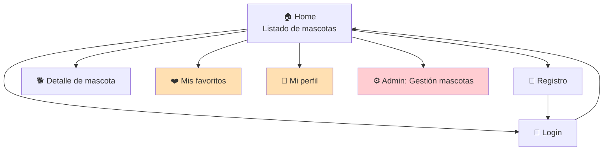
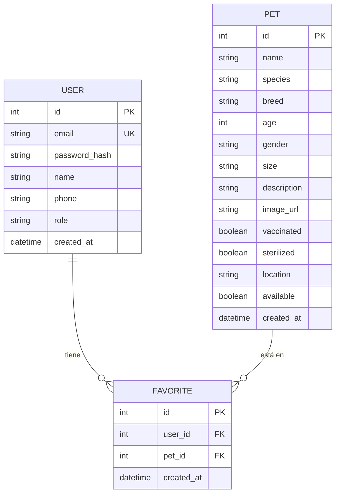
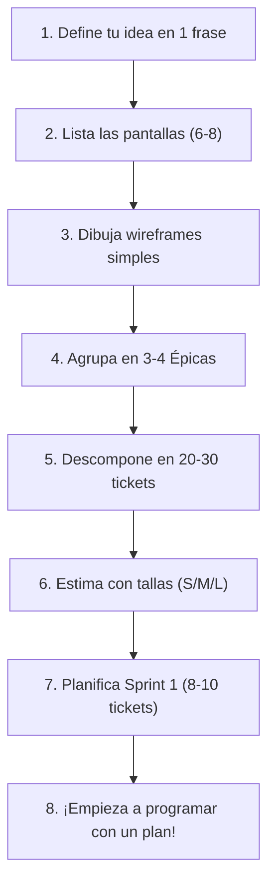

# Step 4: Ejemplo Completo — PetMatch (Adopción de Mascotas)

## 🎯 Objetivo

Ver **todo el proceso de gestión** aplicado a un proyecto ficticio completo: desde la idea inicial hasta el backlog listo para empezar a programar. Usa este ejemplo como **plantilla** para organizar tu propio proyecto final.

---

## 🐾 La Idea: PetMatch

**PetMatch** es una aplicación web que conecta mascotas en adopción con personas que buscan adoptar. Los refugios publican mascotas disponibles y los usuarios pueden explorar, filtrar y guardar sus favoritas.

### Funcionalidades principales:

- Registro e inicio de sesión de usuarios
- Listado de mascotas disponibles para adopción
- Detalle de cada mascota con fotos y descripción
- Guardar mascotas en favoritos
- Perfil de usuario
- Panel de administración para gestionar mascotas

---

## 📱 Las Pantallas

### Mapa de navegación:



> Las pantallas en naranja requieren autenticación. La pantalla en rojo requiere rol admin.

---

### Wireframes simplificados:

#### 1. Home (Listado de mascotas)

```
┌─────────────────────────────────────────┐
│  🐾 PetMatch          [Login] [Signup]  │
├─────────────────────────────────────────┤
│  🔍 [Buscar mascota...    ] [Filtrar ▾] │
├─────────────────────────────────────────┤
│ ┌─────────┐ ┌─────────┐ ┌─────────┐    │
│ │  🐕     │ │  🐈     │ │  🐰     │    │
│ │  Luna   │ │  Milo   │ │  Coco   │    │
│ │  2 años │ │  1 año  │ │  6 meses│    │
│ │  Perro  │ │  Gato   │ │  Conejo │    │
│ │  [❤️] [Ver]│ │  [❤️] [Ver]│ │  [❤️] [Ver]│    │
│ └─────────┘ └─────────┘ └─────────┘    │
│                                         │
│  [← Anterior]  Pág 1 de 3  [Siguiente →]│
└─────────────────────────────────────────┘
```

> **Tickets que construyen esta pantalla:**
>
> | # | Ticket | Capa | Por qué |
> |---|--------|------|---------|
> | 8 | Crear modelo `Pet` | Backend | Los datos de cada tarjeta de mascota vienen de este modelo |
> | 9 | Endpoint `GET /api/pets` | Backend | La pantalla llama a este endpoint para obtener la lista (incluye `?search=` y `?species=`) |
> | 11 | Seed de datos iniciales | Backend | Sin datos de ejemplo, la pantalla estaría vacía |
> | 12 | Pantalla Home (listado) | Frontend | El componente React que renderiza el grid de tarjetas, barra de búsqueda y filtros |
> | 14 | Conectar listado con API | Frontend | El `useEffect` + `fetch` que alimenta la pantalla con datos reales |
> | 22 | Botón de favorito en tarjeta | Frontend | El corazón [❤️] en cada tarjeta |

---

#### 2. Detalle de mascota

```
┌─────────────────────────────────────────┐
│  🐾 PetMatch    [← Volver] [❤️ Favorito]│
├─────────────────────────────────────────┤
│  ┌──────────────────┐                   │
│  │                  │   Luna            │
│  │    📷 Foto       │   Perro - Labrador│
│  │                  │   2 años - Hembra │
│  └──────────────────┘   📍 Madrid       │
│                                         │
│  Descripción:                           │
│  Luna es una labradora muy cariñosa     │
│  que busca una familia activa...        │
│                                         │
│  Detalles:                              │
│  • Vacunada: ✅                          │
│  • Esterilizada: ✅                      │
│  • Tamaño: Grande                       │
│                                         │
│  [📩 Contactar refugio]                  │
└─────────────────────────────────────────┘
```

> **Tickets que construyen esta pantalla:**
>
> | # | Ticket | Capa | Por qué |
> |---|--------|------|---------|
> | 8 | Crear modelo `Pet` | Backend | Los campos (breed, vaccinated, sterilized, etc.) se muestran aquí |
> | 10 | Endpoint `GET /api/pets/:id` | Backend | La pantalla pide el detalle de una mascota específica por su ID |
> | 13 | Pantalla Detalle de mascota | Frontend | El componente React que renderiza foto, datos y descripción |
> | 16 | Endpoint `POST /api/favorites/:pet_id` | Backend | El botón [❤️ Favorito] llama a este endpoint para guardar |
> | 22 | Botón de favorito en tarjeta y detalle | Frontend | El botón de favorito que aparece arriba a la derecha |

---

#### 3. Login / Registro

```
┌─────────────────────────────────────────┐
│  🐾 PetMatch                            │
├─────────────────────────────────────────┤
│                                         │
│        Iniciar Sesión                   │
│                                         │
│     📧 [Email              ]            │
│     🔒 [Contraseña         ]            │
│                                         │
│     [    Entrar    ]                    │
│                                         │
│     ¿No tienes cuenta? Regístrate       │
│                                         │
└─────────────────────────────────────────┘
```

> **Tickets que construyen esta pantalla:**
>
> | # | Ticket | Capa | Por qué |
> |---|--------|------|---------|
> | 1 | Crear modelo `User` | Backend | Los datos del formulario (email, password) se guardan en este modelo |
> | 2 | Endpoint `POST /api/signup` | Backend | El formulario de Registro envía los datos aquí |
> | 3 | Endpoint `POST /api/login` | Backend | El formulario de Login envía las credenciales aquí |
> | 5 | Pantalla de Registro | Frontend | El componente React con formulario de email, password, nombre |
> | 6 | Pantalla de Login | Frontend | El componente React con formulario de email y password |
> | 7 | Auth Context y PrivateRoute | Frontend | Guarda el JWT recibido y gestiona el estado de sesión |

---

#### 4. Mis Favoritos (requiere auth)

```
┌─────────────────────────────────────────┐
│  🐾 PetMatch       [Perfil] [Logout]   │
├─────────────────────────────────────────┤
│  ❤️ Mis Favoritos (3)                   │
├─────────────────────────────────────────┤
│ ┌─────────┐ ┌─────────┐ ┌─────────┐    │
│ │  🐕     │ │  🐈     │ │  🐕     │    │
│ │  Luna   │ │  Milo   │ │  Rocky  │    │
│ │  [❌ Quitar] [Ver]│ │  [❌ Quitar] [Ver]│ │  [❌ Quitar] [Ver]│    │
│ └─────────┘ └─────────┘ └─────────┘    │
└─────────────────────────────────────────┘
```

> **Tickets que construyen esta pantalla:**
>
> | # | Ticket | Capa | Por qué |
> |---|--------|------|---------|
> | 15 | Crear modelo `Favorite` | Backend | Tabla que almacena la relación usuario-mascota favorita |
> | 18 | Endpoint `GET /api/favorites` | Backend | La pantalla llama a este endpoint para listar los favoritos del usuario |
> | 17 | Endpoint `DELETE /api/favorites/:pet_id` | Backend | El botón [❌ Quitar] llama a este endpoint |
> | 20 | Pantalla Mis Favoritos | Frontend | El componente React que muestra la lista de favoritos |
> | 7 | Auth Context y PrivateRoute | Frontend | Protege esta ruta: redirige a /login si no hay sesión |

---

#### 5. Mi Perfil (requiere auth)

```
┌─────────────────────────────────────────┐
│  🐾 PetMatch       [Favoritos] [Logout]│
├─────────────────────────────────────────┤
│  👤 Mi Perfil                           │
│                                         │
│  Nombre:   [Juan García        ]        │
│  Email:    [juan@email.com     ]        │
│  Teléfono: [+34 612 345 678   ]        │
│                                         │
│  [  Guardar cambios  ]                  │
│                                         │
│  [🗑️ Eliminar mi cuenta]                │
└─────────────────────────────────────────┘
```

> **Tickets que construyen esta pantalla:**
>
> | # | Ticket | Capa | Por qué |
> |---|--------|------|---------|
> | 1 | Crear modelo `User` | Backend | Los campos name, email, phone vienen de este modelo |
> | 4 | Endpoint `GET /api/user/profile` | Backend | Al cargar la pantalla, se piden los datos actuales del usuario |
> | 19 | Endpoint `PUT /api/user/profile` | Backend | El botón [Guardar cambios] envía los datos editados a este endpoint |
> | 21 | Pantalla Mi Perfil | Frontend | El componente React con el formulario editable |
> | 7 | Auth Context y PrivateRoute | Frontend | Protege esta ruta y proporciona el JWT para las llamadas |

---

#### 6. Admin: Gestión de mascotas (requiere rol admin)

```
┌─────────────────────────────────────────┐
│  🐾 PetMatch Admin        [Logout]     │
├─────────────────────────────────────────┤
│  ⚙️ Gestión de Mascotas   [+ Añadir]   │
├─────────────────────────────────────────┤
│  Nombre  │ Especie │ Estado  │ Acciones │
│  ────────┼─────────┼─────────┼──────────│
│  Luna    │ Perro   │ Disponible│ [✏️] [🗑️]│
│  Milo    │ Gato    │ Adoptado  │ [✏️] [🗑️]│
│  Coco    │ Conejo  │ Disponible│ [✏️] [🗑️]│
│  Rocky   │ Perro   │ En espera │ [✏️] [🗑️]│
└─────────────────────────────────────────┘
```

> **Tickets que construyen esta pantalla:**
>
> | # | Ticket | Capa | Por qué |
> |---|--------|------|---------|
> | 9 | Endpoint `GET /api/pets` | Backend | La tabla lista todas las mascotas (reutiliza el endpoint del catálogo) |
> | 23 | Endpoint `POST /api/pets` | Backend | El botón [+ Añadir] envía los datos del formulario de nueva mascota |
> | 24 | Endpoint `PUT /api/pets/:id` | Backend | El botón [✏️] abre el formulario de edición y guarda los cambios |
> | 25 | Endpoint `DELETE /api/pets/:id` | Backend | El botón [🗑️] llama a este endpoint para eliminar la mascota |
> | 26 | Pantalla Admin: listado de mascotas | Frontend | El componente React con la tabla de gestión |
> | 27 | Modal/Formulario crear/editar mascota | Frontend | El formulario que se abre al pulsar [+ Añadir] o [✏️] |
> | 28 | Proteger rutas admin en frontend | Frontend | Verifica que el usuario tiene rol admin antes de mostrar esta pantalla |

---

## 🔗 Matriz de Trazabilidad: Pantalla → Tickets

Esta tabla resume **qué tickets necesita cada pantalla** para funcionar completamente. Úsala como referencia rápida para verificar que no falta nada.

| Pantalla | Tickets necesarios | Épica(s) involucrada(s) |
|----------|--------------------|-------------------------|
| **1. Home (Listado)** | #8 Modelo Pet, #9 GET /pets, #11 Seed datos, #12 Pantalla Home, #14 Conectar con API, #22 Botón favorito | Catálogo, Favoritos |
| **2. Detalle mascota** | #8 Modelo Pet, #10 GET /pets/:id, #13 Pantalla Detalle, #16 POST favorites, #22 Botón favorito | Catálogo, Favoritos |
| **3. Registro** | #1 Modelo User, #2 POST /signup, #5 Pantalla Registro, #7 Auth Context | Auth |
| **3. Login** | #1 Modelo User, #3 POST /login, #6 Pantalla Login, #7 Auth Context | Auth |
| **4. Mis Favoritos** | #15 Modelo Favorite, #17 DELETE favorites, #18 GET favorites, #20 Pantalla Favoritos, #7 PrivateRoute | Favoritos, Auth |
| **5. Mi Perfil** | #1 Modelo User, #4 GET /profile, #19 PUT /profile, #21 Pantalla Perfil, #7 PrivateRoute | Auth, Perfil |
| **6. Admin** | #9 GET /pets, #23 POST /pets, #24 PUT /pets/:id, #25 DELETE /pets/:id, #26 Pantalla Admin, #27 Modal crear/editar, #28 Proteger ruta admin | Admin, Catálogo |

> **Clave para leer esta tabla:** Si un ticket aparece en varias pantallas (ej. #8 Modelo Pet aparece en Home, Detalle y Admin), significa que es un ticket **transversal** — al completarlo, avanzas en múltiples pantallas a la vez. Esto es bueno para priorizar: los tickets transversales deberían hacerse primero.

---

## 📦 Épicas y Tickets

### Épica 1: Autenticación (Auth)

> Todo lo necesario para que un usuario se registre, inicie sesión y se mantenga autenticado.

| # | Ticket | Capa | Talla | Pantalla(s) | Descripción |
|---|--------|------|-------|-------------|-------------|
| 1 | Crear modelo `User` | Backend | S | Login, Registro, Perfil | Campos: id, email, password_hash, name, phone, role (user/admin), created_at |
| 2 | Endpoint `POST /api/signup` | Backend | M | Registro | Recibe email+password, hashea con bcrypt, guarda en BD, devuelve JWT |
| 3 | Endpoint `POST /api/login` | Backend | M | Login | Recibe email+password, verifica credenciales, devuelve JWT |
| 4 | Endpoint `GET /api/user/profile` | Backend | S | Perfil | Ruta protegida. Devuelve datos del usuario autenticado |
| 5 | Pantalla de Registro | Frontend | M | Registro | Formulario con email, password, nombre. Llama a POST /api/signup |
| 6 | Pantalla de Login | Frontend | M | Login | Formulario con email, password. Guarda JWT en localStorage/context |
| 7 | Auth Context y PrivateRoute | Frontend | M | Favoritos, Perfil, Admin | Context que gestiona el estado de autenticación. Componente PrivateRoute que redirige a /login |

**Total Épica 1:** 7 tickets (2S + 5M)

---

### Épica 2: Catálogo de Mascotas

> Funcionalidad principal: listar, ver detalle y buscar mascotas disponibles para adopción.

| # | Ticket | Capa | Talla | Pantalla(s) | Descripción |
|---|--------|------|-------|-------------|-------------|
| 8 | Crear modelo `Pet` | Backend | S | Home, Detalle | Campos: id, name, species, breed, age, gender, size, description, image_url, vaccinated, sterilized, location, available, created_at |
| 9 | Endpoint `GET /api/pets` | Backend | M | Home, Admin | Devuelve lista de mascotas disponibles. Acepta query params: ?search=, ?species=, ?size= |
| 10 | Endpoint `GET /api/pets/:id` | Backend | S | Detalle | Devuelve detalle de una mascota específica |
| 11 | Seed de datos iniciales | Backend | S | Home, Detalle | Script que crea 10-15 mascotas de ejemplo en la BD |
| 12 | Pantalla Home (listado) | Frontend | L | Home | Grid de tarjetas de mascotas. Incluye barra de búsqueda y filtros básicos |
| 13 | Pantalla Detalle de mascota | Frontend | M | Detalle | Muestra toda la info de la mascota, foto, botón de favorito |
| 14 | Conectar listado con API | Frontend | S | Home | useEffect + fetch a GET /api/pets, gestionar loading y error states |

**Total Épica 2:** 7 tickets (3S + 3M + 1L)

---

### Épica 3: Perfil y Favoritos

> Funcionalidades del usuario autenticado: guardar favoritos y gestionar su perfil.

| # | Ticket | Capa | Talla | Pantalla(s) | Descripción |
|---|--------|------|-------|-------------|-------------|
| 15 | Crear modelo `Favorite` | Backend | S | Favoritos | Tabla intermedia: user_id + pet_id (relación many-to-many) |
| 16 | Endpoint `POST /api/favorites/:pet_id` | Backend | S | Home, Detalle | Añadir mascota a favoritos (requiere auth) |
| 17 | Endpoint `DELETE /api/favorites/:pet_id` | Backend | S | Favoritos | Quitar mascota de favoritos (requiere auth) |
| 18 | Endpoint `GET /api/favorites` | Backend | S | Favoritos | Devuelve lista de mascotas favoritas del usuario (requiere auth) |
| 19 | Endpoint `PUT /api/user/profile` | Backend | M | Perfil | Actualizar nombre, teléfono del usuario (requiere auth) |
| 20 | Pantalla Mis Favoritos | Frontend | M | Favoritos | Lista las mascotas guardadas. Botón para quitar de favoritos |
| 21 | Pantalla Mi Perfil | Frontend | M | Perfil | Formulario editable con datos del usuario. Botón guardar |
| 22 | Botón de favorito en tarjeta y detalle | Frontend | S | Home, Detalle | Corazón que cambia de estado (toggle). Conectado con POST/DELETE |

**Total Épica 3:** 8 tickets (5S + 3M)

---

### Épica 4: Administración (opcional, Sprint 3)

> Panel para que un admin pueda gestionar el catálogo de mascotas.

| # | Ticket | Capa | Talla | Pantalla(s) | Descripción |
|---|--------|------|-------|-------------|-------------|
| 23 | Endpoint `POST /api/pets` | Backend | M | Admin | Crear nueva mascota (requiere rol admin) |
| 24 | Endpoint `PUT /api/pets/:id` | Backend | M | Admin | Editar mascota existente (requiere rol admin) |
| 25 | Endpoint `DELETE /api/pets/:id` | Backend | S | Admin | Eliminar mascota (requiere rol admin) |
| 26 | Pantalla Admin: listado de mascotas | Frontend | M | Admin | Tabla con todas las mascotas. Botones editar y eliminar |
| 27 | Modal/Formulario crear/editar mascota | Frontend | M | Admin | Formulario reutilizable para crear y editar |
| 28 | Proteger rutas admin en frontend | Frontend | S | Admin | Verificar rol admin antes de mostrar el panel |

**Total Épica 4:** 6 tickets (2S + 4M)

---

## 🗓️ Planificación de Sprints

### Sprint 1: Esqueleto Funcional (Semanas 1-2)

**Objetivo:** *Un usuario puede registrarse, hacer login y ver el listado de mascotas.*

| # | Ticket | Épica | Talla |
|---|--------|-------|-------|
| 1 | Crear modelo `User` | Auth | S |
| 8 | Crear modelo `Pet` | Catálogo | S |
| 2 | Endpoint POST /api/signup | Auth | M |
| 3 | Endpoint POST /api/login | Auth | M |
| 9 | Endpoint GET /api/pets | Catálogo | M |
| 10 | Endpoint GET /api/pets/:id | Catálogo | S |
| 11 | Seed de datos iniciales | Catálogo | S |
| 5 | Pantalla de Registro | Auth | M |
| 6 | Pantalla de Login | Auth | M |
| 7 | Auth Context y PrivateRoute | Auth | M |

**Carga:** 10 tickets (4S + 6M)

**Al final del Sprint 1 tienes:** App donde un usuario se registra, hace login, y ve una lista de mascotas. Es básica pero funciona de punta a punta.

---

### Sprint 2: Features Principales (Semanas 3-4)

**Objetivo:** *El usuario puede ver detalle, guardar favoritos y editar su perfil.*

| # | Ticket | Épica | Talla |
|---|--------|-------|-------|
| 12 | Pantalla Home (listado completo) | Catálogo | L |
| 13 | Pantalla Detalle de mascota | Catálogo | M |
| 14 | Conectar listado con API | Catálogo | S |
| 15 | Crear modelo Favorite | Favoritos | S |
| 16 | Endpoint POST /api/favorites/:pet_id | Favoritos | S |
| 17 | Endpoint DELETE /api/favorites/:pet_id | Favoritos | S |
| 18 | Endpoint GET /api/favorites | Favoritos | S |
| 19 | Endpoint PUT /api/user/profile | Perfil | M |
| 20 | Pantalla Mis Favoritos | Favoritos | M |
| 21 | Pantalla Mi Perfil | Perfil | M |
| 22 | Botón de favorito | Favoritos | S |

**Carga:** 11 tickets (6S + 4M + 1L)

**Al final del Sprint 2 tienes:** App completamente funcional con todas las features principales para el usuario final.

---

### Sprint 3: Admin + Polish + Deploy (Semana 5)

**Objetivo:** *Panel admin funcional, app desplegada y con buen aspecto.*

| # | Ticket | Épica | Talla |
|---|--------|-------|-------|
| 4 | Endpoint GET /api/user/profile | Auth | S |
| 23 | Endpoint POST /api/pets | Admin | M |
| 24 | Endpoint PUT /api/pets/:id | Admin | M |
| 25 | Endpoint DELETE /api/pets/:id | Admin | S |
| 26 | Pantalla Admin: listado | Admin | M |
| 27 | Modal crear/editar mascota | Admin | M |
| 28 | Proteger rutas admin | Admin | S |

**Carga:** 7 tickets (3S + 4M)

**Al final del Sprint 3 tienes:** App completa con admin, desplegada y lista para presentar.

---

## 📊 Cómo se vería en Linear (simulación del Board)

### Vista Board — Sprint 1, Día 5:

```
┌────────────────┬────────────────┬────────────────┐
│   📋 To Do     │  🔄 In Progress│   ✅ Done       │
├────────────────┼────────────────┼────────────────┤
│                │                │                │
│ #5 Pantalla    │ #9 GET /pets   │ #1 Modelo User │
│    Registro    │                │                │
│                │ #6 Pantalla    │ #8 Modelo Pet  │
│ #7 Auth        │    Login       │                │
│    Context     │                │ #2 POST signup │
│                │                │                │
│ #10 GET        │                │ #3 POST login  │
│     pets/:id   │                │                │
│                │                │ #11 Seed datos │
│                │                │                │
└────────────────┴────────────────┴────────────────┘
```

---

## 📋 Esquema de Base de Datos

Para referencia, este sería el diagrama ER de PetMatch:



---

## 🎯 Resumen: Lo que Deberías Replicar para Tu Proyecto



### Template rápido para tu proyecto:

```
Mi proyecto: _______________
Descripción en 1 frase: _______________

Pantallas:
1. _______________
2. _______________
3. _______________
4. _______________
5. _______________
6. _______________

Épicas:
📦 Épica 1: _______________
📦 Épica 2: _______________
📦 Épica 3: _______________

Sprint 1 (objetivo): _______________
Sprint 2 (objetivo): _______________
Sprint 3 (objetivo): _______________
```

---

## ✅ Checklist de este step

- [ ] Entiendo cómo PetMatch fue descompuesto de idea → pantallas → épicas → tickets
- [ ] Puedo identificar las 4 capas de tickets por pantalla (modelo, backend, frontend, integración)
- [ ] Entiendo cómo se priorizaron los sprints (esqueleto primero, polish después)
- [ ] Tengo el template listo para aplicar a mi propio proyecto final
- [ ] He creado (o estoy listo para crear) mis épicas y tickets en Linear
